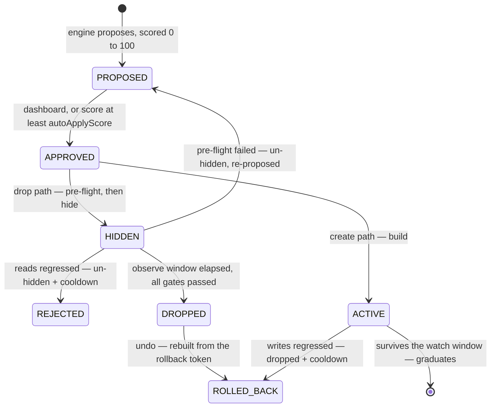

# Indexterity

Index dexterity for MongoDB. A SaaS that watches your indexes and manages them
safely — drop the unused and redundant, merge overlapping, extend prefixes,
create the missing — and proves the result in freed bytes and latency.

Read-only by default. The one irreversible step, a drop, is gated behind an
observe window, a pre-flight check, and a read-latency regression test.

| | |
|---|---|
| **How it is built** | [Architecture](https://github.com/FullmetalBober/Indexterity/wiki/Architecture) |
| **Knobs, scoring and plans** | [Plans and policy](https://github.com/FullmetalBober/Indexterity/wiki/Plans-and-policy) |
| **The MongoDB user it needs** | [Connecting a cluster](https://github.com/FullmetalBober/Indexterity/wiki/Connecting-a-cluster) |
| **Every load-bearing choice** | [`docs/decisions.md`](./docs/decisions.md) |
| **What is planned** | [project board](https://github.com/users/FullmetalBober/projects/6) |

## How it works

1. **Connect** a cluster with any connection string. Indexterity first reports
   what that string can actually do — nothing stored, nothing written. If it can
   create users, it *asks* before provisioning its own least-privilege user
   (`idx_<hex>`, no `find` on your collections, so it **cannot read documents**).
   The admin string is used once and never persisted; only the scoped one is
   stored, sealed with envelope encryption.
2. **Collect** hourly via `$indexStats` / `$collStats` — usage, sizes,
   per-collection read/write latency. Never your documents. What gets *stored* is
   only what changed: an index's shape is written once, and an unchanged counter
   extends the row it already has instead of adding another.
3. **Decide** with a pure analysis engine (`apps/api/src/analysis` — no I/O, so
   it is unit-tested without a database or a cluster).
4. **Apply** safely: `hide → observe → drop` for removals, `build` for
   additions. Clusters start read-only; an owner flips them live.
5. **Prove ROI**: freed bytes and the $/month they cost, index-count delta, and
   a before/after latency trend per collection.

The dashboard follows the engine live: a pass landing, a drop going hidden, a
build graduating or a regression firing arrives over SSE and refetches exactly
the panels it moved — no reload, no polling.

## What it decides

**Dropping.** Each index gets a usage class from its op-count history
(`FLAT_ZERO`, `CONTINUOUS`, `PERIODIC_ALIVE`, `PERIODIC_DEAD`). Dead usage or
redundancy earns a proposal.

A usage claim needs a history worth trusting: **at least a week of it, and at
least three days in which the collection was actually queried**, with no hole
over 48h, a recent newest snapshot and no counter restart. The week is the
warm-up; the activity requirement is what makes it mean something. An index
reads zero either because nobody needs it or because nobody touched the
collection — elapsed time cannot tell those apart. Hours in which the collection
served no reads simply do not count. Redundancy is structural and unaffected.

Every one of those thresholds is expressed in **hours**, not in collect
intervals, which is what made the cadence safe to move
([D36](./docs/decisions.md)).

**Never dropped**, whatever the usage: `_id_`, unique (including unique partial
and sparse — a constraint is not a performance hint), TTL, and shard-key
indexes. They surface as advisories instead. Partial and sparse indexes without
a constraint *are* droppable: the pipeline hides and measures rather than
trusting the counter.

**Adding** (opt-in via `workloadAnalysis`). Query shapes come from `$queryStats`
on **mongo 8.0+**, and from the profiler below it — until 8.0 the store reports
execution counts only, which is the difference between knowing a query ran and
knowing it scanned. Either way `$queryStats` records nothing until
`internalQueryStatsRateLimit` is set; connecting a cluster says so if it is not.

Two shapes earn an index. One is a **collection scan**. The other is a query
that finds its documents through an index and then **sorts them in memory** —
invisible to every scan test, because keys were examined, and the failure mode
that ends in an error rather than slowness, since a blocking sort dies at 100 MB.

Which collections get looked at is a question of **cost, not size**: a
collection earns create-side analysis once its scanning passes a million
documents a week, whatever it holds. A shape must recur — **3+ sightings** — and
must come from something other than a person at a prompt, so the same query from
`mongosh` and from your app arrive as separate entries. Keys are ordered
Equality → Sort → Range.

Full reasoning for all of it: [Architecture §6](https://github.com/FullmetalBober/Indexterity/wiki/Architecture).

## The safety pipeline



Hiding (`collMod hidden:true`) is instant and reversible, and starts the observe
window. Before the drop, `finalize` gates it three ways:

- **Observability.** `$collStats` counters reset when mongod restarts, so a
  restart mid-window leaves a baseline that means nothing. That reads as
  UNOBSERVABLE, never as "no regression" — the index is un-hidden and
  re-proposed rather than dropped on evidence that no longer exists.
- **Regression.** Read latency above `baseline × 1.5` un-hides the index and
  parks it in a cooldown that escalates on repeats.
- **Pre-flight.** Index now protected, covering index gone, or fresh ops on it
  → un-hide and re-propose.

Additions get the mirror treatment: write latency is baselined at build time,
and an index that slows writes during its watch is dropped and cooled down. One
that survives graduates. Every executed operation writes an immutable `actions`
row.

Two escape hatches on the dashboard. **Keep it** cancels a pending drop while
the index is still hidden: it becomes visible again immediately and is parked
for 90 days. **Undo** rebuilds a dropped index from the spec captured at drop
time and corrects the ROI headline back down. Neither counts as a regression.

Undo is available for as long as the plan keeps history — the spec it rebuilds
from lives in the audit trail, and a settled recommendation ages out with it.
Live ones never do, however old: an index hidden through a long outage is still
waiting on its own observe window.

Every recommendation carries a **score**, 0–100, calibrated so 100 is reachable.
It gates *entry* only; every safety stage runs regardless. The
[weights](https://github.com/FullmetalBober/Indexterity/wiki/Plans-and-policy#the-score)
are on the wiki.

## Policy and plans

Seven per-cluster knobs — `readOnly`, `workloadAnalysis`, `instantCreate`,
`observeWindowDays`, `maxCollectionSizeBytes`, `autoApplyScore` and the change
window. Clusters start read-only and approve nothing automatically;
`autoApplyScore` is the one auto-approval control, and **70 is the suggested
setting**.

| | clusters | seats | index suggestions | unattended changes | history |
|---|---|---|---|---|---|
| **FREE** | 1 | 3 | yes | — | 90 days |
| **PRO** | 5 | 15 | yes | yes | 183 days |
| **SCALE** | unlimited | unlimited | yes | yes | 365 days |
| **SELF_HOSTED** | 1 | unlimited | yes | yes | 365 days |

**Free gives away the analysis and sells the automation.** Every plan sees every
recommendation, with the reasoning, and can approve any of them by hand. What a
paid plan adds is not having to. A plan is per organization, history is enforced
on read rather than by deletion (so an upgrade returns yours at once), and no
payment provider is wired on purpose.

Each knob, how the observe window scales to the index, and the entitlement
reasoning: [Plans and policy](https://github.com/FullmetalBober/Indexterity/wiki/Plans-and-policy).

## Connecting a cluster

**MongoDB 6.0 to 8.x.** 4.4 and 5.0 are past end-of-life and have no
`$queryStats`, so they are refused rather than supported half-well. Every write
re-checks the version immediately before running, so a cluster downgraded or
repointed later cannot be half-changed.

Indexterity never gets document read or write privileges. The preflight lists
every privilege it looked for, including the three that decide whether it can
create its own user (`createRole`, `createUser`, `grantRole` on `admin`) — when
one is missing it says which, rather than quietly keeping the string you pasted.
[Connecting a cluster](https://github.com/FullmetalBober/Indexterity/wiki/Connecting-a-cluster)
has the exact `createRole` snippets, what `serverStatus` exposes, which
replica-set members get read, and what `mongodb+srv://` carries outside its own
text.

## Auth & tenancy

Every endpoint requires a better-auth session and is scoped to the caller's org.
The browser holds that session itself: the api answers under `/api` on the
dashboard's own origin, so the cookie is first-party and travels with every call
without CORS or `SameSite=None`. Set `WEB_ORIGIN` and `BETTER_AUTH_URL` on the
api to that origin.

Tenancy is **better-auth's `organization` plugin**, mapped onto the tables the
api already had. Org creators are **owners**, invited users are **members**, and
there is no third rung — members read everything, every mutation is owner-only.
You make an organization and you can delete one; invitations are addressed
rather than bearer, so accepting requires being signed in as the invited
address. The switcher is per session, so two browsers can sit in two different
orgs.

**Deleting an org is the dangerous verb**, because an org is not a row. Cascades
take the clusters and everything under them, so the delete runs the same
restoration a disconnect does — any index parked in an observe window is
un-hidden first — and the confirmation dialog makes you type the org's name and
names every least-privilege user Indexterity created on your clusters, with the
command to drop it.

**Owner-level acts leave a trail.** `actions` records what the engine did to an
index; `security_events` records the rest — signing in and failing to, signing out,
revoking a session, promoting and demoting, removing a member, inviting one, an
invitation accepted, an org made or destroyed, and a cluster connected,
disconnected, rotated or flipped live. Each row names the account that did it, what
it was done to, and the client it came from. It does not age out with the plan's
history window, and nothing cascades into it: deleting an org, a cluster or a user
cannot erase what was done to it.

Session resolution, the cookie-cache trade and the plugin mapping:
[Architecture §9.3](https://github.com/FullmetalBober/Indexterity/wiki/Architecture).

## Stack

Turbo monorepo · NestJS + Fastify (api) · TanStack Start + TanStack Query +
TanStack Form + TanStack Table + TanStack Virtual + TanStack Charts + shadcn (web) ·
better-auth · Drizzle + PostgreSQL · oRPC contracts (zod 4) · graphile-worker ·
Biome · strict TypeScript (no `any`, no `as`, no lint-ignore).

```
apps/api                control plane
  src/analysis          pure decision engine — no I/O, unit-tested without infra
  src/engine            engine-neutral ports (collector, executor, session)
  src/mongo             the MongoDB adapter; zod-parses driver output at the boundary
  src/jobs              graphile-worker tasks (collect/classify/suggest/apply/finalize)
  src/audit             the security trail — who signed in, who changed a role
  src/db                Drizzle schema, client, secret sealing
apps/web                dashboard
  src/routes/app.tsx    the /app shell — auth gate, org switcher, the nav rail
  src/routes/app.index  resolves "no cluster named" — redirects to the first
                        cluster, or to connecting one
  src/routes/app.clusters.$clusterId       one cluster: the heading and its tabs
    …$clusterId.index      overview — ROI, recommendations, latency, collections
    …$clusterId.settings   name, policy, mode, credentials, disconnect
  src/routes/app.clusters.new   connecting a cluster, which is onboarding
  src/routes/app.settings       organization · organizations · account
  src/lib/api.ts        one oRPC client, isomorphic: same-origin in the browser,
                        API_URL with the caller's cookie during SSR
  src/lib/queries       the query layer: the client, one key per api call in
                        keys.ts, and mutations/ grouped by what they change
  src/components/form   TanStack Form bound once to shadcn's Field primitives
  src/components/data-table  TanStack Table bound once to shadcn's table
                        primitives; the two unbounded tables virtualize their rows
  src/components/latency-chart  TanStack Charts behind a props-stable wrapper —
                        pre-1.0, so churn is contained to this one file
packages/contracts      oRPC + zod contracts shared by api and web
  src/schemas.ts        what the api returns
  src/inputs.ts         what it accepts — and what the dashboard's forms validate
                        against, so a field refuses exactly what a route refuses
```

**A cluster is an address, not a selection.** `/app/clusters/<id>` is concrete
before anything reads it, so a cluster-scoped cache key can never mean
"whichever is first", and a cluster can be bookmarked, opened in a second tab
and linked to from an alert. The rest of the shape follows from what each page is
FOR: no configuration form lives on a dashboard, connecting a cluster is
onboarding rather than a card under the ROI numbers, and your name, your
password and this org's members are all settings.

Route loaders are the SSR entry point and write **through** the query client, so
the server render and the browser read one cache entry; mutations invalidate a
key rather than re-running loaders, **one key per api call**. Forms validate
against the api's own input schemas from `packages/contracts`, so a rule lives in
exactly one place. Everything engine-specific sits behind the ports in
`src/engine`, so PostgreSQL and SQL Server adapters can slot in without pipeline
changes.

Every key, component and the things that turned out to be load-bearing:
[Architecture §14](https://github.com/FullmetalBober/Indexterity/wiki/Architecture).

## Develop

```bash
cp .env.example .env      # then fill secrets
npm install
podman-compose up         # postgres + api + web + worker, hot reload
# or npm run up           # the same, and recovers from stale container state
```

**No mongod in the stack** — connect whichever cluster you are working against.
Which throwaway you want depends on who has to reach it:

```bash
# the integration and e2e suites, which run on the HOST (they take MONGO_URL)
podman run -d --rm --name mongo-test -p 27017:27017 docker.io/library/mongo:8

# a cluster you connect IN the stack — then use mongodb://mongo:27017
podman run -d --rm --name mongo --network mongo_optimizer_default \
  --network-alias mongo docker.io/library/mongo:8
```

The second one has to be on the compose network: the api and worker are
containers, so `localhost` is themselves, and the host is only addressable as
`host.containers.internal`, which resolves into `169.254.0.0/16` — a range
`src/engine/net-guard.ts` files as FORBIDDEN and never dials, even with
`ALLOW_PRIVATE_CLUSTER_TARGETS`, because the cloud metadata endpoint shares it.
Clusters registered before the demo mongod was dropped from compose already hold
`mongodb://mongo:27017`, and the worker logs `cluster <id> unreachable —
skipped` every tick until something answers to that name.

Anything topology-shaped needs a replica set, since `$indexStats` and
`$collStats latencyStats` are both per-member — most easily several mongods as
several processes in one host-network container.

```
npm run build · npm run typecheck · npm run lint · npm run test
npm run db:generate · npm run db:migrate
npm run db:deploy -w @repo/api        # production migrations, compiled migrator
npm run version:set 0.2.0             # one version for every workspace + the chart
```

`npm run up` is a convenience, not a requirement — `podman-compose up` works
directly. It recreates containers whose crun state a logout cleared (`cannot
open .../exec.fifo`; named volumes untouched), and drops `node_modules/.bin`
from PATH, which matters only when compose is reached *through* npm —
`@vercel/nft` installs an `nft` binary there and podman's network backend shells
out to `nft` meaning nftables.

`npm run lint` is Biome plus `scripts/lint-tailwind.mjs`, which fails the build
on a Tailwind arbitrary value that has a canonical utility (`w-[220px]` is
`w-55`). Vendored `components/ui` is exempt. Migration installs **two** schemas
— `public` for Drizzle and `graphile_worker` for the queue — because the api and
worker start together and whoever queues a job first would otherwise race a
schema that is not there yet.

**Four test layers**, currently 457 api unit, 244 web unit, 81 integration and
24 end-to-end.

| layer | what it needs | what only it catches |
|---|---|---|
| `npm run test` | nothing | the pure decision engine; components in jsdom with the api client mocked at `~/lib/api` |
| `npm run test:int -w @repo/api` | migrated postgres + a mongod | CI runs it against **6.0, 7.0 and 8.x** — the three take different paths through the workload collector |
| `npm run test:e2e` | both apps built | a real browser all the way to postgres and mongo, with **no proxy in front**, so the passthrough is the path under test |
| `deploy/kind-test.sh` | Kind | the chart actually installing, `helm test`, sign-up over cluster DNS; fails if any pod logged a warning |

The top ones are not decoration. The e2e suite found the api's session cookie
being percent-encoded a second time on its way through the web server — both
sides correct on their own, the defect in the hand-off — and the dashboard
drawing itself twice, which only a browser could see. The Kind run found that
the chart could not install at all, while `helm lint` passed throughout.

**A superseded CI run is cancelled, not finished.** Pushes to `main` and `dev`
are exempt — those runs are the record of whether an integration branch is
sound. The release workflow has no such rule at all.

**House rule: the api and the web app run clean.** No errors and no warnings in
server logs, build output, or the browser console. A warning is a defect — fix
the cause, don't silence it. See
[Architecture §16](https://github.com/FullmetalBober/Indexterity/wiki/Architecture).

## Security posture (defaults)

All three defaults exist because the control plane dials hosts that users name.

- **Sign-up is invite-only** (`SIGNUP_MODE`). The first account bootstraps the
  install. `open` hands that outbound reach to strangers.
- **Private targets are refused** unless `ALLOW_PRIVATE_CLUSTER_TARGETS=true`.
  Cloud metadata ranges stay blocked either way, DNS and SRV are resolved before
  dialing, and every host in a multi-host string is checked.
- **Plaintext connections are refused** unless `ALLOW_INSECURE_CLUSTER_TLS=true`.
  Every client the control plane builds goes through one constructor
  (`mongo/client.ts`) that requires validated TLS — so it holds for the worker's
  stored strings, not only for onboarding. It refuses rather than silently
  adding `tls=true`, because a string that says `tls=false` is a statement worth
  contradicting out loud. Its own switch rather than part of the private-target
  one on purpose: a VPC-peered Atlas cluster is a private address that must
  still be forced to TLS.

**Certificate checking is separate, and is the owner's call per cluster.**
`tlsInsecure`, `tlsAllowInvalidCertificates` and `tlsAllowInvalidHostnames` keep
TLS switched on while turning off the part that makes it worth having, so each
is refused unless the matching checkbox was ticked on the connect form. Three
boxes rather than one toggle: a private CA fails certificate validation with a
perfectly correct hostname, and an SSH tunnel fails the hostname check with a
genuinely valid certificate. The choice is stored on the cluster, every dial is
verified against that recorded decision rather than against whatever the string
happens to say, and it is drawn on the cluster's heading — a concession nobody
can see afterwards is one nobody reviews. There is no box that turns TLS itself
off.

**What lands in the control-plane database:** index names, field names,
collection names, and counters. Not documents — the provisioned role cannot read
them, so there is nothing to store. One deliberate exception: a **partial index**
needs the literal value in its filter, so equality literals from the profiler can
reach the database, narrowed to fields whose value was identical in *every*
sample and short enough to be a discriminator, never one shaped like an ObjectId
or a UUID. `$queryStats` never carries literals at all.

Storage tracks how much a cluster *changes*, not how often we look at it —
**86% smaller** over a simulated year, and an index nobody touches costs one row
instead of 1,460. A hole in the series means "we stopped watching, so absence of
usage proves nothing", so a run is the positive form of the claim: *we looked at
`lastSeenAt`, and it was still this*. Details in
[Architecture §10 and §11](https://github.com/FullmetalBober/Indexterity/wiki/Architecture).

## Deploy

Slim images via `turbo prune` (api ≈ 390 MB, web ≈ 235 MB):

```bash
docker build -f apps/api/Dockerfile -t indexterity-api .
docker build -f apps/web/Dockerfile -t indexterity-web .
```

One web image serves every environment — `API_URL` and `WEB_ORIGIN` are read at
runtime, and nothing about the api's address is baked into the browser bundle.
The worker deploys from the api image with `CMD ["node",
"apps/api/dist/worker.js"]`, or set `RUN_WORKER=true` to embed it in the api for
a one-container install. Hosted should keep them separate: an api rollout would
otherwise abort an in-flight index build.

**One origin, guaranteed by the app.** The browser calls the api itself, so the
session cookie only works if both answer on one origin. That is arranged twice
over, and the difference is a hop rather than whether it works — a proxy in
front routes `/api` to the api (zero hops, what the ingress does), and with
nothing in front the dashboard server answers `/api` itself and forwards it
(`src/lib/api-passthrough.ts`, one transparent hop, no configuration). So
`helm install` without an ingress works, a port-forward works, `npm run dev`
works, and compose works; `indexterity_web_requests_total{kind="api"}` is
non-zero exactly when you have not set the proxy rule, which is how a missing
ingress rule stops being silent. The cost is that the api is publicly reachable,
so its rate limiting, origin checks and auth guard are now the only line of
defence rather than the second.

A Helm chart is in [`deploy/helm/indexterity`](./deploy/helm/indexterity) —
api + dashboard + worker, a pre-upgrade migration hook, ingress, and a
`helm test`. Bring your own PostgreSQL.

### Metrics

`METRICS_ENABLED=true` serves Prometheus metrics on port 9464 (`METRICS_PORT`)
from all three workloads. The chart turns it on and can install a ServiceMonitor
per workload; compose publishes them on 9464 (api), 9465 (worker) and 9466 (web).

Each answers for what only it can see, so scrape all three. The five things a
service that drops other people's indexes has to be able to state:

| question | metric |
|---|---|
| how many clusters can we not reach right now | `indexterity_clusters_unreachable` |
| how long is the job queue | `indexterity_jobs{state="queued"}`, `indexterity_jobs_oldest_queued_age_seconds` |
| how many drops are mid-observe | `indexterity_recommendations{state="HIDDEN"}` |
| how often does the regression gate fire | `indexterity_regression_gate_decisions_total{verdict="regressed"}` |
| what is the dead-letter rate | `rate(indexterity_job_runs_total{outcome="dead_letter"}[1h])`, backlog in `indexterity_jobs{state="dead_letter"}` |

An unreachable cluster is a *handled* condition — the tick is skipped and
retried, nothing fails — so the queue counters cannot see it and
`indexterity_cluster_task_runs_total{outcome=...}` is where the six ways a tick
can end are told apart.

**The endpoint has no auth**, which is why it is a second port instead of a route
on the app. `metrics.prometheusRule.enabled=true` installs 18 alerts with the
metrics, because a scrape endpoint nobody wrote queries against is a scrape
endpoint nobody reads. `deploy/helm/indexterity/README.md` has the thresholds and
the label-selector gotcha; what the dashboard server reports that the api cannot,
and the two alert traps worth knowing, are in
[Architecture §15](https://github.com/FullmetalBober/Indexterity/wiki/Architecture).

## Licence

[BUSL-1.1](./LICENSE.md) — the Business Source License, converting to
Apache-2.0 four years after each release.

**Source-available, not open source**, and the difference is worth stating
plainly rather than borrowing a label: the Open Source Definition requires no
restriction on commercial use, and this restricts one on purpose.

| | |
|---|---|
| **Non-production use** | free and unlimited — evaluation, development, testing, demos |
| **Production, one cluster** | free, forever, company or not — with every feature |
| **What counts as one cluster** | one deployment behind one connection string — a three-node replica set is one, a sharded deployment behind its mongos is one |
| **Production, more than one cluster** | needs a commercial licence, or use the hosted service |
| **Reading, modifying, forking, contributing** | always permitted |
| **Reselling it or offering it as a service** | never permitted |

Each version becomes Apache-2.0 four years after it is published, so nothing
here is withheld permanently.

The Additional Use Grant is one connected cluster and nothing else, so the chart
ships `defaultOrgPlan: SELF_HOSTED` — one cluster, every feature on. It would be
easy to ship the hosted free tier here and cheap to justify; it would also
restrict you further than the licence you are complying with. The plan is not a
security control and does not pretend to be: anyone who owns the database can
change it. The licence is what binds.

**Want more than the grant?** [hello@alivlad.com](mailto:hello@alivlad.com?subject=Indexterity%20commercial%20licence).
The copyright is held by one person, so a commercial licence is a conversation,
not a legal project.

## Notes

npm workspaces. Docker resolves to podman + `podman-compose` here; the compose
file works with either.
