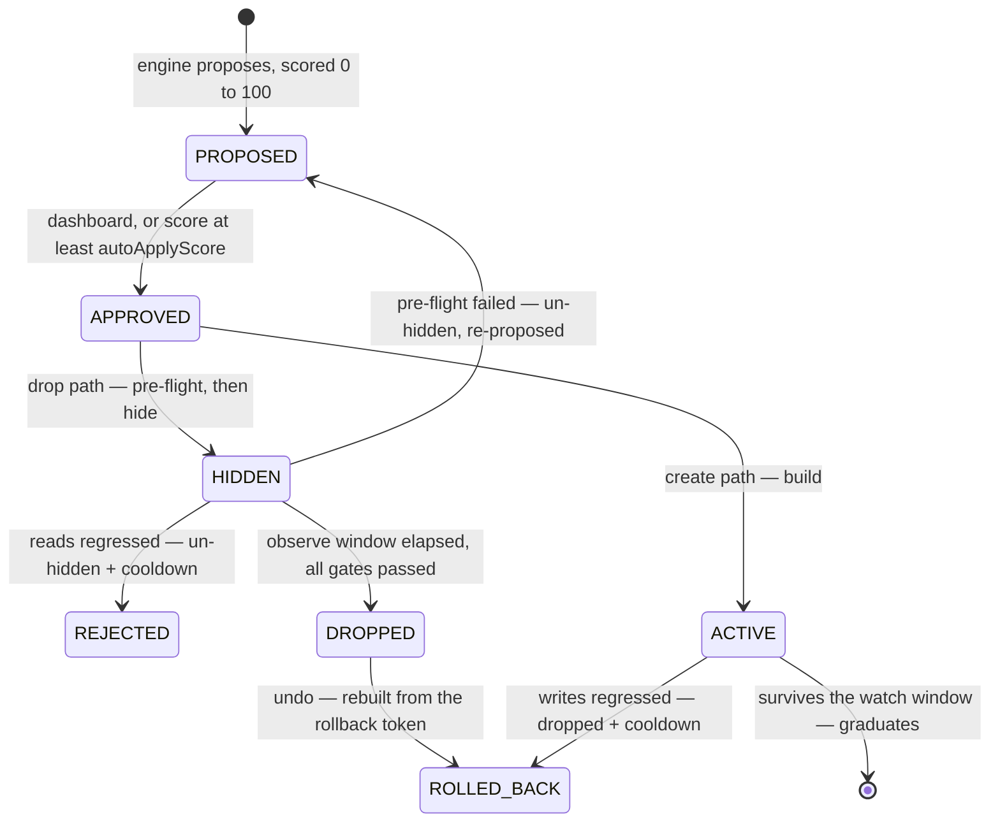

# Indexterity

Index dexterity for MongoDB. A SaaS that watches your indexes and manages them
safely — drop the unused and redundant, merge overlapping, extend prefixes,
create the missing — and proves the result in freed bytes and latency.

Read-only by default. The one irreversible step, a drop, is gated behind an
observe window, a pre-flight check, and a read-latency regression test.

Full design: the [Architecture](https://github.com/FullmetalBober/Indexterity/wiki/Architecture) page in the wiki. Every
load-bearing choice and whether it is still open: [`docs/decisions.md`](./docs/decisions.md).

## How it works

1. **Connect** a cluster with any connection string. Indexterity first reports
   what that string can actually do — nothing stored, nothing written. If it can
   create users, it *asks* before provisioning its own least-privilege user
   (`idx_<hex>`, no `find` on your collections, so it **cannot read documents**).
   The admin string is used once and never persisted; only the scoped one is
   stored, sealed with envelope encryption.
2. **Collect** hourly via `$indexStats` / `$collStats` — usage, sizes,
   per-collection read/write latency. Never your documents. What gets *stored* is
   only what changed: an index's shape is written once, and an unchanged counter
   extends the row it already has instead of adding another.
3. **Decide** with a pure analysis engine (`apps/api/src/analysis` — no I/O, so
   it is unit-tested without a database or a cluster).
4. **Apply** safely: `hide → observe → drop` for removals, `build` for
   additions. Clusters start read-only; an owner flips them live.
5. **Prove ROI**: freed bytes and the $/month they cost, index-count delta, and
   a before/after latency trend per collection.

## What it decides

**Dropping.** Each index gets a usage class from its op-count history
(`FLAT_ZERO`, `CONTINUOUS`, `PERIODIC_ALIVE`, `PERIODIC_DEAD`). Dead usage or
redundancy earns a proposal.

A usage claim needs a history worth trusting: **at least a week of it, and at
least three days in which the collection was actually queried**, with no hole
over 48h, a recent newest snapshot and no counter restart. The week is the
warm-up; the activity requirement is what makes it mean something. An index
reads zero either because nobody needs it or because nobody touched the
collection — elapsed time cannot tell those apart, so an always-on but idle dev
cluster would otherwise accumulate a month of "proof" without doing any work.
Hours in which the collection served no reads simply do not count.
Redundancy is structural and unaffected.

Every one of those thresholds is expressed in **hours**, not in collect
intervals. Two of them used to be interval counts, which meant they only said
what they appeared to say while the cadence stayed at 6h: shorten it and the
engine would have started calling indexes dead on three hours of evidence
instead of three days, with no code change and nothing failing. That is what
made the cadence safe to move. A newly connected cluster is also collected
immediately rather than at the next scheduled pass — the cold start was always a
separate problem from the cadence, and it has a separate fix.

**The cadence is hourly, and the ceiling on it is one table.** Storing only what
changed made index history nearly free — measured on real data, 76% of looks
collapse into an extended run — but `latency_samples` collapses *none* of them.
`$collStats` totals move on any operation, so a live collection differs at every
look and there is nothing to run-length: that table grows in step with the
cadence while index history grows at about a quarter of the rate. Hourly is a
usable trend where 6h gave four points a day; going shorter is a question for
`getLatencySeries` becoming bounded and old latency history being rolled up
first, not a question of load. A collect takes under a second against a hundred
collections, and about a round trip per collection against a remote cluster.

**Never dropped**, whatever the usage: `_id_`, unique (including unique partial
and sparse — a constraint is not a performance hint), TTL, and shard-key
indexes. They surface as advisories instead. Partial and sparse indexes without
a constraint *are* droppable: the pipeline hides and measures rather than
trusting the counter.

**Adding** (opt-in via `workloadAnalysis`). Query shapes come from `$queryStats`
on **mongo 8.0+**, and from the profiler below it. `$queryStats` exists from 6.0,
but until 8.0 it reports execution counts only — no `docsExamined`, no
`keysExamined`, no `hasSortStage` (verified against live 6.0, 7.0 and 8.2
servers). That is the difference between knowing a query ran and knowing it
scanned, so on 6.0 and 7.0 the profiler is the only source that can suggest an
index and the engine falls back to it. Either way `$queryStats` records nothing
until `internalQueryStatsRateLimit` is set — it is `0` by default, and connecting
a cluster says so if it is.

Two shapes earn an index. One is a **collection scan**. The other is a query
that finds its documents through an index and then **sorts them in memory** —
invisible to every scan test, because keys were examined, and the failure mode
that ends in an error rather than slowness, since a blocking sort dies at 100 MB.
The fix is usually extending the index that already found the documents so it
can order them too.

A shape must recur — **3+ sightings** — and must come from something other than a
person at a prompt. `$queryStats` groups by client and the profiler records
`appName`, so the same query from `mongosh` and from your app arrive as separate
entries; one seen only from shells and GUIs earns nothing, because the index
would be maintained on every write for years for queries nobody runs again. Keys
are ordered Equality → Sort → Range. An equality field compared against the same
literal every time moves into a `partialFilterExpression` instead of the keys:
smaller index, same query.

## The safety pipeline



Hiding (`collMod hidden:true`) is instant and reversible, and starts the observe
window. Before the drop, `finalize` gates it three ways:

- **Observability.** `$collStats` counters reset when mongod restarts, so a
  restart mid-window leaves a baseline that means nothing. That reads as
  UNOBSERVABLE, never as "no regression" — the index is un-hidden and
  re-proposed rather than dropped on evidence that no longer exists.
- **Regression.** Read latency above `baseline × 1.5` un-hides the index and
  parks it in a cooldown that escalates on repeats, so it is not re-proposed
  and re-cycled.
- **Pre-flight.** Index now protected, covering index gone, or fresh ops on it
  → un-hide and re-propose.

Additions get the mirror treatment: write latency is baselined at build time,
and an index that slows writes during its watch is dropped and cooled down. One
that survives graduates.

Every executed operation writes an immutable `actions` row.

Two escape hatches on the dashboard. **Keep it** cancels a pending drop while
the index is still hidden: it becomes visible again immediately and is parked
for 90 days so the engine does not re-propose it. **Undo** rebuilds a dropped
index from the spec captured at drop time and corrects the ROI headline back
down. Neither counts as a regression — that number feeds the score, and nothing
regressed.

Undo is available for as long as the plan keeps history: the spec it rebuilds
from lives in the audit trail, and the audit trail ages out with everything
else. A settled recommendation — dropped, rejected, rolled back — is removed
once it passes the window, along with its actions. Live ones never are, however
old: an index hidden through a long outage is still waiting on its own observe
window. The ROI it earned stays either way, unattributed rather than deleted.

**The score.** Every recommendation carries 0–100, and the scale is calibrated
so 100 is reachable and means "as sure as this engine gets". Drops: the argument
is worth 55 (redundant), 50 (never used) or 35 (was periodic, went quiet); a
month of unbroken history adds up to 25; reclaimable space up to 20. Creates: 40
for a live collection scan, up to 35 for frequency, up to 25 for collection size.
Each past regression on the same index subtracts 40, so one is nearly
disqualifying and two are. The score gates *entry* only — every safety stage runs
regardless.

## Policy knobs (per cluster)

| knob | effect | default |
|------|--------|---------|
| `readOnly` | compute everything, never write | on |
| `workloadAnalysis` | enable the create/merge/update engine | off |
| `instantCreate` | build critical missing indexes without approval | off |
| `observeWindowDays` | baseline bake time for a hidden index; scaled per index (below) | 30 |
| `maxCollectionSizeBytes` | size ceiling for building new indexes | — |
| `autoApplyScore` | the one auto-approval control: empty = you approve everything, `0` = everything auto-approves, `1`–`100` = a confidence floor. **70 is the suggested setting.** Advisories never auto-approve | empty |
| `changeWindowStartHour` / `EndHour` | elective changes run only in this UTC window; safety rollbacks never wait | engine-chosen |

**The observe window scales to the index.** `observeWindowDays` is the baseline;
each pending drop gets its own, decided once at hide time and recorded with its
reason. The window is set by whichever question is still open, and the two run
on different clocks — *will anything want this again* at the cadence of the
workload, *did hiding it hurt* at the rate the index is queried:

| the index | window | |
|-----------|--------|---|
| periodic usage (monthly report, weekly batch) | 2× the largest activity gap, ≤ 90d | might be wanted next cycle |
| queried about daily, and still when hidden | 7d | a regression arrives in days, not weeks |
| in place ≥ 2× the policy and used in that time | 1.5× the policy, ≤ 90d | may have a cadence longer than we have watched |
| zero usage across ≥ 2× the policy | half the policy, ≥ 7d | the history already was the observation |
| appeared on our watch, never used since | about as long as it has existed, ≥ 7d | its whole life is on record |
| anything else | the policy | |

Order matters in the first two rows. A quarterly job that runs densely for a
week is periodic, not busy, so the cadence rule is checked first. And "still"
is narrow: an index that *was* busy and went quiet a week ago gets no fast
verdict from being hidden, because nothing is querying it to notice — that one
is back to a cadence question, and waiting is the only answer.

The last two handle a hand-made ad-hoc index: created, used once, forgotten. Its
whole life is on record, so it leaves in about a week instead of a month. Age
only counts when the index appeared *after* we started watching — snapshots
begin at onboarding, so an index in the first one may be five years old.

**Every five minutes, a health probe.** Two things, in order.

First the server as a whole. CPU is not available — mongod reports none outside
FTDC — but `serverStatus` reports what the query engine is *doing*: collection
scans, documents and index keys walked, sorts run with no index to order by, and
operations queued behind the global lock. The signal is **documents walked per
index key**, which is volume-independent, so it reads the same on a small
cluster and a large one. A loaded CPU could be a backup or a noisy neighbour;
thousands of documents per key is a missing index and nothing else. This catches
a scan storm spread thinly across many collections that no single collection's
latency would show.

Then per collection: a missing index shows up as average read latency climbing
while the collection keeps serving traffic. When reads get sharply slower than
their own baseline, the workload pass runs immediately instead of waiting for the
hourly one. Only the busiest 20 collections are probed, and the readings are
never written to `latency_samples` — that table's hourly cadence is what the
activity gate and the change-window inference reason over.

`serverStatus` is the one privilege that reads beyond index metadata, so it is
optional: a cluster without it onboards clean and simply loses the first half of
the probe. [Connecting a cluster](https://github.com/FullmetalBober/Indexterity/wiki/Connecting-a-cluster) says exactly what it
exposes.

**The change window picks itself.** Left unset, the engine buckets the cluster's
own traffic into the four 6h slots of the UTC day and takes the quietest,
re-deriving after every collect. It declines to guess on a flat day or thin
history, and an explicit setting always wins.

## Plans

| | clusters | seats | index suggestions | unattended changes | history |
|---|---|---|---|---|---|
| **FREE** | 1 | 3 | yes | — | 90 days |
| **PRO** | 5 | 15 | yes | yes | 183 days |
| **SCALE** | unlimited | unlimited | yes | yes | 365 days |
| **SELF_HOSTED** | 1 | unlimited | yes | yes | 365 days |

**A plan is per organization.** Every number above is that org's, so a customer
with a free side project and a paid production team holds two orgs on two plans
and is billed for one of them. How many organizations you make is therefore
**not** metered — capping it would cap how much you can buy — and the free tier
is held by the cluster limit, applied inside each org one at a time.

**Free gives away the analysis and sells the automation.** Every plan sees every
recommendation, with the reasoning, and can approve any of them by hand. What a
paid plan adds is not having to: `autoApplyScore` (approve by score) and
`instantCreate` (build a critical missing index immediately). The safety
pipeline — hide, observe, regression-gate, roll back — is what makes unattended
changes safe to run, and it is the part that took the work.

The rules live in one table in `apps/api/src/billing/plans.ts`; nothing else
decides them. Limits are enforced by the api, not drawn in the dashboard, and a
refusal comes back as **402** rather than 403 — the caller is an owner, so
"forbidden" would send them looking for a permissions problem they do not have.
Seats count members **plus outstanding invites**, so an org cannot invite past
its plan and leave the refusal for whoever clicks the link; better-auth's own
`membershipLimit`, which counts members only, is deliberately left unset so that
there is one limit with one name. A downgrade never deletes anything: an org
over its new limit keeps what it has and simply cannot add more, and an
auto-approve score saved on a paid plan stops being obeyed without being erased
— it comes back on upgrading.

History is enforced, not advertised — but **enforced on read, not by deletion**.
Two questions with different answers: how long rows are *kept*, and how much of
them a plan may *see*. Deletion runs one cutoff for the whole deployment (the
longest window any plan could claim), so it sweeps a contiguous range instead of
hunting rows tenant by tenant. The plan's own window is applied at every read of
the time-series tables — the engine's reads as much as the dashboard's, since a
longer series is precisely what lets the engine call an index unused at all.

So **an upgrade returns your history at once.** Before, a free org moving to a
paid plan got nothing extra until ninety more days had passed, because the rows
it was newly entitled to had already been deleted. Now they were there all along,
merely out of view. It costs very little, because run-length storage means an
idle index is one row whether it is retained for ninety days or a year.

`RETENTION_DAYS` remains the operator's ceiling and caps both halves — storage is
their bill, so a plan may keep less than the cap but never more. Rows past the
longest plan's window are deleted outright: nobody could ever be entitled to
them. Settled recommendations still age out on their own plan's clock, because
"we kept last year's decisions and merely stopped showing them to you" is a
different promise from "we deleted them", and that table does not grow per
collect anyway.

**`SELF_HOSTED` is not a tier anyone buys.** It is the BUSL Additional Use Grant
expressed as entitlements — one production cluster, everything else on — and it
is what the chart ships. The licence caps production clusters and says nothing
about features, seats or history, so neither does this. Shipping self-hosters
the hosted free tier would restrict them further than the licence they are
complying with, on hardware they pay for themselves.

**No payment provider is wired, on purpose.** Plans are set with
`node apps/api/dist/set-plan.js <org> <PLAN> [note]` — enough to charge by
invoice today, from anywhere, with no processor account. Whoever eventually
takes the money only decides *which* plan an org is on; a webhook would write
the same column that CLI does, and the entitlements above would not change.

## Connecting a cluster

**MongoDB 6.0 to 8.x.** 4.4 and 5.0 are past end-of-life and have no
`$queryStats`, so they are refused rather than supported half-well. A server
below the floor is refused at connect time with that explanation, and every
write re-checks the version immediately before running, so a cluster downgraded
or repointed later cannot be half-changed. A major series newer than anything
tested is refused too — this engine drops and builds indexes on a live database,
and a major release is where command behaviour moves. Set
`ALLOW_UNTESTED_MONGO_VERSION=true` to run ahead of the tested range.

See [Connecting a cluster](https://github.com/FullmetalBober/Indexterity/wiki/Connecting-a-cluster) for the exact `createRole`
snippets. Indexterity never gets document read or write privileges.

**Replica sets** — `$indexStats` is per member; usage sums all of them, so an
index used only on a secondary counts as used.

**Sharded clusters** — point at the `mongos`. Stats aggregate across shards, and
each collection's shard key is read from `config.collections` so any index it
prefixes is protected. Without config read, the collection is treated as
unsharded.

## Auth & tenancy

Every endpoint requires a better-auth session and is scoped to the caller's org.
The browser holds that session itself: the api answers under `/api` on the
dashboard's own origin, so the cookie is first-party and travels with every call
without CORS or `SameSite=None`. Set `WEB_ORIGIN` and `BETTER_AUTH_URL` on the
api to that origin — it is what better-auth trusts for auth requests and
redirect targets, and what the links in reset emails are built from.

The dashboard used to be a BFF, relaying all 28 calls through the web server
because the api was on another origin. It is not one any more; see
[One origin](#deploy) for what that requires of a deployment.

Tenancy is **better-auth's `organization` plugin**, mapped onto the tables the
api already had (`apps/api/src/auth/organization.ts`). Creating, renaming and
deleting an org, inviting, accepting, changing a role, removing a member,
leaving and switching are all its endpoints under `/api/auth/organization/*`.
Two reads stay on the api because the plugin has no opinion about them: `GET
/api/org`, which carries the plan and how much of it is spent, and `GET
/api/orgs`, which carries the caller's role in each.

Org creators are **owners**, invited users are **members**, and there is no
third rung — the plugin's `admin` role is refused, because half the api still
asks only "are you the owner?". Members read everything; every mutation is
owner-only.

**You make an organization, and you can delete one.** Neither used to be
possible: an org appeared as a side effect of the first authenticated request,
called `My Org`, and an empty one was quietly deleted again when its owner
accepted an invite. A fresh account now belongs to nothing and lands on a
create-org screen, which is also where an invitation waiting for it appears.
Making the *next* one lives on the organization page, and nothing limits how
many — see **Plans** for why.

**Invitations are addressed, not bearer.** They used to be a one-time token
mailed out and pasted back, which meant whoever held the string could join. The
invitation id is not a secret now: accepting requires being signed in as the
invited address, so the api lists your own invitations to you instead. Seven-day
expiry, emailed when `SMTP_*` is configured and a logged no-op otherwise.

**The switcher is per session**, not per user (`session.active_organization_id`
replaced a `members.is_active` flag), so two browsers can sit in two different
orgs.

**Deciding who is asking is cheap.** The session resolves once per request
(memoized in `auth/session.ts` — some endpoints ask more than once), and usually
without touching postgres: `session.cookieCache` carries it in a five-minute
signed cookie. A session change invalidates that cookie in the same response —
switching orgs re-signs it, and every other org mutation expires it (better-auth
stops at the session row there, so `auth.config.ts` closes the gap in an after
hook) — and the api re-arms it on ordinary responses. Membership and role are
still read fresh on every request, so removals and role changes bite
immediately. The trade is revocation: a session torn down behind the browser's
back keeps answering for up to the window — sign-out is not that case, it clears
both cookies in the same response.

**Deleting an org is the dangerous verb**, because an org is not a row. Cascades
take the clusters and everything under them; they touch nothing on the
customer's servers. So the delete runs the same restoration a disconnect does —
any index parked in an observe window is un-hidden first — and the confirmation
dialog makes you type the org's name and names every least-privilege user
Indexterity created on your clusters, with the command to drop it. After the
org is gone there is nothing left to name them from.

## Stack

Turbo monorepo · NestJS + Fastify (api) · TanStack Start + TanStack Query +
TanStack Form + TanStack Table + TanStack Virtual + TanStack Charts + shadcn (web) ·
better-auth · Drizzle +
PostgreSQL · oRPC contracts (zod 4) · graphile-worker · Biome · strict
TypeScript (no `any`, no `as`, no lint-ignore).

```
apps/api                control plane
  src/analysis          pure decision engine — no I/O, unit-tested without infra
  src/engine            engine-neutral ports (collector, executor, session)
  src/mongo             the MongoDB adapter; zod-parses driver output at the boundary
  src/jobs              graphile-worker tasks (collect/classify/suggest/apply/finalize)
  src/db                Drizzle schema, client, secret sealing
apps/web                dashboard
  src/routes/app.tsx    the /app shell — auth gate, cluster bar, org switcher
  src/routes/app.index  the cluster dashboard
  src/routes/app.org    members, roles, invites, plan
  src/lib/api.ts        one oRPC client, isomorphic: same-origin in the browser,
                        API_URL with the caller's cookie during SSR
  src/lib/auth-client   better-auth's own browser client
  src/lib/queries       the query layer: the client, one key per api call in
                        keys.ts, and mutations/ grouped by what they change
  src/components/form   TanStack Form bound once to shadcn's Field primitives —
                        every form in the app is built from these
  src/components/data-table  TanStack Table bound once to shadcn's table
                        primitives; the three dashboard tables are column defs.
                        The two unbounded ones virtualize their rows
  src/components/latency-chart  TanStack Charts behind a props-stable wrapper —
                        pre-1.0, so churn is contained to this one file
  src/router.tsx        the one query client, and the SSR dehydrate/hydrate wiring
packages/contracts      oRPC + zod contracts shared by api and web
  src/schemas.ts        what the api returns
  src/inputs.ts         what it accepts — and what the dashboard's forms validate
                        against, so a field refuses exactly what a route refuses
```

Route loaders are the SSR entry point and write **through** the query client, so
the server render and the browser read one cache entry; mutations invalidate a
key rather than re-running loaders. **One key per api call** — a cache entry
holding three answers is three questions sharing a cache line, and it showed:
the org page fetched a cluster list it never draws, and a failing latency read
blanked the collection table beside it. The wiki's [Architecture](https://github.com/FullmetalBober/Indexterity/wiki/Architecture)
page, under Web / dashboard, has every key and the things that turned out to be
load-bearing.

Forms are TanStack Form, validated against the api's own input schemas from
`packages/contracts` — so a password the sign-up field accepts is one better-auth
accepts, and the rule lives in exactly one place. Values reach a mutation with
`mutate()`, not through the render, which is why nothing in a form needs
`useState` any more.

Tables are TanStack Table, sortable and filterable, rendered through the same
shadcn primitives as before — a column is one object saying how to read a value,
draw it and sort it, rather than a header cell in one place and a body cell in
another.

The two whose row count is bounded only by how big the customer is —
recommendations (collections × indexes) and the per-collection footprint —
virtualize with TanStack Virtual: a screenful of rows in the DOM whatever the
row count, bracketed by two spacer rows rather than absolutely positioned, so the
columns stay aligned and a `<table>` stays a table to a screen reader. The height
is a *maximum*, so a small cluster's table renders at its natural height and looks
untouched.

The latency charts are TanStack Charts, which is pre-1.0 and therefore kept behind
`LineChart`'s unchanged `{title, unit, series}` props: a breaking release is one
file. It replaced recharts, which cut **65 KiB gzipped** off the client bundle
(361 KB → 294 KB, measured) and made the charts render server-side — recharts 3
draws client-only, so the panels used to pop in after hydration.

Everything engine-specific sits behind the ports in `src/engine`, so PostgreSQL
and SQL Server adapters can slot in without pipeline changes — the data model
already carries an `engine` field.

## Develop

```bash
cp .env.example .env      # then fill secrets
npm install
podman-compose up         # postgres + mongo + api + web + worker, hot reload
# or npm run up           # the same, and recovers from stale container state
```

`podman-compose up` (or `docker compose up`) works directly — `npm run up` is a
convenience, not a requirement. It adds one thing worth having: when a logout or
reboot clears `XDG_RUNTIME_DIR` while podman still has containers recorded,
their crun state is gone and `up` fails with `cannot open .../exec.fifo`. They
can then only be removed, so the wrapper recreates them and says so. Named
volumes are untouched by that, so the databases survive — by hand it is
`podman rm -f` the containers and up again.

It also drops `node_modules/.bin` from PATH, which matters only when compose is
reached *through* npm: npm prepends that directory, `@vercel/nft` installs an
`nft` binary there, and podman's network backend shells out to `nft` meaning
nftables. Typing `podman-compose up` yourself never hits it.

`npm run build` · `npm run typecheck` · `npm run lint` · `npm run test` ·
`npm run db:generate` · `npm run db:migrate`. Production migrations run the
compiled migrator: `npm run db:deploy -w @repo/api`.

`npm run lint` is Biome plus `scripts/lint-tailwind.mjs`, which fails the build
on a Tailwind arbitrary value that has a canonical utility (`w-[220px]` is
`w-55`). That warning comes from the editor's Tailwind integration and nothing
else — Biome has no rule for it and Tailwind v4 ships no lint binary — so
without it the rule was observable while typing and unenforceable in CI. Vendored
`components/ui` is exempt: rewriting registry code forks it, and the next
`shadcn add` puts it back.

Both install **two** schemas: `public`, which Drizzle owns, and
`graphile_worker`, which the job queue owns. The queue would install its own on
first boot, but the api and the worker start together, and anything that queues
a job before the worker wins that race fails against a schema that is not there
yet. Migration creates schemas, so migration creates both.

**Versioning.** One number for the whole product, in the root `package.json`.
`npm run version:set 0.2.0` writes it to every workspace and to the chart's
`version` and `appVersion`; `npm run version:check` asserts they agree and runs
in CI. Releasing is `git tag v0.2.0 && git push --tags`, and the release
workflow refuses a tag whose version the tree does not carry.

**Four test layers**, currently 392 api unit, 184 web unit, 75 integration and
23 end-to-end. The e2e suite deliberately runs with **no proxy in front**, so the
passthrough is the path under test — the proxy shape is covered by compose and
the chart, and a fallback nothing exercises is a fallback that is broken when
someone needs it. `npm run test` runs the first two without any infra: the api's
pure decision engine, and the web app's components in jsdom with the api client
mocked at the `~/lib/api` boundary — what the browser does with an answer, not
whether the answer was fetched. That boundary moved when the relay went: it was
`~/lib/app-server`, and mocking the api client instead puts the mutation hooks'
own error handling under test rather than stubbing it out alongside the
transport. `npm run test:int -w
@repo/api` needs a migrated postgres and a mongo, and CI runs it against **6.0,
7.0 and 8.x** because the three take different paths through the workload
collector. `npm run test:e2e` builds both apps and drives a real browser
through them with Playwright — nothing mocked, all the way to postgres and
mongo. And `deploy/kind-test.sh` installs the Helm chart into a throwaway Kind
cluster, runs `helm test`, signs up and connects a cluster over cluster DNS,
and fails if any pod logged a warning.

The layers catch different things, and the top ones are not decoration. The
end-to-end suite found that the api's session cookie was being percent-encoded
a second time on its way through the web server, so every request after signing
in came back 401 — both sides correct on their own, the defect in the hand-off.
It also found the dashboard drawing itself twice: the server fetched everything,
the browser hydrated against an empty query cache and fetched it all again. Both
renders were correct, so only a browser could see it. The Kind run found that the
chart could not install at all: its migration hook referenced a ServiceAccount
and a Secret that hooks run before, and the api's auth signing key was written
into the Secret and never handed to a container. `helm lint` passed throughout.
Rendering valid YAML and being installable are different questions.

**A superseded CI run is cancelled, not finished.** Push again to a pull request
branch and the previous run stops: it is answering about a commit nobody is
looking at any more, and holding a runner while it does. Pushes to `main` and
`dev` are exempt — those runs are the record of whether an integration branch is
sound, and a cancelled one leaves a commit with no verdict. The release workflow
has no such rule at all, since a half-published release is worse than a slow one.

**House rule: the api and the web app run clean.** No errors and no warnings in
server logs, build output, or the browser console. A warning is a defect — fix
the cause, don't silence it. See architecture §16.

## Security posture (defaults)

Both defaults exist because the control plane dials hosts that users name.

- **Sign-up is invite-only** (`SIGNUP_MODE`). The first account bootstraps the
  install. `open` hands that outbound reach to strangers.
- **Private targets are refused** unless `ALLOW_PRIVATE_CLUSTER_TARGETS=true`.
  Cloud metadata ranges stay blocked either way, DNS and SRV are resolved before
  dialing, and every host in a multi-host string is checked.

### What lands in the control-plane database

Index names, field names, collection names, and counters — sizes, op counts,
latency totals. Not documents: the provisioned role cannot read them, so there
is nothing to store.

**And it lands once.** Storage tracks how much a cluster *changes*, not how often
we look at it. An index's shape and its `(database, collection, name)` are
constants of the index, so they live in one `cluster_indexes` row rather than
being rewritten on every collect — the spec alone was two thirds of a snapshot
row and 2.4× the counter it accompanied. The counter itself is stored as a **run**:
a row covers `[capturedAt, lastSeenAt]`, and a collect that finds it unchanged
moves the end forward instead of inserting a duplicate. Simulated over a year at
the then-current 6h cadence, the two together are **86% smaller** (30% from the shape alone),
and an index nobody touches costs **one row instead of 1,460**.

That is what makes collecting more often a load question rather than a storage
bill — but the reason it needed care is the other direction. A hole in the series
means *"we stopped watching, so absence of usage proves nothing"*, so an idle
index that simply stopped producing rows would be indistinguishable from a
cluster we lost, and "cannot tell" would get spelled "all clear". A run is the
positive form of the claim — **we looked at `lastSeenAt`, and it was still this** —
and the collector refuses to extend one across a hole the classifier would object
to, so an outage still shows up as an outage.

Two things hold that rather than one. The collector's refusal is the first, but it
put half of a safety invariant in a different file from the half that depends on
it, with nothing in the data to check against — so each run also records the widest
gap inside its own span, and the classifier *asks* rather than assumes. Overlap is
ruled out by the database itself, with an exclusion constraint over the interval
each row covers: readers find holes by differencing one run's end against the
next's start, so an overlap would be a *negative* gap, which reads as no gap at
all.

One exception, and it is deliberate. A **partial index** needs the literal value
in its filter — `partialFilterExpression: { status: "active" }` cannot be built
without knowing `"active"` — so equality literals from the profiler can reach
the database. What survives to get there is narrow: only fields whose value was
identical in **every** sample, which drops anything per-user or per-request on
its own, and then only values short enough to be a discriminator, never one
shaped like an ObjectId or a UUID. The values that are useful as a partial
filter and the values that are safe to hold are the same set, which is what
makes the rule easy to keep. `$queryStats` never carries literals at all — it
shapifies them to `?string` before we see them.

## Deploy

Slim images via `turbo prune` (api ≈ 390 MB, web ≈ 235 MB):

```bash
docker build -f apps/api/Dockerfile -t indexterity-api .
docker build -f apps/web/Dockerfile -t indexterity-web .
```

One web image serves every environment — `API_URL` and `WEB_ORIGIN` are read at
runtime, and nothing about the api's address is baked into the browser bundle:
it calls `/api` on whatever origin served the page. `API_URL` is now only the
web server's own SSR reads. The worker deploys from the api image with
`CMD ["node", "apps/api/dist/worker.js"]`, or set `RUN_WORKER=true` to embed it
in the api for a one-container install. Hosted should keep them separate: an api
rollout would otherwise abort an in-flight index build, and the alert cooldown
assumes a single worker.

**One origin, guaranteed by the app.** The browser calls the api itself, so the
session cookie only works if both answer on one origin. That is arranged twice
over, and the difference is a hop rather than whether it works:

- **A proxy in front** routes `/api` to the api and `/` to the dashboard, which
  is what the ingress does. Zero hops — the api answers directly.
- **Nothing in front?** The dashboard server answers `/api` itself and forwards
  it (`src/lib/api-passthrough.ts`). One transparent hop, no configuration, and
  the cookie is still first-party because the origin never changed.

So `helm install` without an ingress works, a port-forward works, `npm run dev`
works, and compose works — none of them needs a proxy container to put the two
back on one origin. Set up the proxy rule when you want the hop back; the
`indexterity_web_requests_total{kind="api"}` counter is non-zero exactly when
you have not, which is how a missing ingress rule stops being silent.

This is *not* the relay that used to live here. That was 28 typed wrappers
re-setting cookies onto a different origin, which needed hand-rolled decoding to
survive being encoded twice. This is one pass-through: same origin in and out,
`Set-Cookie` forwarded byte for byte, nothing to re-encode.

Two things it does not do. It strips `x-forwarded-*` and `x-real-ip` from the
client unless `TRUST_PROXY=true`, because forwarding a header a browser could
have written lets a caller pick its own address and never reach the api's
per-IP rate limit. And it never rewrites `Origin`, which better-auth checks
against its trusted origins.

The cost of the browser reaching the api at all is that the api is publicly
reachable. Its rate limiting, origin checks and auth guard used to be a second
line of defence behind an unreachable address; they are now the only line.
Nothing about them changed, but their importance did.

A Helm chart is in [`deploy/helm/indexterity`](./deploy/helm/indexterity) —
api + dashboard + worker, a pre-upgrade migration hook, ingress, and a
`helm test`. Bring your own PostgreSQL.

### Metrics

`METRICS_ENABLED=true` serves Prometheus metrics on port 9464 (`METRICS_PORT`)
from all three workloads. The chart turns it on and can install a ServiceMonitor
per workload; compose publishes them on 9464 (api), 9465 (worker) and 9466 (web).

Each answers for what only it can see, so scrape all three. The five things a
service that drops other people's indexes has to be able to state:

| question | metric |
|---|---|
| how many clusters can we not reach right now | `indexterity_clusters_unreachable` |
| how long is the job queue | `indexterity_jobs{state="queued"}`, `indexterity_jobs_oldest_queued_age_seconds` |
| how many drops are mid-observe | `indexterity_recommendations{state="HIDDEN"}` |
| how often does the regression gate fire | `indexterity_regression_gate_decisions_total{verdict="regressed"}` |
| what is the dead-letter rate | `rate(indexterity_job_runs_total{outcome="dead_letter"}[1h])`, backlog in `indexterity_jobs{state="dead_letter"}` |

An unreachable cluster is a *handled* condition — the tick is skipped and
retried, nothing fails — so the queue counters cannot see it and
`indexterity_cluster_task_runs_total{outcome=...}` is where the six ways a tick
can end are told apart.

The dashboard server reports what the api cannot. `indexterity_web_document_duration_seconds`
is render time per route pattern — the thing the reader waits on.
`indexterity_web_api_requests_total{procedure,status}` is the api measured from
the other end of the network, with `status="unreachable"` for the case the api can
never report itself; it matters because the loaders *swallow* api failures and
render an empty panel, so one procedure returning 500 is otherwise unrecorded. A
500 that never reached the api at all shows up as
`indexterity_web_requests_total{kind="document",status="500"}`.

That api counter is **SSR reads only** since the browser started calling the api
directly — a reader clicking Approve does not pass through this process at all,
and the api's own counters are where those land. `kind` on the request counter
lost its `server_fn` value for the same reason: there are no server functions
left, and a series that is always zero reads as "no traffic" rather than "no
such thing".

**The endpoint has no auth**, which is why it is a second port instead of a route
on the app: an ingress routes the app port, so publishing a host does not publish
this. Instrumentation is OpenTelemetry (`@opentelemetry/sdk-metrics`) with the
Prometheus exporter, wired once in `packages/metrics` — pointing it at an OTLP
collector instead is a change to that one file. Pod CPU and memory come from the
platform, not from here.

`metrics.prometheusRule.enabled=true` installs 18 alerts with the metrics, because
a scrape endpoint nobody wrote queries against is a scrape endpoint nobody reads.
They cover the failures that are otherwise silent — a schedule that stopped
running logs nothing, since nothing runs. Two are shaped by traps worth knowing:
`absent_over_time` rather than `increase` for a dead process (a stale series
matches no `== 0` comparison, so the obvious rule is silent exactly when it
matters), and the alerts watch the `schedule*` dispatchers rather than the
per-cluster tasks, which stop legitimately when the last cluster is offboarded.
`deploy/helm/indexterity/README.md` has the thresholds and the label-selector
gotcha.

## Open

Planned work lives on the [project board](https://github.com/users/FullmetalBober/projects/6),
not here — a roadmap in two places is a roadmap that disagrees with itself. What
follows is the reasoning behind decisions already taken, which the board does not
carry.

**Atlas Admin API onboarding is dropped, not deferred.** An admin API key is a
bigger ask than the `createRole` snippet it would replace, and it hands us a
credential to guard. Atlas clusters get the guided 422 naming the commands to
run in their own console.

**How urgent a missing index is** comes from `docsExamined` — the documents the
server actually walked — not from table size:

| the scan | treatment |
|----------|-----------|
| ≥ 10M documents walked, or ≥ 500k per execution | **critical** — auto-approved with `instantCreate`, and the build skips the change window |
| ≥ 1M walked, or a collection over 100k documents | elevated — auto-approved with `instantCreate`, build waits for the window |
| anything smaller | routine — proposed for a human |

Workload analysis runs **hourly**, on its own half-hour offset from the collect
pass rather than behind it, because a missing index costs on every execution and
most of the old delay was waiting to notice. A critical scan now goes from first
sighting to built index in minutes rather than the better part of a day.

**A shape must recur, measured two ways.** A count floor of three stops someone's
ad-hoc query leaving an index behind. A rate floor — once a fortnight — stops the
quieter mistake: `$queryStats` accumulates for the life of the store, so on a
server up two months, three executions clears a count floor while describing a
query that runs roughly never. Both windows are measurable, so both are measured
(`analysis/workload.ts`).

## Licence

[BUSL-1.1](./LICENSE.md) — the Business Source License, converting to
Apache-2.0 four years after each release.

**Source-available, not open source**, and the difference is worth stating
plainly rather than borrowing a label: the Open Source Definition requires no
restriction on commercial use, and this restricts one on purpose.

| | |
|---|---|
| **Non-production use** | free and unlimited — evaluation, development, testing, demos |
| **Production, one cluster** | free, forever, company or not — with every feature |
| **What counts as one cluster** | one deployment behind one connection string — a three-node replica set is one, a sharded deployment behind its mongos is one |
| **Production, more than one cluster** | needs a commercial licence, or use the hosted service |
| **Reading, modifying, forking, contributing** | always permitted |
| **Reselling it or offering it as a service** | never permitted |

Each version becomes Apache-2.0 four years after it is published, so nothing
here is withheld permanently.

The Additional Use Grant is one connected cluster and nothing else, so the chart
ships `defaultOrgPlan: SELF_HOSTED` — one cluster, every feature on. It would be
easy to ship the hosted free tier here and cheap to justify; it would also
restrict you further than the licence you are complying with, which is a nudge
rather than a limit. The plan is not a security control and does not pretend to
be: anyone who owns the database can change it. The licence is what binds.

**Want more than the grant?** [hello@alivlad.com](mailto:hello@alivlad.com?subject=Indexterity%20commercial%20licence).
The copyright is held by one person, so a commercial licence is a conversation,
not a legal project.

## Notes

npm workspaces. Docker resolves to podman + `podman-compose` here; the compose
file works with either.
