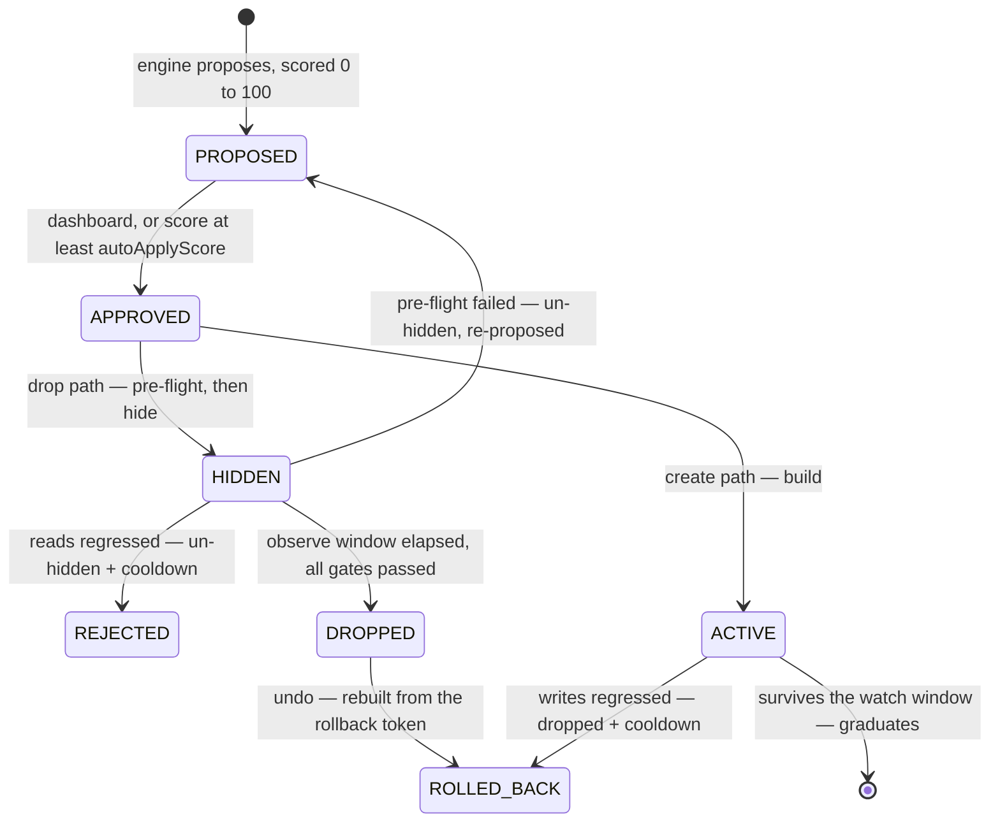

# Indexterity

Index dexterity for MongoDB. A SaaS that watches your indexes and manages them
safely — drop the unused and redundant, merge overlapping, extend prefixes,
create the missing — and proves the result in freed bytes and latency.

Read-only by default. The one irreversible step, a drop, is gated behind an
observe window, a pre-flight check, and a read-latency regression test.

Full design and decision log: [`docs/architecture.md`](./docs/architecture.md).

## How it works

1. **Connect** a cluster with any connection string. Indexterity first reports
   what that string can actually do — nothing stored, nothing written. If it can
   create users, it *asks* before provisioning its own least-privilege user
   (`idx_<hex>`, no `find` on your collections, so it **cannot read documents**).
   The admin string is used once and never persisted; only the scoped one is
   stored, sealed with envelope encryption.
2. **Collect** every 6h via `$indexStats` / `$collStats` — usage, sizes,
   per-collection read/write latency. Never your documents.
3. **Decide** with a pure analysis engine (`apps/api/src/analysis` — no I/O, so
   it is unit-tested without a database or a cluster).
4. **Apply** safely: `hide → observe → drop` for removals, `build` for
   additions. Clusters start read-only; an owner flips them live.
5. **Prove ROI**: freed bytes and the $/month they cost, index-count delta, and
   a before/after latency trend per collection.

## What it decides

**Dropping.** Each index gets a usage class from its op-count history
(`FLAT_ZERO`, `CONTINUOUS`, `PERIODIC_ALIVE`, `PERIODIC_DEAD`). Dead usage or
redundancy earns a proposal.

A usage claim needs a history worth trusting: **at least a week of it, and at
least three days in which the collection was actually queried**, with no hole
over 48h, a recent newest snapshot and no counter restart. The week is the
warm-up; the activity requirement is what makes it mean something. An index
reads zero either because nobody needs it or because nobody touched the
collection — elapsed time cannot tell those apart, so an always-on but idle dev
cluster would otherwise accumulate a month of "proof" without doing any work.
Intervals in which the collection served no reads simply do not count.
Redundancy is structural and unaffected.

**Never dropped**, whatever the usage: `_id_`, unique (including unique partial
and sparse — a constraint is not a performance hint), TTL, and shard-key
indexes. They surface as advisories instead. Partial and sparse indexes without
a constraint *are* droppable: the pipeline hides and measures rather than
trusting the counter.

**Adding** (opt-in via `workloadAnalysis`). Query shapes come from `$queryStats`
on **mongo 8.0+**, and from the profiler below it. `$queryStats` exists from 6.0,
but until 8.0 it reports execution counts only — no `docsExamined`, no
`keysExamined`, no `hasSortStage` (verified against live 6.0, 7.0 and 8.2
servers). That is the difference between knowing a query ran and knowing it
scanned, so on 6.0 and 7.0 the profiler is the only source that can suggest an
index and the engine falls back to it. Either way `$queryStats` records nothing
until `internalQueryStatsRateLimit` is set — it is `0` by default, and connecting
a cluster says so if it is.

Two shapes earn an index. One is a **collection scan**. The other is a query
that finds its documents through an index and then **sorts them in memory** —
invisible to every scan test, because keys were examined, and the failure mode
that ends in an error rather than slowness, since a blocking sort dies at 100 MB.
The fix is usually extending the index that already found the documents so it
can order them too.

A shape must recur — **3+ sightings** — and must come from something other than a
person at a prompt. `$queryStats` groups by client and the profiler records
`appName`, so the same query from `mongosh` and from your app arrive as separate
entries; one seen only from shells and GUIs earns nothing, because the index
would be maintained on every write for years for queries nobody runs again. Keys
are ordered Equality → Sort → Range. An equality field compared against the same
literal every time moves into a `partialFilterExpression` instead of the keys:
smaller index, same query.

## The safety pipeline



Hiding (`collMod hidden:true`) is instant and reversible, and starts the observe
window. Before the drop, `finalize` gates it three ways:

- **Observability.** `$collStats` counters reset when mongod restarts, so a
  restart mid-window leaves a baseline that means nothing. That reads as
  UNOBSERVABLE, never as "no regression" — the index is un-hidden and
  re-proposed rather than dropped on evidence that no longer exists.
- **Regression.** Read latency above `baseline × 1.5` un-hides the index and
  parks it in a cooldown that escalates on repeats, so it is not re-proposed
  and re-cycled.
- **Pre-flight.** Index now protected, covering index gone, or fresh ops on it
  → un-hide and re-propose.

Additions get the mirror treatment: write latency is baselined at build time,
and an index that slows writes during its watch is dropped and cooled down. One
that survives graduates.

Every executed operation writes an immutable `actions` row.

Two escape hatches on the dashboard. **Keep it** cancels a pending drop while
the index is still hidden: it becomes visible again immediately and is parked
for 90 days so the engine does not re-propose it. **Undo** rebuilds a dropped
index from the spec captured at drop time and corrects the ROI headline back
down. Neither counts as a regression — that number feeds the score, and nothing
regressed.

**The score.** Every recommendation carries 0–100, and the scale is calibrated
so 100 is reachable and means "as sure as this engine gets". Drops: the argument
is worth 55 (redundant), 50 (never used) or 35 (was periodic, went quiet); a
month of unbroken history adds up to 25; reclaimable space up to 20. Creates: 40
for a live collection scan, up to 35 for frequency, up to 25 for collection size.
Each past regression on the same index subtracts 40, so one is nearly
disqualifying and two are. The score gates *entry* only — every safety stage runs
regardless.

## Policy knobs (per cluster)

| knob | effect | default |
|------|--------|---------|
| `readOnly` | compute everything, never write | on |
| `workloadAnalysis` | enable the create/merge/update engine | off |
| `instantCreate` | build critical missing indexes without approval | off |
| `observeWindowDays` | baseline bake time for a hidden index; scaled per index (below) | 30 |
| `maxCollectionSizeBytes` | size ceiling for building new indexes | — |
| `autoApplyScore` | the one auto-approval control: empty = you approve everything, `0` = everything auto-approves, `1`–`100` = a confidence floor. **70 is the suggested setting.** Advisories never auto-approve | empty |
| `changeWindowStartHour` / `EndHour` | elective changes run only in this UTC window; safety rollbacks never wait | engine-chosen |

**The observe window scales to the index.** `observeWindowDays` is the baseline;
each pending drop gets its own, decided once at hide time and recorded with its
reason. The window is set by whichever question is still open, and the two run
on different clocks — *will anything want this again* at the cadence of the
workload, *did hiding it hurt* at the rate the index is queried:

| the index | window | |
|-----------|--------|---|
| periodic usage (monthly report, weekly batch) | 2× the largest activity gap, ≤ 90d | might be wanted next cycle |
| queried about daily, and still when hidden | 7d | a regression arrives in days, not weeks |
| in place ≥ 2× the policy and used in that time | 1.5× the policy, ≤ 90d | may have a cadence longer than we have watched |
| zero usage across ≥ 2× the policy | half the policy, ≥ 7d | the history already was the observation |
| appeared on our watch, never used since | about as long as it has existed, ≥ 7d | its whole life is on record |
| anything else | the policy | |

Order matters in the first two rows. A quarterly job that runs densely for a
week is periodic, not busy, so the cadence rule is checked first. And "still"
is narrow: an index that *was* busy and went quiet a week ago gets no fast
verdict from being hidden, because nothing is querying it to notice — that one
is back to a cadence question, and waiting is the only answer.

The last two handle a hand-made ad-hoc index: created, used once, forgotten. Its
whole life is on record, so it leaves in about a week instead of a month. Age
only counts when the index appeared *after* we started watching — snapshots
begin at onboarding, so an index in the first one may be five years old.

**Every five minutes, a health probe.** Two things, in order.

First the server as a whole. CPU is not available — mongod reports none outside
FTDC — but `serverStatus` reports what the query engine is *doing*: collection
scans, documents and index keys walked, sorts run with no index to order by, and
operations queued behind the global lock. The signal is **documents walked per
index key**, which is volume-independent, so it reads the same on a small
cluster and a large one. A loaded CPU could be a backup or a noisy neighbour;
thousands of documents per key is a missing index and nothing else. This catches
a scan storm spread thinly across many collections that no single collection's
latency would show.

Then per collection: a missing index shows up as average read latency climbing
while the collection keeps serving traffic. When reads get sharply slower than
their own baseline, the workload pass runs immediately instead of waiting for the
hourly one. Only the busiest 20 collections are probed, and the readings are
never written to `latency_samples` — that table's 6h cadence is what the activity
gate and the change-window inference count intervals in.

`serverStatus` is the one privilege that reads beyond index metadata, so it is
optional: a cluster without it onboards clean and simply loses the first half of
the probe. [`docs/mongo-user.md`](./docs/mongo-user.md) says exactly what it
exposes.

**The change window picks itself.** Left unset, the engine buckets the cluster's
own traffic into the four 6h slots of the UTC day and takes the quietest,
re-deriving after every collect. It declines to guess on a flat day or thin
history, and an explicit setting always wins.

## Plans

| | clusters | seats | index suggestions | unattended changes | history |
|---|---|---|---|---|---|
| **FREE** | 1 | 3 | yes | — | 90 days |
| **PRO** | 5 | 15 | yes | yes | 183 days |
| **SCALE** | unlimited | unlimited | yes | yes | 365 days |
| **SELF_HOSTED** | 1 | unlimited | yes | yes | 365 days |

**Free gives away the analysis and sells the automation.** Every plan sees every
recommendation, with the reasoning, and can approve any of them by hand. What a
paid plan adds is not having to: `autoApplyScore` (approve by score) and
`instantCreate` (build a critical missing index immediately). The safety
pipeline — hide, observe, regression-gate, roll back — is what makes unattended
changes safe to run, and it is the part that took the work.

The rules live in one table in `apps/api/src/billing/plans.ts`; nothing else
decides them. Limits are enforced by the api, not drawn in the dashboard, and a
refusal comes back as **402** rather than 403 — the caller is an owner, so
"forbidden" would send them looking for a permissions problem they do not have.
Seats count members plus outstanding invites, so an org cannot invite past its
plan and leave the refusal for whoever clicks the link. A downgrade never
deletes anything: an org over its new limit keeps what it has and simply cannot
add more, and an auto-approve score saved on a paid plan stops being obeyed
without being erased — it comes back on upgrading.

History is enforced, not advertised: the prune job groups clusters by their
org's plan and applies a cutoff per group. `RETENTION_DAYS` remains the
operator's ceiling — storage is their bill, so a plan may keep less than the cap
but never more.

**`SELF_HOSTED` is not a tier anyone buys.** It is the BUSL Additional Use Grant
expressed as entitlements — one production cluster, everything else on — and it
is what the chart ships. The licence caps production clusters and says nothing
about features, seats or history, so neither does this. Shipping self-hosters
the hosted free tier would restrict them further than the licence they are
complying with, on hardware they pay for themselves.

**No payment provider is wired, on purpose.** Plans are set with
`node apps/api/dist/set-plan.js <org> <PLAN> [note]` — enough to charge by
invoice today, from anywhere, with no processor account. Whoever eventually
takes the money only decides *which* plan an org is on; a webhook would write
the same column that CLI does, and the entitlements above would not change.

## Connecting a cluster

**MongoDB 6.0 to 8.x.** 4.4 and 5.0 are past end-of-life and have no
`$queryStats`, so they are refused rather than supported half-well. A server
below the floor is refused at connect time with that explanation, and every
write re-checks the version immediately before running, so a cluster downgraded
or repointed later cannot be half-changed. A major series newer than anything
tested is refused too — this engine drops and builds indexes on a live database,
and a major release is where command behaviour moves. Set
`ALLOW_UNTESTED_MONGO_VERSION=true` to run ahead of the tested range.

See [`docs/mongo-user.md`](./docs/mongo-user.md) for the exact `createRole`
snippets. Indexterity never gets document read or write privileges.

**Replica sets** — `$indexStats` is per member; usage sums all of them, so an
index used only on a secondary counts as used.

**Sharded clusters** — point at the `mongos`. Stats aggregate across shards, and
each collection's shard key is read from `config.collections` so any index it
prefixes is protected. Without config read, the collection is treated as
unsharded.

## Auth & tenancy

Every endpoint requires a better-auth session and is scoped to the caller's org.
The dashboard is a BFF: it proxies `/api/auth` to the api so the cookie lives on
the web origin, then forwards it on every data call. Set `WEB_ORIGIN` (api) and
`VITE_WEB_ORIGIN` (web) to the dashboard's public origin.

Org creators are **owners**, invited users are **members**. Members read
everything; every mutation is owner-only. Invites are one-time tokens with a
7-day expiry, emailed when `SMTP_*` is configured and a logged no-op otherwise.

## Stack

Turbo monorepo · NestJS + Fastify (api) · TanStack Start + shadcn (web) ·
better-auth · Drizzle + PostgreSQL · oRPC contracts (zod 4) · graphile-worker ·
Biome · strict TypeScript (no `any`, no `as`, no lint-ignore).

```
apps/api                control plane
  src/analysis          pure decision engine — no I/O, unit-tested without infra
  src/engine            engine-neutral ports (collector, executor, session)
  src/mongo             the MongoDB adapter; zod-parses driver output at the boundary
  src/jobs              graphile-worker tasks (collect/classify/suggest/apply/finalize)
  src/db                Drizzle schema, client, secret sealing
apps/web                dashboard
packages/contracts      oRPC + zod contracts shared by api and web
```

Everything engine-specific sits behind the ports in `src/engine`, so PostgreSQL
and SQL Server adapters can slot in without pipeline changes — the data model
already carries an `engine` field.

## Develop

```bash
cp .env.example .env      # then fill secrets
npm install
podman-compose up         # postgres + mongo + api + web + worker, hot reload
# or npm run up           # the same, and recovers from stale container state
```

`podman-compose up` (or `docker compose up`) works directly — `npm run up` is a
convenience, not a requirement. It adds one thing worth having: when a logout or
reboot clears `XDG_RUNTIME_DIR` while podman still has containers recorded,
their crun state is gone and `up` fails with `cannot open .../exec.fifo`. They
can then only be removed, so the wrapper recreates them and says so. Named
volumes are untouched by that, so the databases survive — by hand it is
`podman rm -f` the containers and up again.

It also drops `node_modules/.bin` from PATH, which matters only when compose is
reached *through* npm: npm prepends that directory, `@vercel/nft` installs an
`nft` binary there, and podman's network backend shells out to `nft` meaning
nftables. Typing `podman-compose up` yourself never hits it.

`npm run build` · `npm run typecheck` · `npm run lint` · `npm run test` ·
`npm run db:generate` · `npm run db:migrate`. Production migrations run the
compiled migrator: `npm run db:deploy -w @repo/api`.

**Versioning.** One number for the whole product, in the root `package.json`.
`npm run version:set 0.2.0` writes it to every workspace and to the chart's
`version` and `appVersion`; `npm run version:check` asserts they agree and runs
in CI. Releasing is `git tag v0.2.0 && git push --tags`, and the release
workflow refuses a tag whose version the tree does not carry.

**Three test layers.** `npm run test` runs the first without any infra: the
api's pure decision engine, and the web app's components in jsdom with the
server functions mocked at the `~/lib/app-server` boundary — what the browser
does with an answer, not whether the answer was fetched. `npm run test:int -w
@repo/api` needs a migrated postgres and a mongo, and CI runs it against **6.0,
7.0 and 8.x** because the three take different paths through the workload
collector. `npm run test:e2e` builds both apps and drives a real browser
through them with Playwright — nothing mocked, all the way to postgres and
mongo. And `deploy/kind-test.sh` installs the Helm chart into a throwaway Kind
cluster, runs `helm test`, signs up and connects a cluster over cluster DNS,
and fails if any pod logged a warning.

The layers catch different things, and the top ones are not decoration. The
end-to-end suite found that the api's session cookie was being percent-encoded
a second time on its way through the web server, so every request after signing
in came back 401 — both sides correct on their own, the defect in the hand-off.
The Kind run found that the chart could not install at all: its migration hook
referenced a ServiceAccount and a Secret that hooks run before, and the api's
auth signing key was written into the Secret and never handed to a container.
`helm lint` passed throughout. Rendering valid YAML and being installable are
different questions.

**House rule: the api and the web app run clean.** No errors and no warnings in
server logs, build output, or the browser console. A warning is a defect — fix
the cause, don't silence it. See architecture §16.

## Security posture (defaults)

Both defaults exist because the control plane dials hosts that users name.

- **Sign-up is invite-only** (`SIGNUP_MODE`). The first account bootstraps the
  install. `open` hands that outbound reach to strangers.
- **Private targets are refused** unless `ALLOW_PRIVATE_CLUSTER_TARGETS=true`.
  Cloud metadata ranges stay blocked either way, DNS and SRV are resolved before
  dialing, and every host in a multi-host string is checked.

## Deploy

Slim images via `turbo prune` (api ≈ 390 MB, web ≈ 235 MB):

```bash
docker build -f apps/api/Dockerfile -t indexterity-api .
docker build -f apps/web/Dockerfile -t indexterity-web .
```

One web image serves every environment — `API_URL` and `WEB_ORIGIN` are read at
runtime. The worker deploys from the api image with
`CMD ["node", "apps/api/dist/worker.js"]`, or set `RUN_WORKER=true` to embed it
in the api for a one-container install. Hosted should keep them separate: an api
rollout would otherwise abort an in-flight index build, and the alert cooldown
assumes a single worker.

A Helm chart is in [`deploy/helm/indexterity`](./deploy/helm/indexterity) —
api + dashboard + worker, a pre-upgrade migration hook, ingress, and a
`helm test`. Bring your own PostgreSQL.

## Open

Engine depth from the original roadmap is done: collation-aware redundancy,
replica-aware ROI, aggregation shapes, create cost estimates, the
`maxCollectionSizeBytes` ceiling, the advisory tier, TTL suggestions, and the
read-only digest.

**Atlas Admin API onboarding is dropped, not deferred.** An admin API key is a
bigger ask than the `createRole` snippet it would replace, and it hands us a
credential to guard. Atlas clusters get the guided 422 naming the commands to
run in their own console.

**How urgent a missing index is** comes from `docsExamined` — the documents the
server actually walked — not from table size:

| the scan | treatment |
|----------|-----------|
| ≥ 10M documents walked, or ≥ 500k per execution | **critical** — auto-approved with `instantCreate`, and the build skips the change window |
| ≥ 1M walked, or a collection over 100k documents | elevated — auto-approved with `instantCreate`, build waits for the window |
| anything smaller | routine — proposed for a human |

Workload analysis runs **hourly**, not on the 6h collect cadence, because a
missing index costs on every execution and most of the old delay was waiting to
notice. A critical scan now goes from first sighting to built index in minutes
rather than the better part of a day.

## Licence

[BUSL-1.1](./LICENSE.md) — the Business Source License, converting to
Apache-2.0 four years after each release.

**Source-available, not open source**, and the difference is worth stating
plainly rather than borrowing a label: the Open Source Definition requires no
restriction on commercial use, and this restricts one on purpose.

| | |
|---|---|
| **Non-production use** | free and unlimited — evaluation, development, testing, demos |
| **Production, one cluster** | free, forever, company or not — with every feature |
| **What counts as one cluster** | one deployment behind one connection string — a three-node replica set is one, a sharded deployment behind its mongos is one |
| **Production, more than one cluster** | needs a commercial licence, or use the hosted service |
| **Reading, modifying, forking, contributing** | always permitted |
| **Reselling it or offering it as a service** | never permitted |

Each version becomes Apache-2.0 four years after it is published, so nothing
here is withheld permanently.

The Additional Use Grant is one connected cluster and nothing else, so the chart
ships `defaultOrgPlan: SELF_HOSTED` — one cluster, every feature on. It would be
easy to ship the hosted free tier here and cheap to justify; it would also
restrict you further than the licence you are complying with, which is a nudge
rather than a limit. The plan is not a security control and does not pretend to
be: anyone who owns the database can change it. The licence is what binds.

**Want more than the grant?** [hello@alivlad.com](mailto:hello@alivlad.com?subject=Indexterity%20commercial%20licence).
The copyright is held by one person, so a commercial licence is a conversation,
not a legal project.

## Notes

npm workspaces. Docker resolves to podman + `podman-compose` here; the compose
file works with either.
