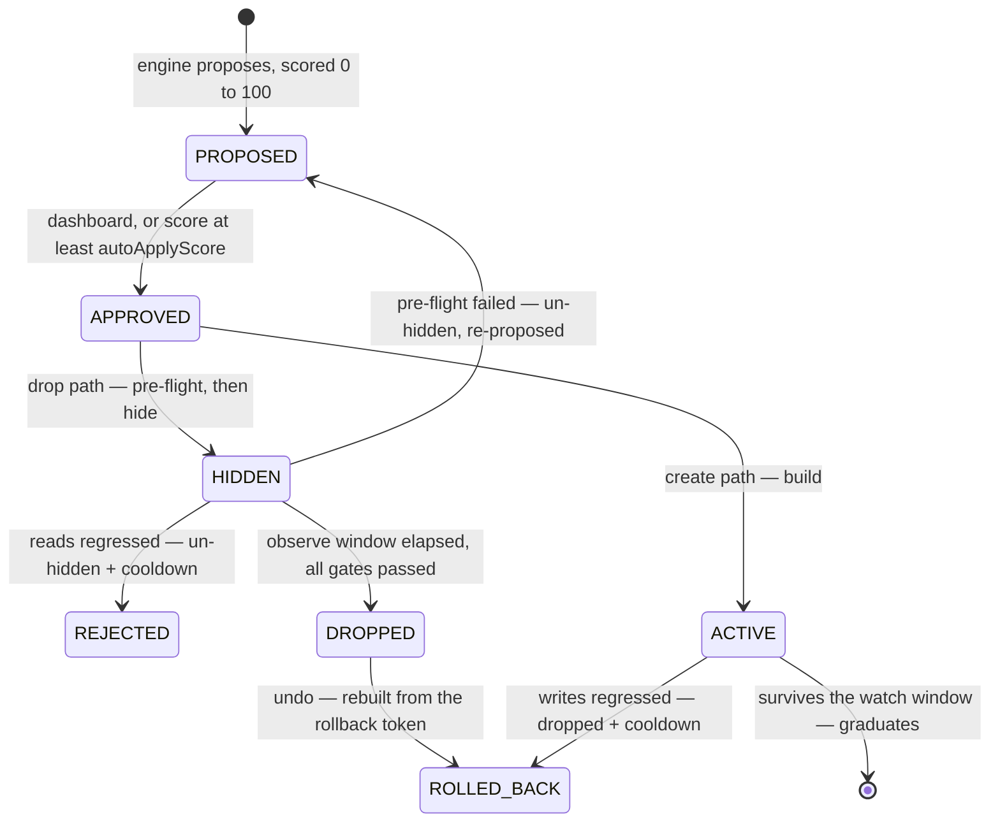

# Indexterity

Index dexterity for MongoDB, PostgreSQL and SQL Server. A SaaS that watches your indexes
and manages them safely — drop the unused and redundant, merge overlapping,
extend prefixes, create the missing — and proves the result in freed bytes and
latency. On SQL Server the workload signal comes from Query Store plans, with
the server's own missing-index suggestions folded in behind the same
recurrence and cost gates every other signal passes (Architecture §9.3).

Read-only by default. The one irreversible step, a drop, is gated behind an
observe window, a pre-flight check, and a read-latency regression test.

PostgreSQL is the third engine and the one that differs most, in two ways worth
knowing before you connect one. It has **no reversible hide** — the observe
window watches usage while the index keeps serving every query, because the only
mechanism Postgres offers needs superuser and cannot be delegated. And it has
**no grantable index privilege**: only a table's owner may alter its indexes, so
the scoped role Indexterity provisions is analysis-only and applying takes
credentials you connect deliberately.

| | |
|---|---|
| **How it is built** | [Architecture](https://github.com/FullmetalBober/Indexterity/wiki/Architecture) |
| **What holds it shut** | [Security](https://github.com/FullmetalBober/Indexterity/wiki/Security) |
| **Knobs, scoring and plans** | [Plans and policy](https://github.com/FullmetalBober/Indexterity/wiki/Plans-and-policy) |
| **The scoped user it needs** | [Connecting a cluster](https://github.com/FullmetalBober/Indexterity/wiki/Connecting-a-cluster) |
| **Every load-bearing choice** | [`docs/decisions.md`](./docs/decisions.md) |
| **What is planned** | [project board](https://github.com/users/FullmetalBober/projects/6) |

## How it works

1. **Connect** a cluster with any connection string — the form names the dialects
   it takes (`mongodb://`, `mongodb+srv://`, `postgresql://`, `postgres://`,
   libpq's `host=… dbname=…` form, `mssql://`, `sqlserver://` and the
   ADO `Server=…` list), says which engine it read yours as before you press
   anything, and asks only when nothing recognises it. Indexterity then reports
   what that string can actually do — nothing stored, nothing written. If it can
   create users, it *asks* before provisioning its own least-privilege user
   (`indexterity`, no `find` on your collections, so it **cannot read
   documents**). The name is fixed rather than random, so a cluster never
   accumulates one leftover user per connection — and a server that already
   carries it is refused, which is what stops the same database being connected
   twice. On SQL Server the same offer creates an `indexterity` login holding exactly
   `VIEW SERVER STATE`, `VIEW DATABASE STATE` and `ALTER` on each schema that
   owns tables — per schema rather than per database, because database-wide
   `ALTER` would also permit dropping tables, and **no `SELECT` at all**.
   The admin string is used once and never persisted; only the scoped one is
   stored, sealed with envelope encryption. An organization can make that the
   only path: **Settings → Organization → Credential policy** turns
   *require least privilege* on, and connecting or rotating with a string that
   can create users or roles is then refused with a 422 pointing at the
   provisioning path. It applies to the next connection and never backwards —
   clusters already stored on an admin string keep collecting and are marked out
   of policy on their own settings page, with a rotation as the fix.
2. **Collect** hourly via `$indexStats` / `$collStats` — usage, sizes,
   per-collection read/write latency, from **every replica-set member** the
   cluster admits to (secondary-only traffic is invisible from the primary).
   The same rule, and the same code shape, on SQL Server: an Availability
   Group's readable secondaries keep their own `sys.dm_db_index_usage_stats`,
   so each replica the group names is dialled through its read-only routing URL
   and reports its own counters (measured on a two-node group: three seeks run
   on the secondary read as 3 there and 0 on the primary).
   Never your documents. What gets *stored* is only what changed: an index's
   shape is written once, and an unchanged counter extends the row it already
   has instead of adding another. The dashboard's node roster shows which
   members the last collect saw and which answered — a member that did not is a
   named blind spot, not a silent zero. The same rule applies to the numbers
   beside it: the recommendations table's Usage column carries the per-member
   split, because 40,000 reads all on one secondary is a reporting replica and
   the same 40,000 spread evenly is your application, and dropping the first
   breaks something nobody was watching. A member the collect could not reach is
   named there too, never counted as a zero.
3. **Decide** with a pure analysis engine (`apps/api/src/analysis` — no I/O, so
   it is unit-tested without a database or a cluster).
4. **Apply** safely: `hide → observe → drop` for removals, `build` for
   additions. Clusters start read-only; an owner flips them live.
5. **Prove ROI**: freed bytes and the $/month they cost, index-count delta, and
   a before/after latency trend per collection. Beside it, the number ROI cannot
   report: total index bytes per day over the trend window. Both ROI figures are
   cumulative and only ever climb, because they count what the engine removed —
   a cluster where it freed 4 GB while the application added 6 GB has a
   triumphant ROI card and a bigger bill, and the footprint series is what says
   so. A day nobody collected renders as a gap, never as a zero.

The dashboard follows the engine live: a pass landing, a drop going hidden, a
build graduating or a regression firing arrives over SSE and refetches exactly
the panels it moved — no reload, no polling.

## What it decides

**Dropping.** Each index gets a usage class from its op-count history
(`FLAT_ZERO`, `CONTINUOUS`, `PERIODIC_ALIVE`, `PERIODIC_DEAD`). Dead usage or
redundancy earns a proposal.

A usage claim needs a history worth trusting: **at least a week of it, and at
least three days in which the collection was actually queried**, with no hole
over 48h, a recent newest snapshot and no counter restart. The week is the
warm-up; the activity requirement is what makes it mean something. An index
reads zero either because nobody needs it or because nobody touched the
collection — elapsed time cannot tell those apart. Hours in which the collection
served no reads simply do not count. Redundancy is structural and unaffected.

Every one of those thresholds is expressed in **hours**, not in collect
intervals, which is what made the cadence safe to move
([D36](./docs/decisions.md)).

**Covering columns count as part of the index.** SQL Server indexes can carry
non-key columns (`INCLUDE`) that answer a query without going back to the table,
so a longer key list is not automatically a wider index: `(customer_id) INCLUDE
(total)` answers `SELECT total WHERE customer_id = ?` on its own, and
`(customer_id, status)` cannot answer it at all. Redundancy therefore folds one
index into another only when the survivor carries every column the victim
covered — as a key or an include — and the same check gates the advisory tier
and the re-order replacement. Measured on SQL Server 2022 over 200k rows: 6
logical reads with the covering index, 1124 without it
([D80](./docs/decisions.md)).

**An index read backwards is the same index.** Both engines serve a sort from a
b-tree when the ordering it needs is the key pattern *or its exact full
reverse*, and neither serves anything in between — so `(a DESC, b DESC, c ASC)`
already covers `(a ASC, b ASC)`, and the narrow one is redundant. Redundancy
used to demand key-for-key direction equality and miss exactly that pair.
Measured on SQL Server 2022 CU26 and mongod 8.2.9 with only the wide index
present: `ORDER BY a` and `ORDER BY a, b` plan without a Sort (`ScanDirection=
"BACKWARD"`, IXSCAN `backward`), `ORDER BY a DESC, b DESC` plans forward, and
the mixed `ORDER BY a, b DESC` sorts on both — which is why the rule is
all-or-nothing across the prefix rather than per key
([D83](./docs/decisions.md)).

**Never dropped**, whatever the usage: `_id_`, unique (including unique partial
and sparse — a constraint is not a performance hint), TTL, and shard-key
indexes. They surface as advisories instead. Partial and sparse indexes without
a constraint *are* droppable: the pipeline hides and measures rather than
trusting the counter.

**Re-ordering** is the one thing the engine will do to a protected index, and it
removes nothing. A unique index's guarantee is a property of its key *set*, not
of its key *directions*, so `{a: 1, b: 1}` unique and `{a: 1, b: -1}` unique
enforce exactly the same rule — which makes a direction change a swap rather
than a drop. When a compound unique index covers a sort's fields in an order
that cannot serve it, the replacement is **built first**, with every option
carried over verbatim, and the original is only retired once the new one has
survived its post-build watch: there is no instant when nothing is enforcing the
constraint. It is **approval-only** whatever the auto-apply threshold says, and
an index anything pins with `hint()` is vetoed outright — a hint at a renamed
index is an error, not a slower query. Single-field, TTL and shard-key indexes
are out of scope by construction, which makes the addressable set small
([D50](./docs/decisions.md)).

**Server-wide distress, every five minutes.** Two readings of the query
engine's own counters a few seconds apart say whether the pressure is
index-shaped — scans climbing while work-per-index-key climbs with them — which
catches a scan storm spread thinly across many collections that no single
latency average would flag. mongod answers from one `serverStatus`; SQL Server
has no such command, so it comes from `sys.dm_os_performance_counters` and
`sys.dm_os_waiting_tasks`, needing only the `VIEW SERVER STATE` the scoped login
already holds. The counters differ enough that the thresholds are per engine:
the docs-per-key analogue is **pages per index search**, whose healthy floor is
the b-tree descent (measured 3.01 seeking, 66.6 when scans dominated), and the
sort signal is **tempdb spills** rather than in-memory sorts — a rarer and worse
event, so the bar is lower rather than higher. Two candidates in the original
mapping did not survive a live server: `Sort Warnings/sec` does not exist on
Linux SQL Server, and `Range Scans/sec` moves for an ordinary singleton seek
([D84](./docs/decisions.md)).

**Adding** (on by default; `workloadAnalysis` turns it off). Query shapes come from `$queryStats`
on **mongo 8.0+**, and from the profiler below it — until 8.0 the store reports
execution counts only, which is the difference between knowing a query ran and
knowing it scanned. Either way `$queryStats` records nothing until
`internalQueryStatsRateLimit` is set; connecting a cluster says so if it is not.

Two shapes earn an index. One is a **collection scan**. The other is a query
that finds its documents through an index and then **sorts them in memory** —
invisible to every scan test, because keys were examined, and the failure mode
that ends in an error rather than slowness, since a blocking sort dies at 100 MB.

Which collections get looked at is a question of **cost, not size**: a
collection earns create-side analysis once its scanning passes a million
documents a week, whatever it holds. A shape must recur — **3+ sightings** — and
must come from something other than a person at a prompt, so the same query from
`mongosh` and from your app arrive as separate entries. Keys are ordered
Equality → Sort → Range.

**A recurring age-based purge** — a job that prunes by timestamp on a schedule —
is the same signal on both engines and a different piece of advice on each,
because SQL Server has no TTL index to recommend. On mongo the advisory names
the TTL index and refuses to build it. On SQL Server it says what is actually
true: a purge with no index leading with the date predicate **scans the table
and holds locks for the whole pass**, which is the job that makes a table
unavailable at night — so a supporting index turns it into a range seek, and
past ten million rows the real answer is a partitioned **sliding window**, where
retiring a period is a metadata operation instead of millions of logged row
deletes. Advisory on both, and never an action on either. The pattern is read
off Query Store's DELETE plans in both the shapes SQL Server writes them,
including the parameterised `WHERE created_at < @cutoff` — where the retention
window is simply not in the plan, and the advisory says so rather than inventing
a number ([D85](./docs/decisions.md)).

**And a run of builds is measured against where it started.** The post-build
watch takes each index's baseline at that index's own build time, so the second
build on a collection is judged against a collection already carrying the first
— the right answer to *did this index slow writes* and not to *did the last
month of changes slow my writes*. On graduation the collection is now also
compared against the oldest baseline still live for it, and a run that has cost
30% or more is reported: the owners are told and nothing more is built there
unattended, with **nothing rolled back**. The newest index is the obvious thing
to undo and is not obviously the culprit, and attribution needs evidence this
does not have ([D101](./docs/decisions.md), #282).

**Builds on one collection compete rather than accumulate.** Every collision
guard in the engine is keyed on an *index*; the cost of an index is paid per
*collection*, because each write updates every index on it. So five
individually-correct creates on one busy collection were five correct findings
that together doubled its write cost, with nothing forming that thought. A
crowding term now costs a create ten points for each index past an ordinary four
that its collection would then carry — counting builds already in flight, not
only what a collect saw — capped at the forty a past regression costs. Nothing is
hidden: every finding is still proposed, with the reason in its rationale, and
what falls below `autoApplyScore` stops being built *unattended* and starts being
a decision. Exempt where it would be perverse — a MERGE folding three indexes
into one leaves the collection carrying fewer, so it answers to no budget
([D100](./docs/decisions.md), #281).

**And when it cannot tell you, it says that instead of reassuring you.** Every
panel on the dashboard used to draw its empty state for a read that had *failed*
as well as for one that came back empty — so a 500 rendered as "Nothing to
review means nothing is obviously wrong" over a cluster with fifty-one live
proposals. A failed read now says whose problem it is (ours, and the cluster was
never dialled) and offers a retry, and a stat card withholds its figure rather
than printing a zero nobody measured
([D102](./docs/decisions.md), #289).

**And when it decides nothing, it says so.** An empty recommendations list is
indistinguishable from "your indexes are all fine", and that reading is wrong in
two directions. Usage findings need a history the engine is willing to trust —
three collects, seven days, no gap, and counters that did not reset underneath it
— and a cluster whose counters reset oftener than that window can never receive
one, with the condition never clearing on its own. Separately, every collision
guard in the engine works by making a finding *disappear*: an index inside its
own post-build watch, one already carrying a recommendation, one parked after a
regression. Both are correct and both were invisible, so the dashboard now names
the dominant reason usage analysis is paused, in the words of the threshold that
caused it, and counts what the guards held back
([D99](./docs/decisions.md), #277). "Cannot tell" is never spelled "all clear"
— on screen as well as in the pipeline.

Full reasoning for all of it: [Architecture §6](https://github.com/FullmetalBober/Indexterity/wiki/Architecture).

## The safety pipeline



Hiding (`collMod hidden:true`) is instant and reversible, and starts the observe
window. Before the drop, `finalize` gates it three ways:

- **Observability.** `$collStats` counters reset when mongod restarts, so a
  restart mid-window leaves a baseline that means nothing. That reads as
  UNOBSERVABLE, never as "no regression" — the index is un-hidden and
  re-proposed rather than dropped on evidence that no longer exists.
- **Regression.** Read latency above `baseline × 1.5` un-hides the index and
  parks it in a cooldown that escalates on repeats.
- **Pre-flight.** Index now protected, covering index gone, or fresh ops on it
  → un-hide and re-propose.

Additions get the mirror treatment: write latency is baselined at build time,
and an index that slows writes during its watch is dropped and cooled down. One
that survives graduates. Every executed operation writes an immutable `actions`
row.

Two escape hatches on the dashboard. **Keep it** cancels a pending drop while
the index is still hidden: it becomes visible again immediately and is parked
for 90 days. **Undo** rebuilds a dropped index from the spec captured at drop
time and corrects the ROI headline back down. Neither counts as a regression.

Everything parked, from either source, is listed on the cluster page under
**Parked**: what the engine has agreed not to propose again, in whose words,
until when, and how many times each index has regressed. An index that has
regressed three times says something about the collection that one rejection
does not, and that count is recorded nowhere else — so an expired cooldown stays
on the list, marked back in scope, rather than disappearing with its date.

Undo is available for as long as the plan keeps history — the spec it rebuilds
from lives in the audit trail, and a settled recommendation ages out with it.
Live ones never do, however old: an index hidden through a long outage is still
waiting on its own observe window.

Every recommendation carries a **score**, 0–100, calibrated so 100 is reachable.
It gates *entry* only; every safety stage runs regardless. The
[weights](https://github.com/FullmetalBober/Indexterity/wiki/Plans-and-policy#the-score)
are on the wiki.

## Policy and plans

Seven per-cluster knobs — `readOnly`, `workloadAnalysis`, `instantCreate`,
`observeWindowDays`, `maxCollectionSizeBytes`, `autoApplyScore` and the change
window. Clusters start read-only and approve nothing automatically;
`autoApplyScore` is the one auto-approval control, and **70 is the suggested
setting**.

| | clusters | seats | index suggestions | unattended changes | history |
|---|---|---|---|---|---|
| **FREE** | 1 | 3 | yes | — | 90 days |
| **PRO** | 5 | 15 | yes | yes | 183 days |
| **SCALE** | unlimited | unlimited | yes | yes | 365 days |
| **SELF_HOSTED** | 1 | unlimited | yes | yes | 365 days |

**Free gives away the analysis and sells the automation.** Every plan sees every
recommendation, with the reasoning, and can approve any of them by hand. What a
paid plan adds is not having to. A plan is per organization, history is enforced
on read rather than by deletion (so an upgrade returns yours at once), and no
payment provider is wired on purpose.

A new organization lands on `DEFAULT_ORG_PLAN`, which the chart sets to
`SELF_HOSTED`. **Upgrading an install that has been running a while?** Its
organizations were created before anything read that variable and are sitting on
`FREE` — three seats, no unattended apply, 90 days. `set-plan.js --backfill
SELF_HOSTED` lists them and changes nothing; add `--apply` to move them. It moves
only organizations that are **on `FREE`** and whose plan was never chosen
deliberately — no `set-plan.js` run, no billing subscription — so it can raise a
plan and never lower one.

Each knob, how the observe window scales to the index, and the entitlement
reasoning: [Plans and policy](https://github.com/FullmetalBober/Indexterity/wiki/Plans-and-policy).

## Connecting a cluster

**PostgreSQL 14 and newer.** 13 reached end of life in November 2025. The floor
is a lifecycle decision rather than a capability one — nothing the pipeline needs
is missing on 14 — and the one newer signal degrades rather than refusing:
`last_idx_scan` arrived in 16, and below it classify falls back to the same
snapshot-delta inference it uses on the other two engines. Probed against 17 and
18; anything newer is refused unless `ALLOW_UNTESTED_DATABASE_VERSION` is set.

**MongoDB 6.0 to 8.x.** 4.4 and 5.0 are past end-of-life and have no
`$queryStats`, so they are refused rather than supported half-well. Every write
re-checks the version immediately before running, so a cluster downgraded or
repointed later cannot be half-changed.

Indexterity never gets document read or write privileges. The preflight lists
every privilege it looked for, including the three that decide whether it can
create its own user (`createRole`, `createUser`, `grantRole` on `admin`) — when
one is missing it says which, rather than quietly keeping the string you pasted.
[Connecting a cluster](https://github.com/FullmetalBober/Indexterity/wiki/Connecting-a-cluster)
has the exact `createRole` snippets, what `serverStatus` exposes, which
replica-set members get read, and what `mongodb+srv://` carries outside its own
text.

**You choose which databases are observed.** A cluster holding one production
database plus staging copies, per-tenant clones and last week's restore does not
need all of them walked. The connect form lists every database the credentials
can see and lets you untick the ones to leave alone, and the cluster's
**Settings** tab edits that afterwards. Observing everything is the default and
stays the default for a cluster you never narrow — including databases added
later, which a narrowed selection deliberately does *not* pick up until you tick
them. Narrowing also sharpens the privilege check: a role scoped to the one
database you care about reads as a gap while the whole cluster is in scope and as
a grant once it is not, so you no longer have to widen a role over databases
nobody asked us to read. What the selection does *not* touch is what a
provisioned user may reach: it is granted across the databases that exist when
it is created, on both engines, so changing your mind later is a checkbox rather
than a grant you have to go and make on the cluster.

## Auth & tenancy

Every endpoint requires a better-auth session and is scoped to the caller's org.
The browser holds that session itself: the api answers under `/api` on the
dashboard's own origin, so the cookie is first-party and travels with every call
without CORS or `SameSite=None`. Set `WEB_ORIGIN` and `BETTER_AUTH_URL` on the
api to that origin.

Tenancy is **better-auth's `organization` plugin**, mapped onto the tables the
api already had. Org creators are **owners**, invited users are **members**, and
there is no third rung — members read everything, every mutation is owner-only.
You make an organization and you can delete one; invitations are addressed
rather than bearer, so accepting requires being signed in as the invited
address. The switcher is per session, so two browsers can sit in two different
orgs.

**Deleting an org is the dangerous verb**, because an org is not a row. Cascades
take the clusters and everything under them, so the delete runs the same
restoration a disconnect does — any index parked in an observe window is
un-hidden first — and the confirmation dialog makes you type the org's name and
names every least-privilege user Indexterity created on your clusters, with the
command to drop it.

**An org-level rule can forbid storing credentials broader than the engine
needs.** Off by default, and the default is a decision rather than a fallback:
an install that has said nothing has not asked us to refuse anybody's string.
Switching it on refuses both doors — connect and rotate — when the diagnosis says
the credentials can create users or roles, and refuses a deployment running with
authentication disabled outright, because that one grants every privilege to
anyone who can reach it and no grant narrows it. Turning it on or off is in the
security trail with both sides of the change.

**Everything owner-level leaves a row, and owners can read them.** Sign-ins and
failed sign-ins, every two-factor event, role changes, invitations, and the four
things that can be done to a cluster's access — 25 kinds of act, at **Settings →
Security**, filterable by kind and by actor and paged back to the day the trail
shipped. It never ages out on a billing clock: the incident that needs a row is
usually older than the day it is noticed. Owner-only, because every row carries
the address and client a colleague acted from. A failed sign-in is shown with no
actor and the typed address worded as an attempt — nobody proved they were that
person, and the account holder is who it was done to.

**Every connection card says which of its privileges are needed and which are
surplus.** The posture badge says how privileged the stored credentials are;
under it, *Check what these credentials hold* dials the cluster and splits the
answer into **provided**, **required** and **redundant** — the last with the
statement that removes each grant, which is the reverse of the grant-the-gap
commands the connect form shows. What counts as surplus is per engine and
measured against a real server: `SUPERUSER` / `CREATEROLE` / `CREATEDB` plus
write privileges on tables the role does not own on PostgreSQL (read access is
*not* surplus there — applying needs ownership, and an owner can read);
`root`, `userAdminAnyDatabase`, `readWriteAnyDatabase`, `dbOwner`,
`dbAdminAnyDatabase` and document writes on MongoDB; `sysadmin`,
`CONTROL SERVER` and `db_owner` on SQL Server. A cluster running on a user
Indexterity provisioned reports an empty redundant group that **says** it is
empty — "nothing surplus" is the reassuring answer and blank space does not
deliver it. The read is lazy and dial-budgeted: nothing is asked until somebody
opens the panel, and the answer is stamped with when it was taken.

**The three acts that reach your database ask for a fresh sign-in.** Going
live, rotating credentials and disconnecting refuse an owner session signed in
more than an hour ago — the dashboard asks for the password again and then
runs the action you chose. Flipping a cluster back to read-only never does:
the emergency stop works from however old a session.

**Owner accounts can carry a second factor, and a deployment can demand one.**
TOTP plus backup codes, enrolled from the account page; with
`REQUIRE_OWNER_2FA=true` every owner-only mutation — and the org acts that
decide who has access — refuses until a code has verified. Where SMTP is
configured, the sign-in page can also mail a six-digit code instead; without
it that button answers with why rather than sending nothing. Read
[D44](./docs/decisions.md) before relying on the emailed code: it is a second
factor against someone who has your password, and none against someone who has
your inbox — which is also where a password reset lands. GitHub sign-ins are
exempt (no password to pair a code with; GitHub enforces its own). Lost device,
lost codes and no email means whoever runs the install resets it after
verifying it's you — there is deliberately no self-serve way around a second
factor.

**The sign-in address can change, carefully.** A verified account's current
address approves the change and the new one verifies itself; an unverified
account changes at once and the new address gets the verification mail. The
signup gate applies to the change — `SIGNUP_MODE` cannot be walked around by
renaming an account — and the old inbox is told either way.

**Owner-level acts leave a trail.** `actions` records what the engine did to an
index; `security_events` records the rest — signing in and failing to, signing out,
revoking a session, promoting and demoting, removing a member, inviting one, an
invitation accepted, an org made or destroyed, and a cluster connected,
disconnected, rotated or flipped live. Each row names the account that did it, what
it was done to, and the client it came from. It does not age out with the plan's
history window, and nothing cascades into it: deleting an org, a cluster or a user
cannot erase what was done to it.

Session resolution, the cookie-cache trade and the plugin mapping:
[Architecture §9.3](https://github.com/FullmetalBober/Indexterity/wiki/Architecture).

## Stack

Turbo monorepo · NestJS + Fastify (api) · TanStack Start + TanStack Query +
TanStack Form + TanStack Table + TanStack Virtual + TanStack Charts + shadcn (web) ·
better-auth · Drizzle + PostgreSQL · oRPC contracts (zod 4) · graphile-worker ·
Biome · strict TypeScript (no `any`, no `as`, no lint-ignore).

```
apps/api                control plane
  src/analysis          pure decision engine — no I/O, unit-tested without infra
  src/engine            engine-neutral ports (collector, executor, session)
  src/mongo             the MongoDB adapter; zod-parses driver output at the boundary
  src/mssql             the SQL Server adapter — DMVs + Query Store behind the same ports
  src/jobs              graphile-worker tasks (collect/classify/suggest/apply/finalize)
  src/audit             the security trail — who signed in, who changed a role,
                        read at Settings → Security by owners only
  src/db                Drizzle schema, client, secret sealing
apps/web                dashboard
  src/routes/app.tsx    the /app shell — auth gate, org switcher, the nav rail
  src/routes/app.index  resolves "no cluster named" — redirects to the first
                        cluster, or to connecting one
  src/routes/app.clusters.$clusterId       one cluster: the heading and its tabs
    …$clusterId.index      overview — ROI, index footprint over time,
                           recommendations, latency, nodes, collections
    …$clusterId.settings   name, policy, mode, credentials, disconnect
  src/routes/app.clusters.new   connecting a cluster, which is onboarding
  src/routes/app.settings       organization · organizations · account · security
  src/lib/api.ts        one oRPC client, isomorphic: same-origin in the browser,
                        API_URL with the caller's cookie during SSR
  src/lib/queries       the query layer: the client, one key per api call in
                        keys.ts, and mutations/ grouped by what they change
  src/components/form   TanStack Form bound once to shadcn's Field primitives
  src/components/data-table  TanStack Table bound once to shadcn's table
                        primitives; the long tables virtualize their rows, and
                        the api caps what it sends them (D47)
  src/components/latency-chart  TanStack Charts behind a props-stable wrapper —
                        pre-1.0, so churn is contained to this one file
packages/contracts      oRPC + zod contracts shared by api and web
  src/schemas.ts        what the api returns
  src/inputs.ts         what it accepts — and what the dashboard's forms validate
                        against, so a field refuses exactly what a route refuses
```

**A cluster is an address, not a selection.** `/app/clusters/<id>` is concrete
before anything reads it, so a cluster-scoped cache key can never mean
"whichever is first", and a cluster can be bookmarked, opened in a second tab
and linked to from an alert. The rest of the shape follows from what each page is
FOR: no configuration form lives on a dashboard, connecting a cluster is
onboarding rather than a card under the ROI numbers, and your name, your
password and this org's members are all settings.

Route loaders are the SSR entry point and write **through** the query client, so
the server render and the browser read one cache entry; mutations invalidate a
key rather than re-running loaders, **one key per api call**. Forms validate
against the api's own input schemas from `packages/contracts`, so a rule lives in
exactly one place. Everything engine-specific sits behind the ports in
`src/engine` — the SQL Server adapter slotted in as one directory plus one
registry line, and a PostgreSQL adapter can do the same without pipeline
changes.

Every key, component and the things that turned out to be load-bearing:
[Architecture §14](https://github.com/FullmetalBober/Indexterity/wiki/Architecture).

## Develop

```bash
cp .env.example .env      # then fill secrets
npm install
podman-compose up         # postgres + api + web, hot reload
# or npm run up           # the same, and recovers from stale container state
```

**No mongod in the stack** — connect whichever cluster you are working against.
Which throwaway you want depends on who has to reach it:

```bash
# the integration and e2e suites, which run on the HOST (they take MONGO_URL)
podman run -d --rm --name mongo-test -p 27017:27017 docker.io/library/mongo:8

# a cluster you connect IN the stack — then use mongodb://mongo:27017
podman run -d --rm --name mongo --network mongo_optimizer_default \
  --network-alias mongo docker.io/library/mongo:8
```

The second one has to be on the compose network: the api is a container, so
`localhost` is itself, and the host is only addressable as
`host.containers.internal`, which resolves into `169.254.0.0/16` — a range
`src/engine/net-guard.ts` files as FORBIDDEN and never dials, even with
`ALLOW_PRIVATE_CLUSTER_TARGETS`, because the cloud metadata endpoint shares it.
Clusters registered before the demo mongod was dropped from compose already hold
`mongodb://mongo:27017`, and the api logs `cluster <id> unreachable — skipped`
every tick until something answers to that name.

Anything topology-shaped needs a replica set, since `$indexStats` and
`$collStats latencyStats` are both per-member — most easily several mongods as
several processes in one host-network container.

```
npm run build · npm run typecheck · npm run lint · npm run test
npm run db:generate · npm run db:migrate
npm run db:deploy -w @repo/api        # production migrations, compiled migrator
npm run version:set 0.2.0             # workspaces + the chart + the lockfile
npm run version:check                 # assert every file that states it agrees
```

**Releases are cut by hand, and the tag is the only trigger.** Work integrates
on `dev`: `npm run version:set X.Y.Z` in a `chore: release X.Y.Z` commit writes
the version to the seven manifests, both chart fields and the eight places
`package-lock.json` states it. A `dev` → `main` pull request promotes that, the
merge is tagged `vX.Y.Z`, and the GitHub Release is written from the commits it
carried. `release.yml` waits on the tag and nothing publishes from a branch, so
what a cluster pulls cannot move because something merged.

`version:check` is what makes it safe rather than careful. One version lives in
seventeen places, and `release.yml` runs the check against the **tag** before it
builds or installs anything — so a tag cannot claim a version the tree does not
carry. It earned that: 0.3.0, 0.4.0 and 0.5.0 each shipped with a stale
`package-lock.json`, a tree `npm ci` refuses, while the one command whose whole
job is reporting version drift said everything agreed ([#186](https://github.com/FullmetalBober/Indexterity/issues/186),
[D78](./docs/decisions.md)).

`npm run up` is a convenience, not a requirement — `podman-compose up` works
directly. It recreates containers whose crun state a logout cleared (`cannot
open .../exec.fifo`; named volumes untouched), and drops `node_modules/.bin`
from PATH, which matters only when compose is reached *through* npm —
`@vercel/nft` installs an `nft` binary there and podman's network backend shells
out to `nft` meaning nftables.

`npm run lint` is Biome plus two checks Biome cannot express.
`scripts/lint-tailwind.ts` fails the build on a Tailwind arbitrary value that has
a canonical utility (`w-[220px]` is `w-55`); vendored `components/ui` is exempt.
`scripts/lint-migrations.ts` fails it on a migration that adds an enum value and
then uses it — Postgres refuses that inside one transaction, and drizzle-kit runs
one file per transaction, so the `ALTER TYPE` has to commit on its own and the
backfill goes in the next migration. Both scripts verify their own cases on every
run, because the way a check like that fails is by matching nothing.

Migration installs **two** schemas
— `public` for Drizzle and `graphile_worker` for the queue — installed before the
api serves, because a request that queues a job would otherwise race a schema
that is not there yet.

**Four test layers**, currently 870 api unit, 452 web unit, 134 integration and
34 end-to-end.

| layer | what it needs | what only it catches |
|---|---|---|
| `npm run test` | nothing | the pure decision engine; components in jsdom with the api client mocked at `~/lib/api` |
| `npm run test:int -w @repo/api` | migrated postgres + a mongod | CI runs it against **6.0, 7.0 and 8.x** — the three take different paths through the workload collector |
| `npm run test:e2e` | both apps built | a real browser all the way to postgres and mongo, with **no proxy in front**, so the passthrough is the path under test |
| `deploy/kind-test.sh` | Kind | the chart actually installing, `helm test`, sign-up over cluster DNS; fails if any pod logged a warning. `TOPOLOGY=` runs the same assertions against each packaging, which is what holds them to being blind to it |

The top ones are not decoration. The e2e suite found the api's session cookie
being percent-encoded a second time on its way through the web server — both
sides correct on their own, the defect in the hand-off — and the dashboard
drawing itself twice, which only a browser could see. The Kind run found that
the chart could not install at all, while `helm lint` passed throughout.

**A superseded CI run is cancelled, not finished.** Pushes to `main` and `dev`
are exempt — those runs are the record of whether an integration branch is
sound. The release workflow has no such rule at all.

**House rule: the api and the web app run clean.** No errors and no warnings in
server logs, build output, or the browser console. A warning is a defect — fix
the cause, don't silence it. See
[Architecture §16](https://github.com/FullmetalBober/Indexterity/wiki/Architecture).

## Security posture (defaults)

All three defaults exist because the control plane dials hosts that users name.

- **Sign-up is invite-only** (`SIGNUP_MODE`). The first account bootstraps the
  install. `open` hands that outbound reach to strangers.
- **Private targets are refused** unless `ALLOW_PRIVATE_CLUSTER_TARGETS=true`.
  Cloud metadata ranges stay blocked either way, DNS and SRV are resolved before
  dialing, and every host in a multi-host string is checked.
- **Plaintext connections are refused** unless `ALLOW_INSECURE_CLUSTER_TLS=true`.
  Every client the control plane builds goes through one constructor
  (`mongo/client.ts`) that requires validated TLS — so it holds for the
  pipeline's stored strings, not only for onboarding. It refuses rather than silently
  adding `tls=true`, because a string that says `tls=false` is a statement worth
  contradicting out loud. Its own switch rather than part of the private-target
  one on purpose: a VPC-peered Atlas cluster is a private address that must
  still be forced to TLS.

**Certificate checking is separate, and is the owner's call per cluster.**
`tlsInsecure`, `tlsAllowInvalidCertificates` and `tlsAllowInvalidHostnames` keep
TLS switched on while turning off the part that makes it worth having, so each
is refused unless the matching checkbox was ticked on the connect form. Three
boxes rather than one toggle: a private CA fails certificate validation with a
perfectly correct hostname, and an SSH tunnel fails the hostname check with a
genuinely valid certificate. The choice is stored on the cluster, every dial is
verified against that recorded decision rather than against whatever the string
happens to say, and it is drawn on the cluster's heading — a concession nobody
can see afterwards is one nobody reviews. There is no box that turns TLS itself
off.

**What lands in the control-plane database:** index names, field names,
collection names, and counters. Not documents — the provisioned role cannot read
them, so there is nothing to store. One deliberate exception: a **partial index**
needs the literal value in its filter, so equality literals from the profiler can
reach the database, narrowed to fields whose value was identical in *every*
sample and short enough to be a discriminator, never one shaped like an ObjectId
or a UUID. `$queryStats` never carries literals at all.

Storage tracks how much a cluster *changes*, not how often we look at it —
**86% smaller** over a simulated year, and an index nobody touches costs one row
instead of 1,460. A hole in the series means "we stopped watching, so absence of
usage proves nothing", so a run is the positive form of the claim: *we looked at
`lastSeenAt`, and it was still this*. Details in
[Architecture §10 and §11](https://github.com/FullmetalBober/Indexterity/wiki/Architecture).

**Two of those defaults are checked on every pull request.** An OWASP ZAP baseline
scan runs against the origin a browser actually gets — the dashboard's, since it
answers `/api` itself — and `npm run audit:gate` fails on high or critical
advisories reachable from the half of the dependency tree that ships, ignoring the
build tools that never leave the runner. Neither can be silenced without writing
down why: exceptions live in `scripts/audit-gate.ts` and `.zap/rules.tsv`, keyed
so that a *new* advisory against an already-excepted package still fails and an
exception whose advisory was fixed fails too.

**The dashboard's documents carry a `Content-Security-Policy` with a nonce minted
per response** — `default-src 'none'`, and a `script-src` of `'self'` plus that
nonce, so an injected `<script>` is refused whatever else goes wrong. The nonce
reaches the framework's own inline scripts through `router.options.ssr.nonce` and
the header is built from the same variable, which is what stops the two drifting
into a page that renders and never hydrates. **No `'unsafe-inline'` anywhere
except the `style` attribute**: the dependencies that write style elements from
JavaScript are covered by name — the same nonce where the library asks for one,
a content hash where it cannot, and a unit test recomputes those hashes from
`node_modules` so an upgrade is a red test rather than a silent change. Every
end-to-end test fails if the browser refused anything at all.

The full review, chapter by chapter against OWASP ASVS 5.0 Level 2, including what
is deliberately not done:
[Security](https://github.com/FullmetalBober/Indexterity/wiki/Security).

## Deploy

Small images via `turbo prune`, and small on purpose, in three passes. The api's
runtime tree is installed from manifests with `devDependencies` deleted rather
than pruned after the fact (`deploy/prod-manifests.mts`): `npm prune --omit=dev`
was measured to change nothing here — `turbo prune` regenerates a lockfile with no
`dev` markers, so npm reads the whole graph as production and ships typescript,
drizzle-kit, @rolldown and esbuild. Then the base itself, which was most of what
remained: **`node:26-alpine`** (181 MB) instead of `node:26-slim` (252 MB). The
shipped api tree contains no native binaries, so that is a base swap and not a
musl rebuild — and `mongodb+srv://`, the one lookup that would care, is tested on
musl rather than assumed ([D76](./docs/decisions.md)). Then the same manifest lever
a second time, for the all-in-one only, pointed at the dashboard's `dependencies`:
those are not devDependencies and the manifest is right to list them, but a runtime
that starts the dashboard from a self-contained `.output` bundle resolves nothing
from them, and they were 185 MB — including two prebuilt lightningcss bindings, one
of which can never load ([D77](./docs/decisions.md)). api **303 MB** (was 510),
web **193 MB** (was 264), all-in-one **322 MB** (was 714), whose `node_modules` is
now the api's 153 MB to the megabyte:

```bash
docker build -f apps/api/Dockerfile -t indexterity-api .
docker build -f apps/web/Dockerfile -t indexterity-web .
```

There is a third, for hosts that run one container per service and have no pods
at all — Fly, Render, Cloud Run, a single VM. Same builds, same artefacts, both
processes under a supervisor that is PID 1, forwards `SIGTERM` to both and exits
non-zero if either dies:

```bash
docker build -f deploy/all-in-one/Dockerfile -t indexterity-all-in-one .
docker run -p 3000:3000 -e DATABASE_URL=… -e MASTER_KEY=… indexterity-all-in-one
```

Port 3000 is the only one that has to be published: the dashboard answers `/api`
itself, so the browser gets everything from one origin. The Helm chart can deploy
this shape too — `topology: single-container`.

### Configuration

**Every process validates its environment before it serves anything**, against
one schema per process rather than reads scattered through the code. `absent is
fine, malformed is fatal`: an unset optional knob takes its default, and a
malformed one is a boot failure naming the variable and what it expected. So
`AUTH_RATE_LIMIT_MAX=2O` (letter O) refuses to start instead of quietly reading
as 20, and a garbled `TRUST_PROXY` refuses instead of quietly meaning "no proxy
in front" — which used to collapse every per-client rate limit into one shared
bucket.

Three schemas, because three validation surfaces are given different things
(`apps/api/src/config/schema.ts`):

| Process | Demands | Because |
|---|---|---|
| `migrate` | `DATABASE_URL` | The pre-install Job talks to Postgres and exits |
| `worker` | `+ MASTER_KEY` | The pipeline's subset, and what the `rotate-key` CLI validates — it unseals stored credentials without serving HTTP |
| `api` | `+ BETTER_AUTH_SECRET` | Only the api serves auth (and it validates the pipeline's variables too, since it runs the jobs) |

**`DATABASE_URL` has to be the direct endpoint**, not a transaction-pooled one —
Neon's `-pooler` host, PgBouncer or Supavisor in transaction mode. `LISTEN/NOTIFY`
does not survive transaction pooling: the `LISTEN` is accepted and the notification
never arrives, because the listener and the notifier land on different backends.
Nothing errors, and the dashboard's SSE quietly never fires — panels only refresh
on their own `staleTime`. Since a shape of failure that logs nothing is worse
than one that refuses, the api runs a `NOTIFY` round trip at boot (`apps/api/src/db/notify-probe.ts`: `LISTEN` a throwaway channel,
`pg_notify` it from a second connection, wait two seconds, close both) and refuse to
start when it does not come back — three attempts, so a Postgres that was restarting
is a slow boot rather than a crashloop. The round trip is the test and the hostname
only a hint: measured on PgBouncer 1.25, `pool_mode=transaction` loses the
notification and `pool_mode=session` delivers it. A pooler buys this app nothing
either way — it holds about 20 connections at its defaults
([D89](./docs/decisions.md)).

The dashboard server has its own, built on `@t3-oss/env-core`
(`apps/web/src/lib/env.ts`), where the interesting part is the split: every
variable is a **server** one, so reading one in the browser throws rather than
returning undefined, and a value the browser genuinely needs has to be declared
with the `VITE_` prefix that makes it public by construction. There are none.

The schema is also the source of truth for the four places a variable has to be
registered — `.env.example`, `docker-compose.yml`, the test suites, and the Helm
chart. `config/homes.test.ts` walks it and holds all four to it, in both
directions: a required variable the chart never sets fails the test rather than
the deploy, and a variable the chart sets that no schema knows is a typo nothing
else would have caught.

One web image serves every environment — `API_URL` and `WEB_ORIGIN` are read at
runtime, and nothing about the api's address is baked into the browser bundle.
The api runs the whole job pipeline itself (#232 retired the separate worker
process): no resident runner, no `LISTEN` — a 30-second in-process tick claims
what became due and drains it with `runOnce`, so between ticks an idle api holds
nothing. Replicas are safe: passes are claimed per occurrence, so concurrent
tickers cannot double-dispatch. The interval still queries twice a minute — a
database that suspends on idle wants the external clock below instead.

**The clock outside (`RUN_CRONJOB=false`).** The api always executes jobs; this
flag hands over the decision of *when* passes become due. Nothing then fires on
its own — an external scheduler you own fetches the tick:

```
GET /api/internal/tick     Authorization: Bearer $CRON_TRIGGER_SECRET
  → {"dispatched":["scheduleApply","scheduleProbe"],"alreadyClaimed":[],"drained":true}
```

The request **claims and drains** — the same tick the in-process interval runs,
because nothing LISTENs any more, so if this request did not drain, nothing
would. It is bounded: past 25 seconds (under the 30-60s platform proxy floors)
the response says `"drained": false` while the drain carries on in-process, and
pinging again resumes a partially drained queue rather than duplicating it —
which is what makes even a dumb every-five-minutes ping a working scheduler.

**`GET`, and only `GET`** — `POST` is not routed and answers 404. The endpoint
changes state, so by the letter of HTTP it wants `POST`, and that is what it
was; the method turned out to be the thing standing between an operator and a
working schedule. The audience for an external clock is the host that sleeps,
and what such a host comes with is a URL pinger — an uptime monitor, a platform
cron field that takes a URL, a status-page checker — most of which send `GET`
and nothing else. What a safe method actually promises an intermediary is that
it may repeat the request or reuse the answer, and both are already true here:
repeating is free by construction (below), and reuse is refused outright,
because every response this api sends carries `Cache-Control: no-store`. A
cached `200` would otherwise be this endpoint's worst failure — a scheduler
being told the pipeline ran while nothing runs at all.

**Safe to call as often as you like**, and that is a property rather than a
promise — it is also what makes serving this over `GET` unremarkable: passes are
claimed against their *occurrence* in `worker_watermarks`, so a hundred calls
inside one five-minute bucket enqueue at most one `scheduleApply`. Two crons
firing a minute apart compute the same occurrence and only one claim wins — no
lock. A host that slept through eleven buckets owes
**one** run per pass, not eleven, so catching up never dials the fleet eleven
times over; `retention` stays on 03:00 and the weekly digest on Monday 09:00,
which an interval reading would have drifted. `CRON_TRIGGER_SECRET` is required
when `RUN_CRONJOB=false` — the endpoint authorises the whole pipeline and there
is no user session behind it — and the boot refuses without it, because a
deployment with no interval and no way in is a pipeline that is silently dead.

**Hosts that sleep are a supported topology, with caveats named.** On a host
that sleeps when idle, or a database that suspends its compute, a resident
schedule does not slow down, it **stops** — which is why the external clock
exists. Any scheduler that can fetch a URL with a bearer header drives the
pipeline in request-sized bites: the work happens *inside* the request window,
which is exactly what a platform that freezes the container after the response
needs. The one loss on such a platform is the post-deadline tail of a long
drain — a frozen mid-flight job waits out graphile-worker's lock before
retrying — so keep the ping cadence at a few minutes and the tail stays short.
Ticked every fifteen minutes, a five-minute pass *is* a fifteen-minute pass;
that is a latency question, not a safety one — the observe windows the drop
pipeline runs on are measured in days.

**On-demand actions ride the same tick**: the dashboard's collect button and an
approval enqueue, and the next drain — at most 30 seconds away with the
interval, or your ping cadence without it — picks them up.

**The api holds no database connection when nobody is watching.** Its SSE
listener needs a dedicated session (`LISTEN` binds to one, so it cannot come
from a pool), and that session used to be opened at boot and held for the life
of the process — which after burst mode was the *only* thing an idle api held,
and the one thing that pins a database that suspends when idle. It is lazy now:
the session opens on the first subscriber and closes thirty seconds after the
last one leaves. Measured on a built image, forty seconds idle, no dashboard
open: **zero** client backends. One while a stream is
live, which the integration suite asserts against `pg_stat_activity` rather than
against the service's own opinion of itself. Thirty seconds rather than zero
because the SSE route caps a stream at five minutes to re-check ownership, so an
open dashboard re-subscribes on a schedule and would otherwise churn the session
([D87](./docs/decisions.md)).

One thing the tick design forced everywhere: the alert cooldown is a Postgres
claim rather than a Map in process memory, so restarts and replicas cannot
re-mail a cluster's owners on every tick of a bad day
([D86](./docs/decisions.md)).

**One origin, guaranteed by the app.** The browser calls the api itself, so the
session cookie only works if both answer on one origin. That is arranged twice
over, and the difference is a hop rather than whether it works — a proxy in
front routes `/api` to the api (zero hops, what the ingress does), and with
nothing in front the dashboard server answers `/api` itself and forwards it
(`src/lib/api-passthrough.ts`, one transparent hop, no configuration). So
`helm install` without an ingress works, a port-forward works, `npm run dev`
works, and compose works; `indexterity_web_requests_total{kind="api"}` is
non-zero exactly when you have not set the proxy rule, which is how a missing
ingress rule stops being silent. The cost is that the api is publicly reachable,
so its rate limiting, origin checks and auth guard are now the only line of
defence rather than the second.

Those limits are worth reading precisely, because two limiters answer for them.
`RATE_LIMIT_MAX` (300/min) is counted in each api process's memory, so it is **per
replica** and a rolling deploy resets it. `AUTH_RATE_LIMIT_MAX` (20/min) is read
twice: the same per-replica way for `/api/auth/*`, and by better-auth for the
credential endpoints, which counts in Postgres — so that half is one budget for the
whole deployment. Both count per client address, and `TRUST_PROXY` is what decides
what that address is — for both, since the api resolves it once and hands
better-auth the answer rather than letting it read the header itself. Set it to the
CIDR ranges of whatever sits in front; on a managed host that does not publish
ranges, set it to the number of appending proxies instead (`1` for the platform,
`2` with a CDN in front of it). `true` is the one to avoid: it takes the first
entry in `X-Forwarded-For`, which a caller can write, so anywhere the platform
appends rather than replaces it lets each attempt choose the bucket it spends. The chart
**requires** it whenever its ingress is on and infers nothing — it derived the
value from `ingress.enabled` once, which chose `true` with an ingress and `false`
without one, and a proxy routed to the Services from outside the chart is
invisible to that test.
[Architecture §10.5](https://github.com/FullmetalBober/Indexterity/wiki/Architecture)
has the table.

A Helm chart is in [`deploy/helm/indexterity`](./deploy/helm/indexterity) —
api (pipeline included) + dashboard, a pre-upgrade migration hook, ingress, and a
`helm test`. Bring your own PostgreSQL. `topology` folds the two workloads into
one container (`single-container`) for an install where two Deployments is more
than it needs; the Services, the ingress and the app are identical either way, so
nothing in front of the chart has to know which one is installed.

### Metrics

`METRICS_ENABLED=true` serves Prometheus metrics on port 9464 (`METRICS_PORT`)
from both workloads. Off unless asked for — an exporter costs memory in
every process, and an install with nothing scraping it pays that for nobody. The
chart can turn it on and install a ServiceMonitor per workload; compose has it on
and publishes 9464 (api) and 9466 (web).

Each answers for what only it can see, so scrape both. The five things a
service that drops other people's indexes has to be able to state:

| question | metric |
|---|---|
| how many clusters can we not reach right now | `indexterity_clusters_unreachable` |
| how long is the job queue | `indexterity_jobs{state="queued"}`, `indexterity_jobs_oldest_queued_age_seconds` |
| how many drops are mid-observe | `indexterity_recommendations{state="HIDDEN"}` |
| how often does the regression gate fire | `indexterity_regression_gate_decisions_total{verdict="regressed"}` |
| what is the dead-letter rate | `rate(indexterity_job_runs_total{outcome="dead_letter"}[1h])`, backlog in `indexterity_jobs{state="dead_letter"}` |

An unreachable cluster is a *handled* condition — the tick is skipped and
retried, nothing fails — so the queue counters cannot see it and
`indexterity_cluster_task_runs_total{outcome=...}` is where the six ways a tick
can end are told apart.

**The endpoint has no auth**, which is why it is a second port instead of a route
on the app. `metrics.prometheusRule.enabled=true` installs 18 alerts with the
metrics, because a scrape endpoint nobody wrote queries against is a scrape
endpoint nobody reads. `deploy/helm/indexterity/README.md` has the thresholds and
the label-selector gotcha; what the dashboard server reports that the api cannot,
and the two alert traps worth knowing, are in
[Architecture §15](https://github.com/FullmetalBober/Indexterity/wiki/Architecture).

### Errors

The metrics above say how *often* something failed. `SENTRY_DSN` says *what*.
Every process reads that one variable; leave it empty — the default here, in
compose and in the chart — and neither app initialises the SDK. The dashboard
does not even load it: importing `@sentry/tanstackstart-react` costs 17.3 MB of
heap, measured, and a dynamic `import()` there is real ESM, so a default install
skips it entirely. The api loads `@sentry/nestjs` (12.5 MB) either way — a
deliberate tradeoff, not an oversight, kept for full static typing over that
saving. See [D75](./docs/decisions.md) for why the two apps land differently.

**The DSN is yours.** A self-hosted install reports to your own Sentry
organisation or your own self-hosted Sentry, never to us.

**Two projects.** The api — pipeline included, one process since #232 — and the
dashboard, which is a separate app with a separate release. In compose that is
`SENTRY_DSN_API` and `SENTRY_DSN_WEB`; in the chart, `errorReporting.dsn` and
`errorReporting.webDsn`.

| workload | what is reported |
|---|---|
| api | unhandled 500s from `AppExceptionFilter`, tagged with the request id already in the log line and the response body — and a job that burned its last retry (the dead-letter transition), tagged with task, attempt and cluster |
| web | server-side render failures, and anything the passthrough throws |

Plus the unhandled-rejection and uncaught-exception sinks the SDK installs in
every process, which is the half that had no home before.

Reported once each, and only for things that are actually faults. A retry is not
an event (the counters above already say how often jobs retry), and neither is a
429, a 413, a 404, or a cluster whose owner's firewall is doing its job — an
unreachable cluster is a handled condition, so paging about it would be paging
about somebody else's network.

**Nothing leaves with a connection string in it.** `packages/errors` strips
MongoDB and Postgres URIs whole — hosts included, because a replica set's member
list is the customer's infrastructure and `+srv` resolves to it — plus the
credentials of any other URI, any field named like a secret (a superset of the
Fastify logger's redact list), and the same secrets encoded inside a JSON string,
where key matching cannot see them. It walks the entire event rather than a list
of known fields, because the way a field list fails is silently, on the day the
SDK adds a field. Unit-tested against a seeded event carrying the string in every
place one could hide.

**The request body is dropped entirely**, not scrubbed: `POST /clusters` carries
a customer's connection string as a field. `sendDefaultPii: false` does *not*
cover this — in SDK 10.69 bodies, stack locals and database payloads are governed
by `dataCollection`, and its defaults collect all three. All are off, and the body
is removed in `beforeSend` as well, because setting `httpBodies: []` did not stop
it arriving. That was measured against the running stack, not read off the docs.

Tracing, profiling, session replay and Sentry's own metrics are all off: the
scrape endpoint above is the only source of timings, and a second one would
answer the same questions where the chart's alerts cannot see them.

## Licence

[BUSL-1.1](./LICENSE.md) — the Business Source License, converting to
Apache-2.0 four years after each release.

**Source-available, not open source**, and the difference is worth stating
plainly rather than borrowing a label: the Open Source Definition requires no
restriction on commercial use, and this restricts one on purpose.

| | |
|---|---|
| **Non-production use** | free and unlimited — evaluation, development, testing, demos |
| **Production, one cluster** | free, forever, company or not — with every feature |
| **What counts as one cluster** | one deployment behind one connection string — a three-node replica set is one, a sharded deployment behind its mongos is one |
| **Production, more than one cluster** | needs a commercial licence, or use the hosted service |
| **Reading, modifying, forking, contributing** | always permitted |
| **Reselling it or offering it as a service** | never permitted |

Each version becomes Apache-2.0 four years after it is published, so nothing
here is withheld permanently.

The Additional Use Grant is one connected cluster and nothing else, so the chart
ships `defaultOrgPlan: SELF_HOSTED` — one cluster, every feature on. It would be
easy to ship the hosted free tier here and cheap to justify; it would also
restrict you further than the licence you are complying with. The plan is not a
security control and does not pretend to be: anyone who owns the database can
change it. The licence is what binds.

**Want more than the grant?** [hello@alivlad.com](mailto:hello@alivlad.com?subject=Indexterity%20commercial%20licence).
The copyright is held by one person, so a commercial licence is a conversation,
not a legal project.

## Notes

npm workspaces. Docker resolves to podman + `podman-compose` here; the compose
file works with either.
