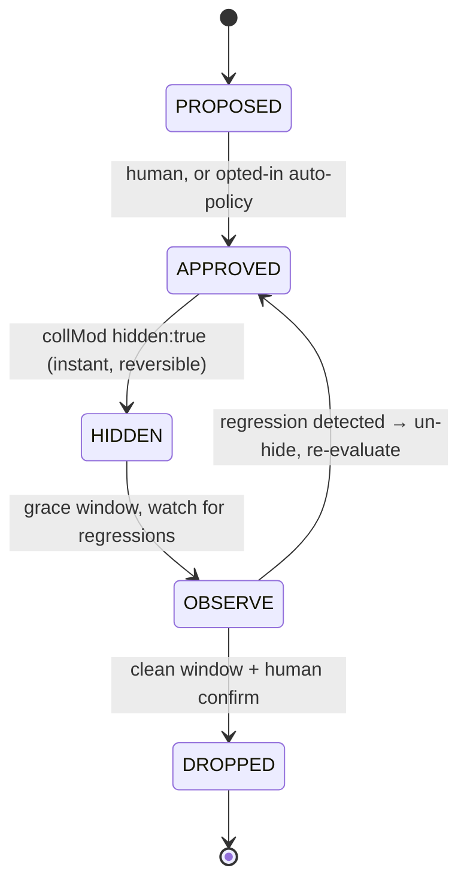
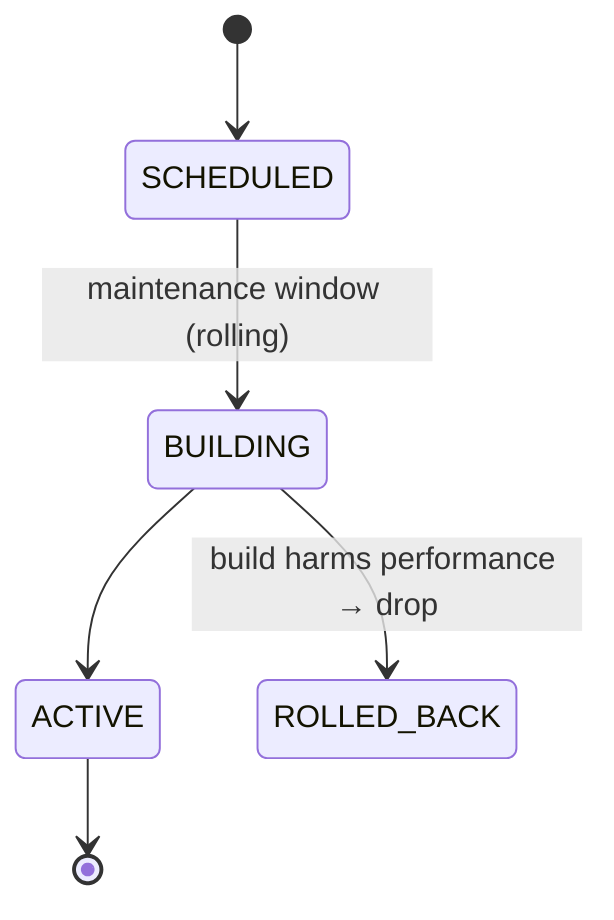

# Architecture — MongoDB Index Optimizer (working title)

**Status:** Draft v1 · **Last updated:** 2026-07-22

This document locks the architecture and the key decisions behind them. It is the
source of truth for the initial build. Update the Decision Log at the bottom when
anything here changes.

---

## 1. Product

A SaaS that continuously monitors MongoDB indexes and safely manages them:
create missing indexes, drop unused ones, remove redundant ones, and merge
overlapping ones — while proving the improvement in hard numbers.

**Problem.** Teams add indexes over time and almost never remove them. Every
index slows writes (each write updates every index), consumes RAM (working set)
and disk, and nobody audits `$indexStats`. The cost is a slow burn, so it is
rarely acted on.

**Wedge / differentiation.**

- MongoDB Atlas *Index Autopilot* only auto-**creates** indexes. It recommends
  removals but never auto-drops them (dropping is dangerous), and it is
  **Atlas-only**.
- Our edge is the part Atlas leaves manual: **safe auto-cleanup** (drop unused /
  redundant, merge), **self-hosted + multi-cloud coverage**, and a
  **cross-provider ROI dashboard**.
- Second edge: an **index-only permission model** means we never read customer
  data rows — a strong trust story Atlas does not need to make.

Do **not** compete on auto-create on Atlas. Compete on safe cleanup everywhere.

---

## 2. Principles

1. **Safety is asymmetric.** Keeping a useless index is mild waste; dropping a
   needed one is an outage. Every ambiguous call biases toward *keep*.
2. **Read-only by default.** Demo/read-only is structural, not a UI toggle. The
   data plane refuses all writes to a cluster unless that cluster is explicitly
   taken out of demo mode.
3. **Deletion is a confirmed, reversible pipeline** — never a single command.
4. **No customer data exposure** in the cleanup path. Index metadata and usage
   stats only; no `find`.
5. **ROI must be visible.** Every action reports before/after. No visible ROI,
   no renewal.
6. **Fully typed.** No `any`, no `as` overrides, no linter-ignore comments.
   Latest stable versions of every dependency. Comments stay short.

---

## 3. Tech stack

| Layer | Choice | Role |
|-------|--------|------|
| API (control plane) | **NestJS + Fastify** | orchestration, tenancy, apply engine |
| Web (dashboard) | **TanStack Start** + **shadcn/ui** | dashboard UI |
| Auth | **better-auth** | GitHub OAuth + email/password |
| ORM / migrations | **Drizzle** | Postgres schema + migrations |
| App database | **PostgreSQL** | control-plane state (not the managed DBs) |
| Monorepo | **Turbo** | build/task orchestration |
| Lint/format | **Biome** | one tool, strict |
| API contracts | **oRPC** (`@orpc/contract` + `@orpc/nest` + OpenAPILink client) | typed contracts shared api ↔ web ↔ agent, zod 4 |
| Data fetching (web) | **TanStack Query** | pairs with TanStack Start + the oRPC client |
| Job queue | **graphile-worker** | Postgres-backed jobs (no Redis) |
| Crypto | **@noble/ciphers** | envelope encryption for secrets |
| Container | **Docker** | separate api/web images, compose for dev |

Postgres stores **our** state. The databases we manage are the customers'
**MongoDB** clusters, reached via the data plane. Clean separation.

Versions are pinned to latest stable at scaffold time — this doc does not hard-code
version numbers so it does not go stale.

---

## 4. Topology — control plane / data plane

The spine of the system. The **control plane** (our SaaS) never touches customer
MongoDB directly in agent mode; it decides and displays. The **data plane** is the
only component that touches MongoDB, using an **index-only role**.

```
 CUSTOMER INFRA (private)            OUR SaaS (control plane)          BROWSER
┌───────────────────────┐          ┌──────────────────────────┐     ┌──────────┐
│  MongoDB replica set  │          │  apps/api (NestJS+Fastify)│     │ apps/web │
│  ┌─────┐ ┌─────────┐  │          │   - accounts / tenancy    │◄───►│ TanStack │
│  │prim.│ │secondary│  │          │   - recommendations       │ ts- │  Start   │
│  └──┬──┘ └────┬────┘  │          │   - apply orchestrator    │ rest│ +shadcn  │
│     │        │        │          │   - audit + ROI           │     └──────────┘
│  ┌──▼────────▼──────┐ │  HTTPS   │   - job queue (graphile)  │
│  │  DATA PLANE      │ │◄────────►│                           │
│  │  collector +     │ │ outbound │  PostgreSQL (Drizzle)     │
│  │  executor        │ │  only    │  secrets (envelope enc)   │
│  │  (index-only role)│ │(agent mode)                         │
│  └──────────────────┘ │          └──────────────────────────┘
└───────────────────────┘
```

### Connection modes (same data-plane interface, two implementations)

- **Hosted-direct — v1.** Customer pastes a MongoDB connection string (SRV URI,
  index-only role) into the dashboard. Our servers connect out over TLS. Fastest
  onboarding; self-serve. Requires their cluster be reachable from us (public
  endpoint or IP allowlist) and that they trust us to hold creds (encrypted).
- **Agent — phase 2.** Customer runs a small container inside their network. It
  talks to MongoDB locally and phones home outbound-only. MongoDB is never
  exposed; creds never leave customer infra. Enterprise trust tier.

The data plane is defined by **one interface**; hosted-direct and agent are two
implementations. Building hosted-direct first does not preclude the agent — it is
an additive second implementation, not a rewrite.

---

## 5. Monorepo layout (Turbo)

```
apps/
  api/          NestJS + Fastify — control plane
  web/          TanStack Start + shadcn — dashboard
  agent/        deployable collector + executor (phase 2; same iface as hosted)
packages/
  core/         PURE analysis + safety engine. No I/O. Heavily tested. ← the heart
  mongo/        driver wrapper: collect $indexStats, execute create/drop/hide
  db/           Drizzle schema + migrations (Postgres) + secret sealing
  contracts/    oRPC contracts + zod 4 schemas (shared types api ↔ web ↔ agent)
  auth/         better-auth config (GitHub + email/password)
  config/       shared tsconfig + Biome config
```

`packages/core` holds all dangerous logic as **pure functions**:
`(indexes + usage snapshots) → classified recommendations`. No database, no
network. Pure means deterministic, testable, and trustworthy. This package gets
the deepest test coverage.

---

## 6. Core domain — the analysis engine

### 6.1 Recommendation types

| Type | Trigger | Risk |
|------|---------|------|
| `DROP_UNUSED` | ~0 ops over the observation model | medium |
| `DROP_REDUNDANT` | index is a prefix of another, options compatible | medium |
| `MERGE` | two indexes replaceable by one superset | medium |
| `CREATE` | workload needs it (phase 2 — needs profiler) | low (additive) |
| `UPDATE` | option change (e.g. add partial filter) | low |

### 6.2 Usage detection — the subtlety that causes outages if wrong

`$indexStats.accesses.ops` is **cumulative since that mongod last restarted**, and
it is **per-member**. Consequences the engine must handle:

- **Snapshot over time.** Periodically snapshot `$indexStats` into Postgres and
  compute rolling-window usage from the deltas. A single reading is meaningless.
- **Detect restarts.** If the counter drops, the member restarted; track member
  uptime. If uptime is shorter than the window, the stats are unreliable — do not
  recommend a drop.
- **Aggregate across all replica-set members.** Secondaries serve reads with
  different index usage than the primary. Reading only the primary and dropping an
  index a secondary relies on is a classic outage. Sum usage across primary + all
  secondaries before concluding "unused".

### 6.3 Usage classification by time series

Classify each index from its usage history, not a single number:

| Class | Signal | Action |
|-------|--------|--------|
| `CONTINUOUS` | regular ops | keep |
| `PERIODIC_ALIVE` | bursts on a detected cycle, latest expected burst **present** | keep — never drop |
| `PERIODIC_DEAD` | had a cycle, then **≥N expected bursts missed** | propose drop, move faster |
| `FLAT_ZERO` | long zero, no detectable pattern | standard window |

To label a pattern **dead** (rather than "hasn't fired this cycle yet"), the engine
must first *learn the period* (needs ≥2–3 observed periods of history), then observe
**N expected occurrences that did not happen**. Example: an index that fires around
the 1st of each month — if two consecutive month-starts pass with zero ops, the
workload is decommissioned → propose drop.

This is both **safer** (a flat window would wrongly flag a live monthly index during
a quiet stretch) and **faster** (a genuinely dead pattern can be dropped without
waiting the full conservative window). Before enough history exists to detect a
cycle, fall back to `FLAT_ZERO` rules.

### 6.4 Redundancy / merge rules

An index is redundant when it is a **proper prefix** of another compound index —
e.g. `{a:1}` is covered by `{a:1, b:1}`. But prefix match alone is not sufficient;
the classifier must confirm **option compatibility**, or it will drop something
that does more than accelerate queries:

- Sort direction of the shared prefix keys must match.
- A **unique** `{a:1}` is *not* redundant against a non-unique `{a:1, b:1}` — it
  enforces a constraint. Same for differing `partialFilterExpression`, `collation`,
  `sparse`, TTL, or index type (text/geo/wildcard).

`MERGE` is the inverse: when two indexes are each partially useful, propose a single
superset index that covers both, then retire the two — via the same apply pipeline.

### 6.5 Safety classifier — the never-auto-drop list

Hard block. These are never eligible for an automated drop, regardless of usage:

- The `_id_` index (mandatory).
- **Unique** indexes — they enforce a constraint; zero query ops does **not** mean
  unused. Dropping one can allow data corruption.
- **TTL** indexes — they expire documents; low query usage is expected.
- **Shard key** indexes — the cluster breaks without them.
- Partial / sparse indexes serving a constraint.
- Any index younger than the observation window (insufficient data).
- Any index used on **any** replica-set member.

Bias: when uncertain, keep.

---

## 7. Apply pipeline — safety-critical

Every recommendation moves through an explicit state machine. Ordering is part of
the safety guarantee.

### 7.1 Drops (reversible until the final step)



1. `PROPOSED` — shown with rationale and estimated savings.
2. `APPROVED` — by a human, or by an auto-policy only where the customer opted in
   for that class of action.
3. `HIDDEN` — execute `collMod { hidden: true }`. Instant and fully reversible. The
   planner stops using the index; the index still exists.
   > Note: a hidden index is **still maintained on writes** and still consumes disk
   > and RAM. Hiding yields no write/space benefit — it is purely a safety probe.
   > Real benefit arrives only at `DROPPED`.
4. `OBSERVE` — grace window (default 30d, see §7.3). Watch for query-latency
   regressions or errors. On any degradation, un-hide instantly (one `collMod`) and
   re-evaluate.
5. `DROPPED` — only after a clean observe window, and always human-confirmed. This
   is the sole irreversible step.

### 7.2 Creates



Creates are scheduled into a maintenance window (a rolling build still drives I/O
and can cause replication lag). The build spec is retained as a rollback token: if
the build harms performance, drop it.

### 7.3 Observe / grace window

- **Default 30 days.** 7 days catches daily and weekly patterns but misses monthly
  jobs (billing, month-end reports); dropping an index a monthly job needs causes an
  outage weeks later. 30 days catches monthly. The cost of waiting is only *delayed*
  benefit, never lost benefit — outage from dropping too soon is real damage.
- **Adaptive down.** If ≥90 days of zero-usage snapshots already exist for the
  index, shorten the window and drop with confidence.
- **Pattern-aware.** `PERIODIC_DEAD` (see §6.3) can proceed faster; `PERIODIC_ALIVE`
  never proceeds.
- **Configurable** per policy (a customer who knows there are no monthly jobs may
  set 7 days).

### 7.4 Execution-time pre-flight (defense in depth)

The world changes between recommendation and execution. Immediately before any
hide/drop, the executor re-fetches live stats and re-runs the classifier against the
current index spec. If the index is no longer unused, its options changed, or it is
now unique/TTL — **abort and re-propose**. Classification is centralized in `core`;
this final re-check runs at the executor.

### 7.5 "Instant apply" for critical indexes — scoped

Restricted to **creation only** — never an instant drop. "Critical" is defined
narrowly: an index that resolves a collection scan on a large, hot collection during
an active latency incident. Even then it is gated behind per-cluster opt-in and a
maximum-collection-size threshold, and logged prominently. Drops never skip the
hide → observe → drop path, regardless of urgency.

---

## 8. Verification & ROI

After each action, measure before/after and persist to `roi_metrics`:

- RAM / working-set and disk bytes freed (`collStats`, `$indexStats`).
- Write-throughput delta (fewer indexes → faster writes).
- Index-count trend.

The dashboard headline is these hard numbers.

---

## 9. Security

### 9.1 Index-only MongoDB role — no data-row access

The data plane connects with a custom role granting only index management and stats,
excluding `find` / `insert` / `update` / `remove`. It therefore cannot read customer
documents.

```js
db.getSiblingDB("admin").createRole({
  role: "indexManager",
  privileges: [
    { resource: { db: "yourDb", collection: "" }, // "" = all collections in db
      actions: [
        "listCollections", "listIndexes",       // discover
        "indexStats", "collStats", "dbStats",   // usage + size → ROI numbers
        "createIndex", "dropIndex", "collMod"   // act (collMod = hide before drop)
      ]
    }
  ],
  roles: []
})
```

- `createIndex` builds the index under server authority, so **no read grant is
  needed** — the role never exposes document contents.
- **Confidentiality vs availability.** This role prevents data leakage, but
  `dropIndex` can still cause an outage and `createIndex` can spike load. The
  role does not replace the confirm / hide-first / windowed-build pipeline; both
  layers are required.
- **Suggesting new indexes needs more.** Workload analysis for `CREATE` reads the
  profiler / slow-query logs (`system.profile`), which contain query predicates
  with **literal data values**. That path is a higher trust tier and opt-in. The
  cleanup path (drop/merge) needs index metadata + `$indexStats` only → zero data
  exposure. Ship cleanup first.

### 9.2 Secrets at rest — app-level envelope encryption

MongoDB connection strings and agent tokens are encrypted with a swappable
`KeyProvider` (the master-key custodian). v1 keeps the master key in the runtime
environment (Docker secret / host env, never in git); it can later move to
self-hosted Vault/OpenBao or a cloud KMS with no call-site changes.

Primitive: **@noble/ciphers**, XChaCha20-Poly1305 with `managedNonce`
(24-byte random-safe nonce, auto-managed — avoids the GCM nonce-reuse footgun).
Pure TS, audited, zero deps, no native build, fully typed.

```ts
import { xchacha20poly1305 } from "@noble/ciphers/chacha.js";
import { managedNonce, randomBytes } from "@noble/ciphers/utils.js";

// Master-key custodian. v1 = env; later Vault/KMS — same interface, swap impl.
interface KeyProvider {
  wrap(dek: Uint8Array): Promise<Uint8Array>;   // encrypt data key with master key
  unwrap(wrapped: Uint8Array): Promise<Uint8Array>;
}

// v1: master key = 32 random bytes, injected via env / Docker secret.
function envKeyProvider(masterKey: Uint8Array): KeyProvider {
  const kek = managedNonce(xchacha20poly1305)(masterKey);
  return {
    wrap: async (dek) => kek.encrypt(dek),
    unwrap: async (wrapped) => kek.decrypt(wrapped),
  };
}

interface Sealed { dek: Uint8Array; data: Uint8Array; }

// Envelope: random per-secret DEK encrypts data; KEK wraps the DEK.
async function seal(plaintext: Uint8Array, kp: KeyProvider): Promise<Sealed> {
  const dek = randomBytes(32);
  const cipher = managedNonce(xchacha20poly1305)(dek);
  return { dek: await kp.wrap(dek), data: cipher.encrypt(plaintext) };
}

async function open(s: Sealed, kp: KeyProvider): Promise<Uint8Array> {
  const dek = await kp.unwrap(s.dek);
  return managedNonce(xchacha20poly1305)(dek).decrypt(s.data);
}
```

`Sealed` is stored as two `bytea` columns (Drizzle `customType`).

**Accepted risk (v1).** With the master key in the app environment, an attacker who
obtains both the runtime env and the database can decrypt everything. A KMS/Vault
adds a separation boundary and an audit trail. For early stage with few customers
this is acceptable **provided** the master key is injected at runtime (never
committed), host access is tightly controlled, and a rotation path is planned.
Moving the custodian to Vault/OpenBao or a KMS is a funded-stage / first-enterprise
task, not a v1 blocker.

**Password hashing is separate.** better-auth owns credential hashing
(scrypt/argon2). Never hand-encrypt passwords with the above — it is only for
secrets at rest.

### 9.3 Tenancy

Organizations → members → connected clusters. Every row is scoped by `orgId`;
all queries are org-filtered. An immutable audit log records every state transition.

---

## 10. Data model (PostgreSQL / Drizzle)

- **better-auth tables** (users, sessions, accounts) — via the better-auth Drizzle
  adapter.
- **organizations**, **members** — multi-tenant; everything scoped by `orgId`.
- **clusters** — connection mode, encrypted creds/agent token (`Sealed`),
  `demoMode` (default `true`).
- **agents** — registration, last-seen, version (phase 2).
- **index_snapshots** — time series: cluster / db / collection / index, spec,
  options, size, per-member ops, member uptime, `capturedAt`.
- **recommendations** — type, target, rationale, safety class, usage class,
  estimated savings, state.
- **actions** — audit: what / when / who-or-policy, before/after, rollback token,
  result.
- **roi_metrics** — freed bytes, throughput delta, index-count delta, per period.
- **policies** — per-cluster auto-apply rules, maintenance windows, thresholds,
  observe-window override.
- **audit_log** — immutable, every state transition.

---

## 11. API & contracts

- **oRPC** contracts live in `packages/contracts` and are shared by api, web, and
  agent — one source of truth for types, no codegen, no `any`. Zod schemas validate
  at the boundary.
- **Dashboard API:** oRPC (`@Implement` on Nest controllers) over Fastify;
  consumed by the web app through the oRPC OpenAPILink client.
- **Agent channel (phase 2):** authenticated, outbound-initiated. The agent posts
  snapshots over HTTPS and receives commands (create/drop/hide) via a long-lived
  channel (long-poll or websocket). Agent authenticates with a per-agent token; mTLS
  is an option for higher tiers.

---

## 12. Background jobs

**graphile-worker** (Postgres-backed) — no Redis dependency, fits the compose setup.
Job kinds:

- **collect** — snapshot `$indexStats` / sizes per cluster on a schedule.
- **classify** — run `core` over recent snapshots to (re)generate recommendations.
- **execute** — run the apply pipeline steps (hide, drop, create) with pre-flight.
- **verify** — measure before/after and write `roi_metrics`.

In agent mode much of *collect* and *execute* runs agent-side on its own timer; the
control plane orchestrates and stores. graphile-worker can be swapped for
Redis + BullMQ only if scale demands it.

---

## 13. Web / dashboard (TanStack Start + shadcn)

- **Overview** — ROI headline (RAM/disk freed, write-throughput gained, index-count
  trend), per-cluster health.
- **Recommendations** — proposed actions with safety and usage-class badges,
  approve/reject, diff view.
- **Cluster detail** — collections, indexes, usage heatmap, redundancy graph.
- **History / audit** — executed actions with rollback controls.
- **Settings** — connection, policies, maintenance windows, demo toggle.

---

## 14. Deployment

- **Separate Dockerfiles** — `apps/api/Dockerfile` and `apps/web/Dockerfile`
  (multi-stage), so api and web deploy independently.
- **`apps/agent/Dockerfile`** — the distributable agent (phase 2).
- **docker-compose** (dev) — `postgres` + `api` + `web`, with **hot reload** via
  bind mounts and Turbo watch. PostgreSQL runs in compose.

---

## 15. Engineering standards

- No `any`, no `as` overrides, no linter-ignore comments. Strict TypeScript
  everywhere; the contracts package enforces boundary types.
- Every dependency pinned to latest stable at scaffold time.
- Comments stay short.
- **graphify** — once the monorepo exists, build the knowledge graph and treat
  architecture / flow / dependency questions as graph queries first. Re-run when a
  large change may have made the graph stale.

---

## 16. Decision log

| # | Decision | Rationale | Status |
|---|----------|-----------|--------|
| D1 | Control-plane / data-plane split | Keep prod creds and DB access isolated from the SaaS; enables agent mode later | Locked |
| D2 | Hosted-direct connection for v1 | Fastest onboarding / self-serve; agent is an additive impl, not a rewrite | Locked |
| D3 | Index-only MongoDB role | No data-row exposure in cleanup path; strong trust story | Locked |
| D4 | Hide → observe → drop pipeline | Makes drops reversible until the final confirmed step | Locked |
| D5 | Observe window 30d, adaptive + pattern-aware + configurable | Catches monthly jobs; waiting only delays benefit, dropping early causes outages | Locked |
| D6 | Usage classified by time series (incl. `PERIODIC_DEAD`) | Distinguishes live periodic jobs from decommissioned ones — safer and faster | Locked |
| D7 | "Instant apply" limited to creates, opt-in, size-gated | Auto-create is additive-ish; auto-drop never instant | Locked |
| D8 | App-level envelope encryption via swappable `KeyProvider`, `@noble/ciphers` | Zero cost, no extra infra, no lock-in; KMS/Vault later without call-site changes | Locked |
| D9 | **oRPC** for contracts (was ts-rest) | Migrated Jul 2026 at the founder's call: same contract-first shape (`@Implement` mirrors `@TsRestHandler`), zod 4 native, OpenAPI-standard paths kept so the integration suite survived unchanged (11/12 on first run). Handler errors are ORPCError-coded; the Nest filter now covers only non-oRPC paths | Revised |
| D10 | graphile-worker for jobs | Postgres-backed, no Redis; fits compose | Locked |
| D11 | Demo/read-only default per cluster | Read-only is structural, not a toggle | Locked |
| D12 | npm workspaces (not pnpm) for now | Local Node is Zed-managed; a global pnpm install conflicted. Turbo supports npm workspaces; swappable later | Locked |
| D13 | TypeScript **6** (last JS line); api built with **swc** directly (no Nest CLI) | Was TS 7 (native), but 7 ships no `tsserver.js` until 7.1 — editors broke. TS 6 keeps full toolchain parity (tsserver, programmatic API); typecheck speed is a non-issue at this repo size. Revisit 7 at 7.1 | Revised |
| D14 | **zod 4** (pin lifted) | Landed with the oRPC migration (D9). The api's internal driver-boundary schemas were already v4-compatible (two-arg `z.record`, no deprecated APIs) — zero code changes beyond `z.uuid()`/`z.email()` in the contracts | Revised |
| D15 | Internal packages compile to CJS `dist`; apps consume built output | Predictable dev/prod module resolution; Turbo orders builds via `^build` | Locked |

### Deferred / open

- **KMS/Vault custodian** — deferred to funded stage / first enterprise deal
  (see §9.2). App-level now.
- **TypeScript 7 (native)** — re-adopt at 7.1 when `tsserver.js` and the
  programmatic compiler API return; also unblocks reverting api to the Nest CLI
  (see D13).

- **Agent mode** — phase 2. Interface designed for it from day one.
- **Suggest-mode (`CREATE` from workload)** — higher trust tier; needs profiler
  access. Ship cleanup path first.

---

## 17. Phasing

**v1 (cleanup, hosted-direct)**
- Hosted-direct connection, index-only role, demo default.
- Collect snapshots → classify (`DROP_UNUSED`, `DROP_REDUNDANT`, `MERGE`).
- Hide → observe → drop pipeline with pre-flight.
- ROI dashboard.

**Phase 2**
- Agent deployment mode.
- `CREATE` from workload analysis (profiler, opt-in trust tier).
- Scoped "instant apply" for critical creates.
- KMS/Vault key custodian.
