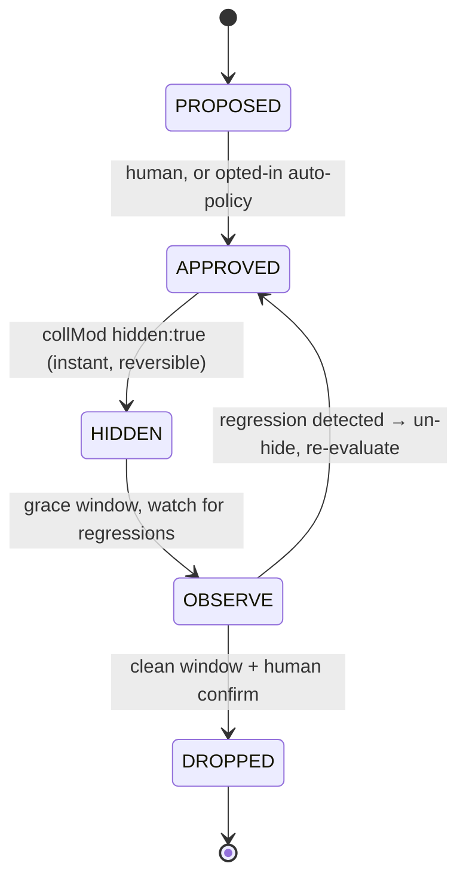
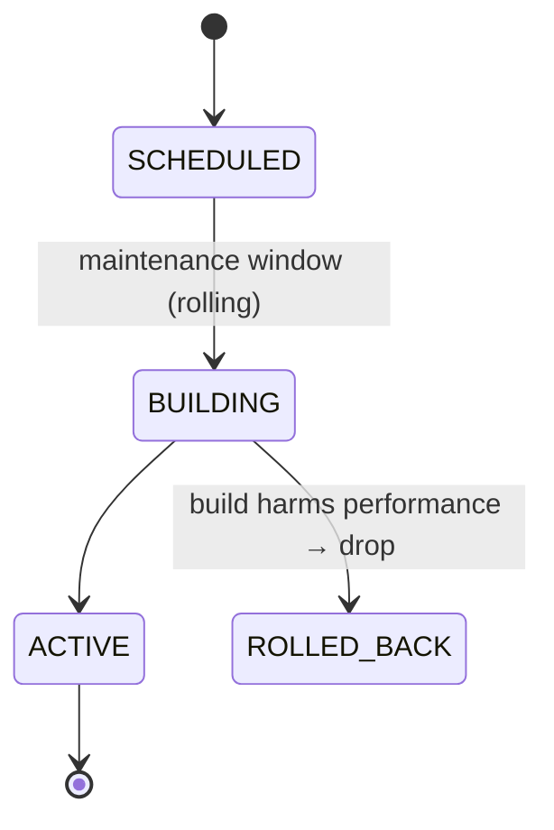

# Architecture — MongoDB Index Optimizer (working title)

**Status:** Draft v1 · **Last updated:** 2026-07-22

This document locks the architecture and the key decisions behind them. It is the
source of truth for the initial build. Update the Decision Log at the bottom when
anything here changes.

---

## 1. Product

A SaaS that continuously monitors MongoDB indexes and safely manages them:
create missing indexes, drop unused ones, remove redundant ones, and merge
overlapping ones — while proving the improvement in hard numbers.

**Problem.** Teams add indexes over time and almost never remove them. Every
index slows writes (each write updates every index), consumes RAM (working set)
and disk, and nobody audits `$indexStats`. The cost is a slow burn, so it is
rarely acted on.

**Wedge / differentiation.**

- MongoDB Atlas *Index Autopilot* only auto-**creates** indexes. It recommends
  removals but never auto-drops them (dropping is dangerous), and it is
  **Atlas-only**.
- Our edge is the part Atlas leaves manual: **safe auto-cleanup** (drop unused /
  redundant, merge), **self-hosted + multi-cloud coverage**, and a
  **cross-provider ROI dashboard**.
- Second edge: an **index-only permission model** means we never read customer
  data rows — a strong trust story Atlas does not need to make.

Do **not** compete on auto-create on Atlas. Compete on safe cleanup everywhere.

---

## 2. Principles

1. **Safety is asymmetric.** Keeping a useless index is mild waste; dropping a
   needed one is an outage. Every ambiguous call biases toward *keep*.
2. **Read-only by default.** Demo/read-only is structural, not a UI toggle. The
   data plane refuses all writes to a cluster unless that cluster is explicitly
   taken out of demo mode.
3. **Deletion is a confirmed, reversible pipeline** — never a single command.
4. **No customer data exposure** in the cleanup path. Index metadata and usage
   stats only; no `find`.
5. **ROI must be visible.** Every action reports before/after. No visible ROI,
   no renewal.
6. **Fully typed.** No `any`, no `as` overrides, no linter-ignore comments.
   Latest stable versions of every dependency. Comments stay short.

---

## 3. Tech stack

| Layer | Choice | Role |
|-------|--------|------|
| API (control plane) | **NestJS + Fastify** | orchestration, tenancy, apply engine |
| Engine adapters | **ports + registry** (`src/engine`, §9) | MongoDB shipped; PostgreSQL/MSSQL planned |
| Web (dashboard) | **TanStack Start** + **shadcn/ui** | dashboard UI |
| Auth | **better-auth** | GitHub OAuth + email/password |
| ORM / migrations | **Drizzle** | Postgres schema + migrations |
| App database | **PostgreSQL** | control-plane state (not the managed DBs) |
| Monorepo | **Turbo** | build/task orchestration |
| Lint/format | **Biome** | one tool, strict |
| API contracts | **oRPC** (`@orpc/contract` + `@orpc/nest` + OpenAPILink client) | typed contracts shared api ↔ web ↔ agent, zod 4 |
| Data fetching (web) | **TanStack Query** | pairs with TanStack Start + the oRPC client |
| Job queue | **graphile-worker** | Postgres-backed jobs (no Redis) |
| Crypto | **@noble/ciphers** | envelope encryption for secrets |
| Container | **Docker** | separate api/web images, compose for dev |

Postgres stores **our** state. The databases we manage are the customers'
**MongoDB** clusters, reached via the data plane. Clean separation.

Versions are pinned to latest stable at scaffold time — this doc does not hard-code
version numbers so it does not go stale.

---

## 4. Topology — control plane / data plane

The spine of the system. The **control plane** (our SaaS) never touches customer
MongoDB directly in agent mode; it decides and displays. The **data plane** is the
only component that touches MongoDB, using an **index-only role**.

```
 CUSTOMER INFRA (private)            OUR SaaS (control plane)          BROWSER
┌───────────────────────┐          ┌──────────────────────────┐     ┌──────────┐
│  MongoDB replica set  │          │  apps/api (NestJS+Fastify)│     │ apps/web │
│  ┌─────┐ ┌─────────┐  │          │   - accounts / tenancy    │◄───►│ TanStack │
│  │prim.│ │secondary│  │          │   - recommendations       │ ts- │  Start   │
│  └──┬──┘ └────┬────┘  │          │   - apply orchestrator    │ rest│ +shadcn  │
│     │        │        │          │   - audit + ROI           │     └──────────┘
│  ┌──▼────────▼──────┐ │  HTTPS   │   - job queue (graphile)  │
│  │  DATA PLANE      │ │◄────────►│                           │
│  │  collector +     │ │ outbound │  PostgreSQL (Drizzle)     │
│  │  executor        │ │  only    │  secrets (envelope enc)   │
│  │  (index-only role)│ │(agent mode)                         │
│  └──────────────────┘ │          └──────────────────────────┘
└───────────────────────┘
```

### Connection modes (same data-plane interface, two implementations)

- **Hosted-direct — v1.** Customer pastes a MongoDB connection string (SRV URI,
  index-only role) into the dashboard. Our servers connect out over TLS. Fastest
  onboarding; self-serve. Requires their cluster be reachable from us (public
  endpoint or IP allowlist) and that they trust us to hold creds (encrypted).
- **Agent — phase 2.** Customer runs a small container inside their network. It
  talks to MongoDB locally and phones home outbound-only. MongoDB is never
  exposed; creds never leave customer infra. Enterprise trust tier.

The data plane is defined by **one interface**; hosted-direct and agent are two
implementations. Building hosted-direct first does not preclude the agent — it is
an additive second implementation, not a rewrite.

---

## 5. Monorepo layout (Turbo)

```
apps/
  api/          NestJS + Fastify — control plane
  web/          TanStack Start + shadcn — dashboard
  agent/        deployable collector + executor (phase 2; same iface as hosted)
packages/
  core/         PURE analysis + safety engine. No I/O. Heavily tested. ← the heart
  mongo/        driver wrapper: collect $indexStats, execute create/drop/hide
  db/           Drizzle schema + migrations (Postgres) + secret sealing
  contracts/    oRPC contracts + zod 4 schemas (shared types api ↔ web ↔ agent)
  auth/         better-auth config (GitHub + email/password)
  config/       shared tsconfig + Biome config
```

`packages/core` holds all dangerous logic as **pure functions**:
`(indexes + usage snapshots) → classified recommendations`. No database, no
network. Pure means deterministic, testable, and trustworthy. This package gets
the deepest test coverage.

---

## 6. Core domain — the analysis engine

### 6.1 Recommendation types

| Type | Trigger | Risk |
|------|---------|------|
| `DROP_UNUSED` | ~0 ops over the observation model | medium |
| `DROP_REDUNDANT` | index is a prefix of another, options compatible | medium |
| `MERGE` | two indexes replaceable by one superset | medium |
| `CREATE` | workload needs it (phase 2 — needs profiler) | low (additive) |
| `UPDATE` | option change (e.g. add partial filter) | low |

### 6.2 Usage detection — the subtlety that causes outages if wrong

`$indexStats.accesses.ops` is **cumulative since that mongod last restarted**, and
it is **per-member**. Consequences the engine must handle:

- **Snapshot over time.** Periodically snapshot `$indexStats` into Postgres and
  compute rolling-window usage from the deltas. A single reading is meaningless.
- **Detect restarts.** *Implemented* (`countersRestartedDuring`): every snapshot
  persists each member's `accesses.since` — the moment that member's counter
  started — so classification can see a reset rather than infer one. A window is
  distrusted when `since` advances for any member across it, or when the newest
  counters are younger than the window itself (they cannot account for a period
  they did not exist for). Either way no usage-based finding is made. Snapshots
  written before the field existed carry none and are skipped, so the check
  never invents evidence.
- **Aggregate across all replica-set members.** Secondaries serve reads with
  different index usage than the primary. Reading only the primary and dropping an
  index a secondary relies on is a classic outage. Sum usage across primary + all
  secondaries before concluding "unused".

### 6.3 Usage classification by time series

Classify each index from its usage history, not a single number:

| Class | Signal | Action |
|-------|--------|--------|
| `CONTINUOUS` | regular ops | keep |
| `PERIODIC_ALIVE` | bursts on a detected cycle, latest expected burst **present** | keep — never drop |
| `PERIODIC_DEAD` | had a cycle, then **≥N expected bursts missed** | propose drop, move faster |
| `FLAT_ZERO` | long zero, no detectable pattern | standard window |

To label a pattern **dead** (rather than "hasn't fired this cycle yet"), the engine
must first *learn the period* (needs ≥2–3 observed periods of history), then observe
**N expected occurrences that did not happen**. Example: an index that fires around
the 1st of each month — if two consecutive month-starts pass with zero ops, the
workload is decommissioned → propose drop.

This is both **safer** (a flat window would wrongly flag a live monthly index during
a quiet stretch) and **faster** (a genuinely dead pattern can be dropped without
waiting the full conservative window). Before enough history exists to detect a
cycle, fall back to `FLAT_ZERO` rules.

### 6.4 Redundancy / merge rules

An index is redundant when it is a **proper prefix** of another compound index —
e.g. `{a:1}` is covered by `{a:1, b:1}`. But prefix match alone is not sufficient;
the classifier must confirm **option compatibility**, or it will drop something
that does more than accelerate queries:

- Sort direction of the shared prefix keys must match.
- A **unique** `{a:1}` is *not* redundant against a non-unique `{a:1, b:1}` — it
  enforces a constraint. Same for differing `partialFilterExpression`, `collation`,
  `sparse`, TTL, or index type (text/geo/wildcard).

`MERGE` is the inverse: when two indexes are each partially useful, propose a single
superset index that covers both, then retire the two — via the same apply pipeline.

### 6.5 Safety classifier — the never-auto-drop list

Hard block. These are never eligible for an automated drop, regardless of usage:

- The `_id_` index (mandatory).
- **Unique** indexes — they enforce a constraint; zero query ops does **not** mean
  unused. Dropping one can allow data corruption.
- **TTL** indexes — they expire documents; low query usage is expected.
- **Shard key** indexes — the cluster breaks without them.
- Partial / sparse indexes serving a constraint.
- Any index younger than the observation window (insufficient data).
- Any index used on **any** replica-set member.

Bias: when uncertain, keep.

---

## 7. Apply pipeline — safety-critical

Every recommendation moves through an explicit state machine. Ordering is part of
the safety guarantee.

### 7.1 Drops (reversible until the final step)



1. `PROPOSED` — shown with rationale and estimated savings.
2. `APPROVED` — by a human, or by an auto-policy only where the customer opted in
   for that class of action.
3. `HIDDEN` — execute `collMod { hidden: true }`. Instant and fully reversible. The
   planner stops using the index; the index still exists.
   > Note: a hidden index is **still maintained on writes** and still consumes disk
   > and RAM. Hiding yields no write/space benefit — it is purely a safety probe.
   > Real benefit arrives only at `DROPPED`.
4. `OBSERVE` — grace window (default 30d, see §7.3). Watch for query-latency
   regressions or errors. On any degradation, un-hide instantly (one `collMod`) and
   re-evaluate.
5. `DROPPED` — only after a clean observe window, and always human-confirmed. This
   is the sole irreversible step.

### 7.2 Creates



Creates are scheduled into a maintenance window (a rolling build still drives I/O
and can cause replication lag). The build spec is retained as a rollback token: if
the build harms performance, drop it.

### 7.3 Observe / grace window

- **Default 30 days.** 7 days catches daily and weekly patterns but misses monthly
  jobs (billing, month-end reports); dropping an index a monthly job needs causes an
  outage weeks later. 30 days catches monthly. The cost of waiting is only *delayed*
  benefit, never lost benefit — outage from dropping too soon is real damage.
- **Adaptive down.** If ≥90 days of zero-usage snapshots already exist for the
  index, shorten the window and drop with confidence.
- **Pattern-aware.** `PERIODIC_DEAD` (see §6.3) can proceed faster; `PERIODIC_ALIVE`
  never proceeds.
- **Configurable** per policy (a customer who knows there are no monthly jobs may
  set 7 days).

### 7.4 Execution-time pre-flight (defense in depth)

The world changes between recommendation and execution. Immediately before any
hide/drop, the executor re-fetches live stats and re-runs the classifier against the
current index spec. If the index is no longer unused, its options changed, or it is
now unique/TTL — **abort and re-propose**. Classification is centralized in `core`;
this final re-check runs at the executor.

### 7.4.1 Losing the cluster mid-pipeline

An outage of days or weeks is the case where a safety gate is most likely to be
wrong, because the counters it compares are **cumulative since mongod started**.

- **Restart during the window.** `current.ops < baseline.ops` means the numbers
  are from a different process lifetime. `evaluateRegression` returns
  **UNOBSERVABLE** — never STABLE — and finalize **un-hides and re-proposes**
  the drop instead of taking the one irreversible action on a window it never
  saw. The same reading also releases an index that sat hidden through the
  outage. On the create side the write watch re-baselines and restarts rather
  than graduating unchecked, and graduation is only evaluated *after* a real
  reading.
- **No restart, just nobody watching.** The counters kept climbing, so the
  observation is still valid — the window merely lasted longer. Nothing special
  happens, which is correct.
- **Usage history with a hole.** Snapshots stop and resume. `classifyUsage`
  cannot tell a busy index from a dead one across a gap, so
  `usageHistoryIsTrustworthy` (≥ 3 snapshots, no gap beyond `maxGapHours`,
  newest within it) gates every usage-based finding. Structural findings
  (redundancy, unique-prefix) are unaffected. This also stops a brand-new
  cluster from proposing a drop for every index on its first collect.
- **Noise.** A cluster that stays unreachable fails collect every 6h forever;
  owner alerts are capped at one per cluster+task per day.
- **Visibility.** `cluster.lastCollectedAt` feeds a staleness badge, so figures
  from before a gap cannot read as current.

### 7.5 "Instant apply" for critical indexes — scoped

Restricted to **creation only** — never an instant drop. "Critical" is defined
narrowly: an index that resolves a collection scan on a large, hot collection during
an active latency incident. Even then it is gated behind per-cluster opt-in and a
maximum-collection-size threshold, and logged prominently. Drops never skip the
hide → observe → drop path, regardless of urgency.

---

## 8. Verification & ROI

After each action, measure before/after and persist to `roi_metrics`:

- RAM / working-set and disk bytes freed (`collStats`, `$indexStats`).
- Write-throughput delta (fewer indexes → faster writes).
- Index-count trend.

The dashboard headline is these hard numbers.

---

## 9. Engine ports — multi-database architecture

The decision core never touches a database driver. Everything engine-specific
sits behind two ports plus a session factory (`apps/api/src/engine/ports.ts`):

- **`IndexCollector`** — the read-only statistics surface (usage, sizes,
  latency, workload shapes, delete patterns). Deliberately contains nothing
  that can read customer data rows. Every method is per namespace except
  `collectWorkload`, which takes them all at once: each engine's workload source
  is one cluster-wide store you filter per namespace (`$queryStats`,
  `pg_stat_statements`), so a per-collection signature invites reading the whole
  store once per collection.
- **`IndexExecutor`** — the only write surface (hide/unhide/drop/create);
  implementations must enforce read-only mode structurally.
- **`EngineSession`** — a pooled connection exposing both, plus
  `listDatabaseNames()` (system namespaces pre-filtered per engine) and
  `ping()` (rotation's verification probe).
- **`EngineAdapter`** — connection-string validation (the SSRF guard) +
  `open()`, registered per engine in `src/engine/registry.ts`. The
  `clusters.engine` column picks the adapter per cluster; adding an engine is
  one new adapter directory plus one registry line, with zero pipeline changes.

The analysis core (`src/analysis`) is pure and engine-neutral; the jobs, the
connection pool, and the API speak only the ports. MongoDB
(`src/mongo/adapter.ts`) is the shipped reference adapter. Vocabulary stays
MongoDB-flavored ("database", "collection") — relational adapters map their
terms (schema, table) rather than the codebase adopting a
lowest-common-denominator vocabulary.

### 9.1 Planned adapter mapping

| Port concept | MongoDB (shipped) | PostgreSQL (planned) | SQL Server (planned) |
|---|---|---|---|
| Usage stats | `$indexStats` | `pg_stat_user_indexes.idx_scan` | `sys.dm_db_index_usage_stats` |
| Sizes + row counts | `$collStats storageStats` | `pg_relation_size` / `pg_stat_user_tables` | `sys.dm_db_partition_stats` |
| Read/write latency | `$collStats latencyStats` | `pg_stat_statements` aggregated per table | Query Store runtime stats |
| Workload shapes | `$queryStats` / profiler | `pg_stat_statements` normalized queries | Query Store query texts |
| Reversible hide | `collMod hidden: true` | **none native** (see capabilities) | `ALTER INDEX … DISABLE` (re-enable = `REBUILD`) |
| Online create | `createIndex` | `CREATE INDEX CONCURRENTLY` | `WITH (ONLINE = ON)` |
| Scoped user | `createRole` + `createUser` | `CREATE ROLE` + `pg_monitor` + index DDL grants | `CREATE LOGIN/USER` + `VIEW SERVER STATE` + `ALTER` |

### 9.2 Capability flags

`EngineCapabilities` marks where engines genuinely differ, so feature gates
check a flag instead of assuming MongoDB semantics deep in the pipeline:

- **`hideIndexes`** — the safety pipeline's observe stage rides on cheap,
  reversible invisibility. SQL Server has an analogue (`DISABLE`, undone by a
  rebuild — reversible but not free). PostgreSQL has none: its adapter will
  need an alternative observe mechanism (extended stats-only observation
  before an irreversible `DROP INDEX CONCURRENTLY`, with the undo path being
  a scripted recreate from the rollback token).
- **`provisionScopedUsers`** — admin-string onboarding (§10.1). Each engine's
  provisioning is inherently engine-specific commands/SQL.

## 10. Security

### 10.1 Index-only MongoDB role — no data-row access

The data plane connects with a custom role granting only index management and
stats, excluding `find` / `insert` / `update` / `remove` on customer
collections. It therefore cannot read customer documents — enforced by the
server, not by promise.

**Automated (admin-string onboarding).** `POST /clusters/provision` accepts an
admin connection string, uses it ONCE to create the role + a dedicated user
(`idx_<hex>`) on the customer cluster, verifies the scoped credentials
authenticate, and stores only the scoped string (sealed, §10.3). The admin
string is never persisted. Re-provisioning refreshes the role's privileges via
`updateRole`, so app updates can evolve the grant. The exact role
(`apps/api/src/mongo/provision.ts`, live-verified against an `--auth` mongod —
every engine command allowed, every document access denied):

```js
db.getSiblingDB("admin").createRole({
  role: "indexterityEngine",
  privileges: [
    // Un-transformed $queryStats needs BOTH actions (verified on mongo 8);
    // both are dropped automatically on mongo <7 (profiler fallback).
    { resource: { cluster: true },
      actions: ["listDatabases", "queryStatsRead", "queryStatsReadTransformed"] },
    { resource: { db: "", collection: "" }, // all non-system collections, all dbs
      actions: [
        "listCollections", "listIndexes",     // discover
        "indexStats", "collStats",            // usage + size + latency → ROI
        "createIndex", "dropIndex", "collMod" // act (collMod = hide before drop)
      ] },
    // The only find grants are metadata namespaces:
    { resource: { db: "", collection: "system.profile" }, actions: ["find"] },
    { resource: { db: "config", collection: "collections" }, actions: ["find"] }
  ],
  roles: []
})
```

Where direct role creation is not possible (Atlas manages users through its own
UI/API; the endpoint maps that failure to a 422 with guidance), create the same
role there manually and connect with the scoped string instead.

- `createIndex` builds the index under server authority, so **no read grant is
  needed** — the role never exposes document contents.
- **Confidentiality vs availability.** This role prevents data leakage, but
  `dropIndex` can still cause an outage and `createIndex` can spike load. The
  role does not replace the confirm / hide-first / windowed-build pipeline; both
  layers are required.
- **`system.profile` is the trust boundary.** Profiler entries contain query
  predicates with **literal data values**; that read powers workload analysis
  and partial-index detection and remains opt-in (`policy.workloadAnalysis`).
  The cleanup path (drop/merge) needs index metadata + `$indexStats` only →
  zero data exposure.

### 10.2 The control plane dials customer hosts — SSRF and the front door

Onboarding takes a connection string and connects to it. That makes the api a
request-forgery primitive unless two things are true.

**The target must not be ours.** `engine/net-guard.ts` resolves every host a
string would dial — including SRV expansion, because on Atlas the seed domain
is not what gets connected — and classifies each resulting address:

- **FORBIDDEN**, never dialed: link-local (`169.254.0.0/16`, which is the cloud
  metadata endpoint and never a database), multicast, reserved, unspecified,
  documentation and benchmarking ranges, IPv6 link-local.
- **PRIVATE**, dialed only when `ALLOW_PRIVATE_CLUSTER_TARGETS=true`: RFC1918,
  loopback, CGNAT, IPv6 ULA. Self-hosted installs need this; a hosted one must
  not set it.

IPv4-mapped IPv6 (`::ffff:10.0.0.5`) is unwrapped before classification — the
classic bypass. Every host in a multi-host string is checked, so a public host
cannot smuggle a private one alongside it. An unresolvable host is allowed
through to fail as "unreachable", which is honest and leaks nothing.

*Residual risk:* DNS may change between the check and the driver's own
resolution (rebinding). Closing it needs the driver to accept pre-resolved
addresses; the practical mitigations in place are the per-user dial budget and
the fact that a rebound target still has to speak the MongoDB wire protocol and
authenticate before anything is stored.

**The front door must not be open by default.** `SIGNUP_MODE` (`invite` by
default) gates account creation for both password and OAuth sign-ups via
better-auth's `user.create.before` hook: the first account bootstraps the
install, everyone after needs a pending invite for their address. `open` and
`closed` are the deliberate alternatives. This gates the *account* only —
joining an org still requires the invite token, so knowing an invited address
buys nothing.

Both are backed by a per-user budget (10 dials/minute, `errors/dial-budget.ts`)
that is consumed *before* the address check, so aiming at blocked addresses
does not buy free attempts.

### 10.3 Secrets at rest — app-level envelope encryption

MongoDB connection strings and agent tokens are encrypted with a swappable
`KeyProvider` (the master-key custodian). v1 keeps the master key in the runtime
environment (Docker secret / host env, never in git); it can later move to
self-hosted Vault/OpenBao or a cloud KMS with no call-site changes.

Primitive: **@noble/ciphers**, XChaCha20-Poly1305 with `managedNonce`
(24-byte random-safe nonce, auto-managed — avoids the GCM nonce-reuse footgun).
Pure TS, audited, zero deps, no native build, fully typed.

```ts
import { xchacha20poly1305 } from "@noble/ciphers/chacha.js";
import { managedNonce, randomBytes } from "@noble/ciphers/utils.js";

// Master-key custodian. v1 = env; later Vault/KMS — same interface, swap impl.
interface KeyProvider {
  wrap(dek: Uint8Array): Promise<Uint8Array>;   // encrypt data key with master key
  unwrap(wrapped: Uint8Array): Promise<Uint8Array>;
}

// v1: master key = 32 random bytes, injected via env / Docker secret.
function envKeyProvider(masterKey: Uint8Array): KeyProvider {
  const kek = managedNonce(xchacha20poly1305)(masterKey);
  return {
    wrap: async (dek) => kek.encrypt(dek),
    unwrap: async (wrapped) => kek.decrypt(wrapped),
  };
}

interface Sealed { dek: Uint8Array; data: Uint8Array; }

// Envelope: random per-secret DEK encrypts data; KEK wraps the DEK.
async function seal(plaintext: Uint8Array, kp: KeyProvider): Promise<Sealed> {
  const dek = randomBytes(32);
  const cipher = managedNonce(xchacha20poly1305)(dek);
  return { dek: await kp.wrap(dek), data: cipher.encrypt(plaintext) };
}

async function open(s: Sealed, kp: KeyProvider): Promise<Uint8Array> {
  const dek = await kp.unwrap(s.dek);
  return managedNonce(xchacha20poly1305)(dek).decrypt(s.data);
}
```

`Sealed` is stored as two `bytea` columns (Drizzle `customType`).

**Accepted risk (v1).** With the master key in the app environment, an attacker who
obtains both the runtime env and the database can decrypt everything. A KMS/Vault
adds a separation boundary and an audit trail. For early stage with few customers
this is acceptable **provided** the master key is injected at runtime (never
committed), host access is tightly controlled, and a rotation path is planned.
Moving the custodian to Vault/OpenBao or a KMS is a funded-stage / first-enterprise
task, not a v1 blocker.

**Password hashing is separate.** better-auth owns credential hashing
(scrypt/argon2). Never hand-encrypt passwords with the above — it is only for
secrets at rest.

### 9.3 Tenancy

Organizations → members → connected clusters. Every row is scoped by `orgId`;
all queries are org-filtered. An immutable audit log records every state transition.

---

## 11. Data model (PostgreSQL / Drizzle)

- **better-auth tables** (users, sessions, accounts) — via the better-auth Drizzle
  adapter.
- **organizations**, **members** — multi-tenant; everything scoped by `orgId`.
  `members.is_active` is the org switcher's selection (at most one per user;
  unset falls back to the oldest membership).
- **clusters** — connection mode, encrypted creds/agent token (`Sealed`),
  `demoMode` (default `true`).
- **agents** — registration, last-seen, version (phase 2).
- **index_snapshots** — time series: cluster / db / collection / index, spec,
  options, size, per-member ops, member uptime, `capturedAt`.
- **recommendations** — type, target, rationale, safety class, usage class,
  estimated savings, state.
- **actions** — audit: what / when / who-or-policy, before/after, rollback token,
  result.
- **roi_metrics** — freed bytes, throughput delta, index-count delta, per
  period. `recommendation_id` attributes each row to the drop that earned it
  (undo inserts a negative row against the same id, netting it out of the
  dashboard's per-index list).
- **policies** — per-cluster auto-apply rules, maintenance windows, thresholds,
  observe-window override.
- **audit_log** — immutable, every state transition.

---

## 12. API & contracts

- **oRPC** contracts live in `packages/contracts` and are shared by api, web, and
  agent — one source of truth for types, no codegen, no `any`. Zod schemas validate
  at the boundary.
- **Dashboard API:** oRPC (`@Implement` on Nest controllers) over Fastify;
  consumed by the web app through the oRPC OpenAPILink client.
- **Agent channel (phase 2):** authenticated, outbound-initiated. The agent posts
  snapshots over HTTPS and receives commands (create/drop/hide) via a long-lived
  channel (long-poll or websocket). Agent authenticates with a per-agent token; mTLS
  is an option for higher tiers.

---

## 13. Background jobs

**graphile-worker** (Postgres-backed) — no Redis dependency, fits the compose setup.
Job kinds:

- **collect** — snapshot `$indexStats` / sizes per cluster on a schedule.
- **classify** — run `core` over recent snapshots to (re)generate recommendations.
- **execute** — run the apply pipeline steps (hide, drop, create) with pre-flight.
- **verify** — measure before/after and write `roi_metrics`.

In agent mode much of *collect* and *execute* runs agent-side on its own timer; the
control plane orchestrates and stores. graphile-worker can be swapped for
Redis + BullMQ only if scale demands it.

---

## 14. Web / dashboard (TanStack Start + shadcn)

- **Overview** — ROI headline (RAM/disk freed, write-throughput gained, index-count
  trend), per-cluster health.
- **Recommendations** — proposed actions with safety and usage-class badges,
  approve/reject, diff view.
- **Cluster detail** — collections, indexes, usage heatmap, redundancy graph.
- **History / audit** — executed actions with rollback controls.
- **Settings** — connection, policies, maintenance windows, demo toggle.

### 14.0 Components

The UI is built from **shadcn/ui** components (`components.json`, new-york,
generated with the CLI into `src/components/ui`). Anything interactive comes
from there rather than raw elements: Button, Input, Label, Card, Select,
Checkbox, Separator, Alert, AlertDialog, Tooltip, Badge, Table, plus **sonner**
for toasts. `~` is aliased to `src` in both tsconfig and Vite so future
`shadcn add` output drops in unmodified.

Two deliberate deviations. The generated sonner wrapper is rewritten to drop
`next-themes` and its two `as` casts (the repo forbids assertions), and card
headings stay real `<h3>`/`<dt>` elements rather than `CardTitle` on the
landing page, because its heading outline is load-bearing for SEO.

Every destructive or cluster-affecting action goes through `ConfirmButton`
(AlertDialog) instead of `window.confirm`, so the dialog can show the exact
consequence — the revoke command for a disconnect, what a drop will observe
first, who loses access.

### 14.1 Landing page and SEO

`/` is the only indexable page: static (no loader, no api calls), so it renders
even when the control plane is down, and it carries the full meta set —
title/description, canonical, Open Graph and Twitter card, plus
`SoftwareApplication` and `FAQPage` JSON-LD emitted through the router's head
`scripts` (entries are spread as element props: `{type, children}`, not
`{attrs}`). The root route defaults to `noindex, nofollow` and the landing opts
back in, so the dashboard and the password-reset page can never be indexed —
new private routes inherit the safe default automatically. Canonical and
`og:url` come from `WEB_ORIGIN` at runtime (`VITE_WEB_ORIGIN` at build time),
so one image serves any domain. `robots.txt`, the OG card and the favicon are
static assets under `apps/web/public/`.

No `sitemap.xml`: with a single public URL it adds nothing a crawler cannot
find from `/`, and a static one cannot know the deployment's host. Add one (or
submit `/` directly) if the marketing site ever grows more pages.

---

## 15. Deployment

- **Separate Dockerfiles** — `apps/api/Dockerfile` and `apps/web/Dockerfile`
  (multi-stage), so api and web deploy independently.
- **`apps/agent/Dockerfile`** — the distributable agent (phase 2).
- **docker-compose** (dev) — `postgres` + `api` + `web`, with **hot reload** via
  bind mounts and Turbo watch. PostgreSQL runs in compose.

---

## 16. Engineering standards

- No `any`, no `as` overrides, no linter-ignore comments. Strict TypeScript
  everywhere; the contracts package enforces boundary types.
- Every dependency pinned to latest stable at scaffold time.
- Comments stay short.
- **Clean runtime.** The api and the web app must run with no errors and no
  warnings — server logs, build output, and the browser console. A warning is a
  defect: fix the cause, never silence it. In particular:
  - Nothing may log above `info` on a healthy request. An expected external
    condition (a cluster that is down, a customer's credentials we cannot
    decrypt) is *handled* — classified, logged once at the right level, and
    turned into a decision — not thrown as a stack trace and retried.
  - The web app hydrates without mismatches. Anything the server cannot compute
    the way the reader will see it — their clock, their timezone — is gated
    behind `useMounted()` (`apps/web/src/lib/hydration.ts`) so both sides of
    hydration render identical markup.
  - Builds emit no warnings; a framework asking for a config value (nitro's
    `compatibilityDate`) gets one.
- **graphify** — once the monorepo exists, build the knowledge graph and treat
  architecture / flow / dependency questions as graph queries first. Re-run when a
  large change may have made the graph stale.

---

## 17. Decision log

| # | Decision | Rationale | Status |
|---|----------|-----------|--------|
| D1 | Control-plane / data-plane split | Keep prod creds and DB access isolated from the SaaS; enables agent mode later | Locked |
| D2 | Hosted-direct connection for v1 | Fastest onboarding / self-serve; agent is an additive impl, not a rewrite | Locked |
| D3 | Index-only MongoDB role | No data-row exposure in cleanup path; strong trust story | Locked |
| D4 | Hide → observe → drop pipeline | Makes drops reversible until the final confirmed step | Locked |
| D5 | Observe window 30d, adaptive + pattern-aware + configurable | Catches monthly jobs; waiting only delays benefit, dropping early causes outages | Locked |
| D6 | Usage classified by time series (incl. `PERIODIC_DEAD`) | Distinguishes live periodic jobs from decommissioned ones — safer and faster | Locked |
| D7 | "Instant apply" limited to creates, opt-in, size-gated | Auto-create is additive-ish; auto-drop never instant | Locked |
| D8 | App-level envelope encryption via swappable `KeyProvider`, `@noble/ciphers` | Zero cost, no extra infra, no lock-in; KMS/Vault later without call-site changes | Locked |
| D9 | **oRPC** for contracts (was ts-rest) | Migrated Jul 2026 at the founder's call: same contract-first shape (`@Implement` mirrors `@TsRestHandler`), zod 4 native, OpenAPI-standard paths kept so the integration suite survived unchanged (11/12 on first run). Handler errors are ORPCError-coded; the Nest filter now covers only non-oRPC paths | Revised |
| D10 | graphile-worker for jobs | Postgres-backed, no Redis; fits compose | Locked |
| D11 | Demo/read-only default per cluster | Read-only is structural, not a toggle | Locked |
| D12 | npm workspaces (not pnpm) for now | Local Node is Zed-managed; a global pnpm install conflicted. Turbo supports npm workspaces; swappable later | Locked |
| D13 | TypeScript **6** (last JS line); api built with **swc** directly (no Nest CLI) | Was TS 7 (native), but 7 ships no `tsserver.js` until 7.1 — editors broke. TS 6 keeps full toolchain parity (tsserver, programmatic API); typecheck speed is a non-issue at this repo size. Revisit 7 at 7.1 | Revised |
| D14 | **zod 4** (pin lifted) | Landed with the oRPC migration (D9). The api's internal driver-boundary schemas were already v4-compatible (two-arg `z.record`, no deprecated APIs) — zero code changes beyond `z.uuid()`/`z.email()` in the contracts | Revised |
| D15 | **Provisioned least-privilege onboarding** instead of an Atlas API integration | Jul 2026. An admin string is used once to create the `indexterityEngine` role + an `idx_<hex>` user on the customer's cluster; only the scoped string is stored (the admin one never persists). Turns "we can't read your documents" from a promise into a server-enforced guarantee (§10.1), works on any self-hosted/community deployment, and degrades to a guided 422 on Atlas (which owns its user management). Live-verified under `--auth`: full engine surface allowed, find/insert/drop/escalation denied, collect e2e as the scoped user | Locked |
| D19 | **"Cannot tell" is never spelled "all clear"** | Jul 2026. Losing a cluster for days or weeks used to end badly: `$collStats`/`$indexStats` counters are cumulative since mongod started, so a restart during the observe window made `current − baseline` negative, which failed the minimum-ops check and read as *no regression* — the drop then proceeded on evidence that no longer existed, with the pre-flight's `$indexStats` check equally reset. The gate now returns REGRESSED / STABLE / **UNOBSERVABLE**; an unobservable window un-hides and re-proposes (which also ends the case of an index left hidden through an outage), and the create-side watch re-baselines instead of graduating unchecked. Separately, usage findings now require a continuous, current history (≥ 3 snapshots, no hole over 48h) — during a gap a busy index is indistinguishable from a dead one — and repeat failure alerts are capped at one per cluster+task per day | Locked |
| D22 | **One auto-approval control, not two** | Jul 2026. `autoApply` (boolean) and `autoApplyScore` (threshold) read like a switch and its dial but were mutually exclusive branches, and the boolean won: setting both silently discarded the number the owner had typed directly beneath the checkbox. The boolean also promoted `ADVISORY_REVIEW` rows, which the score path explicitly excluded — and an approved advisory is worse than useless, because `classify` only deletes and re-inserts PROPOSED rows, so it leaves the refresh pool and is never re-evaluated even after the index starts being used again. `autoApply` is deleted: `autoApplyScore` alone means null = a human approves everything, 0 = everything auto-approves, 1-100 = a confidence floor, advisories never at any setting. Strictly more expressive than the pair, and both bugs stop existing rather than being fixed. Migration carries `auto_apply = true` across as threshold 0 — the behaviour that was actually running | Locked |
| D21 | **The change window picks itself when unset** | Jul 2026. An unset window used to mean "run elective changes at any hour", which is the worst default available: the one moment a drop's brief collection lock is least welcome is peak traffic, and the owners least likely to configure a window are the ones least able to absorb that. The engine now derives one from the cluster's own `latency_samples` — cumulative counters differenced, bucketed into the four 6h slots of the UTC day, quietest slot wins — and re-derives it after every collect so it tracks a workload that moves. Six hours is the honest resolution: collect runs every 6h, so claiming an hour-level window would be precision the evidence does not have. It refuses to guess rather than guessing badly: three clean observations per bucket minimum, the quiet slot must be ≤ 75% of peak (a flat day yields nothing), and intervals crossing a counter reset or a collection gap are discarded. Stored in `inferred_window_*`, apart from the owner's columns, so an explicit setting always wins and clearing it returns to auto instead of freezing the last guess | Locked |
| D20 | **A warning is a defect** (§16) | Jul 2026. Adopted as a repo rule, then applied. Three real faults were hiding behind "just warnings": every oRPC route logged `FST_ERR_REP_ALREADY_SENT` because `@orpc/nest`'s interceptor sends the Fastify reply itself while Nest — which only stands down when a handler declares `@Res()` — sent a second empty one (fixed by wrapping `@Implement` in `src/orpc/implement.ts`, so no route can forget); an unreachable cluster threw five stack traces per task per tick instead of being classified and skipped; and the dashboard rendered `toLocaleString()` during SSR, guaranteeing a hydration mismatch for every reader outside UTC. Each was a genuine behavior bug whose only symptom was log noise | Locked |
| D18 | **Deny-by-default network guard + invite-only sign-up** (§10.2) | Jul 2026. Onboarding dials whatever an owner pastes, which made the api a request-forgery primitive: with open sign-up, anyone could register and use it to map our internal network, or connect an unauthenticated internal database outright. Targets are now resolved (SRV expanded, IPv4-mapped IPv6 unwrapped, every host in a multi-host string checked) and classified — link-local/metadata forbidden outright, private ranges only with `ALLOW_PRIVATE_CLUSTER_TARGETS`; sign-up defaults to invite-only with first-user bootstrap; a per-user dial budget is consumed before the address check. Self-hosted installs flip both knobs, and the chart warns when the combination is unsafe | Locked |
| D16 | **Engine ports** extracted for future PostgreSQL/SQL Server support (§9) | Jul 2026. `IndexCollector`/`IndexExecutor`/`EngineSession` moved to `src/engine/ports.ts`; adapters register per `clusters.engine` (enum ready, MONGODB the only implementation); the pool, jobs, and API speak only the ports. Capability flags (`hideIndexes`, `provisionScopedUsers`) mark where engines genuinely differ — notably PostgreSQL has no reversible hide, so its adapter will need an alternative observe stage. Behavior-preserving: the untouched integration suite (25/25) passed on the refactor | Locked |
| D17 | **Dynamic observe window** + recurrence floor | Jul 2026. The observe window is decided per drop at hide time from the index's own usage history (`analysis/observe.ts`, stored in `recommendations.observe_days`, reason in the audit trail): periodic usage extends to 2× the largest activity gap (≤ 90d) so a monthly job gets a full cycle inside the window; zero usage across ≥ 2× the baseline shortens to half (≥ 7d). Policy stays the baseline and the fallback. Workload shapes now need ≥ 3 sightings to propose and ≥ 5 for instant apply — a manually-run heavy query once or twice produces nothing | Locked |
| D15 | Internal packages compile to CJS `dist`; apps consume built output | Predictable dev/prod module resolution; Turbo orders builds via `^build` | Locked |

### Deferred / open

- **KMS/Vault custodian** — deferred to funded stage / first enterprise deal
  (see §10.3). App-level now.
- **TypeScript 7 (native)** — re-adopt at 7.1 when `tsserver.js` and the
  programmatic compiler API return; also unblocks reverting api to the Nest CLI
  (see D13).

- **Agent mode** — phase 2. Interface designed for it from day one.
- **Suggest-mode (`CREATE` from workload)** — higher trust tier; needs profiler
  access. Ship cleanup path first.

---

## 18. Phasing

**v1 (cleanup, hosted-direct)**
- Hosted-direct connection, index-only role, demo default.
- Collect snapshots → classify (`DROP_UNUSED`, `DROP_REDUNDANT`, `MERGE`).
- Hide → observe → drop pipeline with pre-flight.
- ROI dashboard.

**Phase 2**
- Agent deployment mode.
- `CREATE` from workload analysis (profiler, opt-in trust tier).
- Scoped "instant apply" for critical creates.
- KMS/Vault key custodian.
